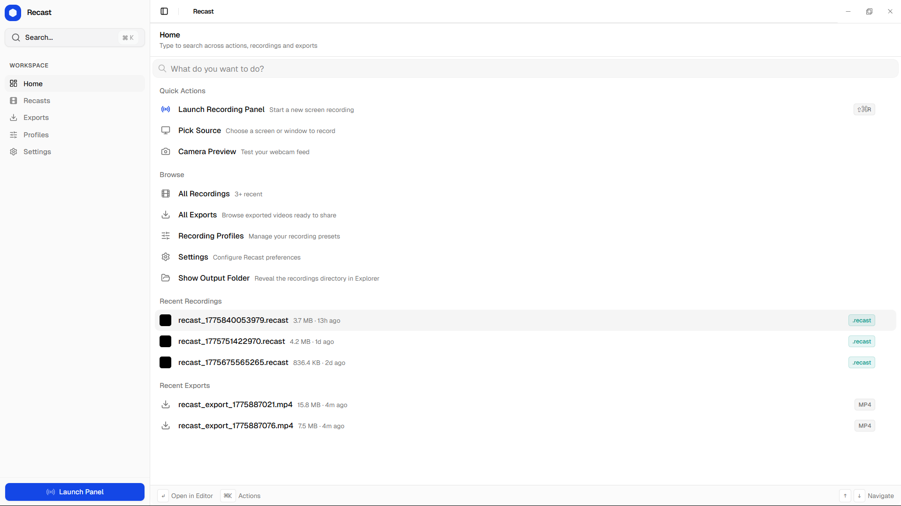
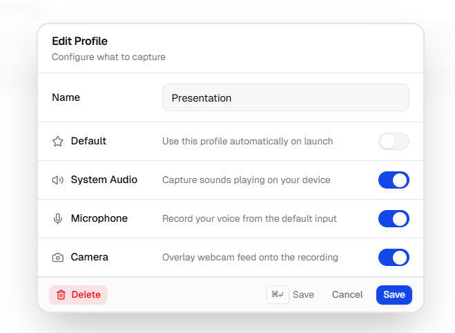

<h1 align="center">Recast</h1>

<p align="center">
  <strong>Video editing, refined.</strong> The fast, minimal, and intentional editor built for the next generation of storytellers.
</p>

<p align="center">
  <a href="https://github.com/kanakkholwal/recast/actions"></a>
  <a href="https://github.com/kanakkholwal/recast/blob/main/LICENSE.md"></a>
</p>

## 📖 About

Recast is a high-performance, open-source screen recorder with integrated,
cinematic editing built in. It replaces messy timeline-based tools with a
**"Smooth by Default"** experience — aimed at startups and creators who need
polished product demos without the editing overhead.

It's an **offline-first desktop app**: recording, editing, and export all run
locally on your machine. Nothing is uploaded, and there's no account to create.

## ✨ Key Features

- **Cinematic Magic by Default** — perfect cursor motion smoothing, automatic zooming, and intelligent tracking.
- **Zero-Lag Recording** — built natively with Tauri and Rust, offloading high-performance video encoding (FFmpeg) to your silicon.
- **Pause & Resume** — pause mid-take and pick up where you left off; paused spans are trimmed cleanly out of the final video.
- **Camera, Mic & System Audio** — record any combination, with a floating webcam bubble and per-source device picking.
- **Privacy-First** — fully offline, locally generated profiles, no invasive tracking.
- **Sleek Interface** — a "Craft" design system featuring minimal glassmorphism, native blurs, and Svelte 5 reactivity.

## 📸 Screenshots




## 🚀 Getting Started

### Prerequisites

- Node.js (v18+)
- [pnpm](https://pnpm.io/) (v9+)
- Rust (v1.70+) & Cargo
- [Tauri OS prerequisites](https://v2.tauri.app/start/prerequisites/) for your platform (macOS / Windows / Linux)

The one-shot setup script below can auto-install any of these that are missing.

### Installation

1. Clone the repository:

   ```sh
   git clone https://github.com/kanakkholwal/recast.git
   cd recast
   ```

2. Run the one-shot setup script. It detects your OS, auto-installs any missing
   prerequisites, downloads the FFmpeg sidecar binaries, installs workspace
   dependencies, and produces a debug build of the desktop app:

   ```sh
   # Windows (PowerShell)
   powershell -ExecutionPolicy Bypass -File scripts/setup.ps1

   # macOS / Linux
   bash scripts/setup.sh
   ```

Prefer to set things up by hand? See the
[manual setup steps in CONTRIBUTING.md](CONTRIBUTING.md#manual-setup).

### Running Locally

Start the desktop app in dev mode (spins up both the SvelteKit frontend and the
Tauri backend, with hot-reloading):

```sh
pnpm --filter recast-desktop dev
```

Or run the marketing website:

```sh
pnpm turbo run dev --filter=recast-web
```

## 🤝 Contributing

Contributions are welcome! The [Contributing Guide](CONTRIBUTING.md) covers the
codebase mental model, manual setup, building production binaries, the
changelog/release workflow, and how to submit pull requests.

## ⚖️ License

Recast is distributed under a **Dual-Licensing model**:

1. **Open Source (GPLv3)** — free for personal, educational, and open-source
   use. As a strong copyleft license, any modifications or derived works must
   also be open-sourced under the same license.
2. **Commercial License** — required for enterprise deployment, proprietary
   commercial use, and closed-source redistribution. If you want to keep your
   modifications private or sell a derived product, you must purchase a
   commercial license.

See [LICENSE.md](LICENSE.md) for full legal details.
