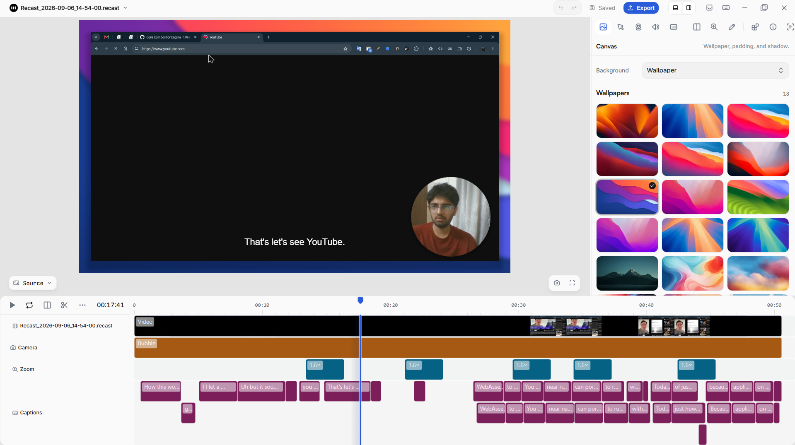

<h1 align="center">Recast</h1>

<p align="center">
  <strong>Record. Polish. Share.</strong> An open-source screen recorder that polishes as you record, so a demo is ready the same day you make it.
</p>

<p align="center">
  <a href="https://recast.li">Website</a>
  ·
  <a href="https://recast.li/download">Download</a>
  ·
  <a href="https://recast.li/changelog">Changelog</a>
  ·
  <a href="https://recast.li/architecture">Architecture</a>
  ·
  <a href="https://recast.li/pricing">Pricing</a>
</p>

<p align="center">
  <a href="https://github.com/kanakkholwal/recast/blob/main/LICENSE.md"></a>
  <a href="https://github.com/kanakkholwal/recast/actions/workflows/deploy-web.yml"></a>
  <a href="https://deepwiki.com/kanakkholwal/recast"></a>
</p>

<p align="center">
  
</p>

## What Recast does

Recast is a screen recorder built for founders and indie devs who ship product demos, walkthroughs, and launch videos. Auto-polish runs while you record, so the timeline is mostly done by the time you stop.

- **Smart zoom on clicks.** Automatic zoom to whatever you clicked, no keyframes needed.
- **Cursor smoothing.** Velocity-aware easing kills the jitter, snaps to interactive targets.
- **Silence trimming.** Dead-air detection with one-click cuts, powered by Silero VAD.
- **On-device captions.** Parakeet V3 or Whisper for transcription. Burn into the video or export as .vtt / .srt. No cloud, no upload.
- **Scene animations.** Per-segment fade, slide, scale, pop, and shrink for cleaner beats.
- **Timeline editor.** Cut, split, ripple, per-segment speed, zoom regions, annotations, blur.
- **Camera bubble.** Draggable webcam with shape, border, and follow-cursor motion.
- **Extension packs.** Cursor styles, backgrounds, gradients, and motion presets. Hash-checked, no code execution, install live from the editor.
- **Drive sharing.** Push finished videos straight to your own Google Drive, copy the share link.

Everything above runs on your machine, offline. No account required to record. Anonymous crash reporting is on by default and product analytics is opt-in. Both are untied to any account and can be switched off in Settings.

## Platform support

| Platform | Status | Build |
|---|---|---|
| Windows 10/11 | Stable | Signed installer |
| macOS 13+ | Beta | Universal DMG |
| Linux (X11 + Wayland) | Beta | AppImage / .deb |

> **Requires WebGL2.** Any GPU from ~2015 onward qualifies. On Linux, WebKitGTK
> hardware acceleration must be enabled (default on most desktop distros; some
> minimal Wayland or headless setups need a flag).

## Tech stack

Tauri v2 (Rust core, WebView2 / WKWebView / WebKitGTK frontend). SvelteKit 5 + TypeScript for the UI, Tailwind v4 and shadcn-svelte for the design system. FFmpeg sidecar for export encoding, WebCodecs for preview decode. Own wgpu compositor crate for zero-copy render on all three OSes. On-device ASR via `transcribe-rs` (Parakeet) and Whisper. Full per-subsystem architecture at [recast.li/architecture](https://recast.li/architecture).

## Recast Cloud

A hosted sharing layer with watch analytics, per-viewer access, link expiry, and team workspaces is in development. Storage-agnostic by design: bring your own storage on the free tier (Google Drive today, Cloudinary and autorender.io planned), or use Recast-managed storage or your own S3, R2, Azure, or GCP bucket on paid plans. [Join the waitlist](https://recast.li/pricing).

## Quick start

Prerequisites: Node.js 18+, [pnpm](https://pnpm.io/) 10+, Rust 1.77+, and the [Tauri OS prerequisites](https://v2.tauri.app/start/prerequisites/) for your platform. The setup script can auto-install any of these that are missing.

```sh
git clone https://github.com/kanakkholwal/recast.git
cd recast

# Windows (PowerShell)
powershell -ExecutionPolicy Bypass -File scripts/setup.ps1

# macOS / Linux
bash scripts/setup.sh
```

Run the desktop app in dev mode:

```sh
pnpm --filter recast-desktop dev
```

Run the website:

```sh
pnpm turbo run dev --filter=recast-web
```

Manual setup and per-OS gotchas live in [CONTRIBUTING.md](CONTRIBUTING.md#manual-setup).

## Architecture

One page per subsystem at [recast.li/architecture](https://recast.li/architecture), written as markdown in [`apps/web/content/architecture/`](apps/web/content/architecture/). Each opens with what goes in, what comes out, which files to start at, and the invariants that subsystem cannot break.

## Contributing

[CONTRIBUTING.md](CONTRIBUTING.md) covers the codebase mental model, manual setup, building production binaries, the changelog and release workflow, and how to submit pull requests. Good places to start are the [good-first-issue](https://github.com/kanakkholwal/recast/labels/good%20first%20issue) label and the [`extensions/`](extensions/) directory if you want to publish a cursor pack, background pack, or motion preset.

## License

Recast is dual-licensed:

- **GPLv3** for personal, educational, and open-source use.
- **Commercial license** required for closed-source redistribution or proprietary derived products.

See [LICENSE.md](LICENSE.md) for the full terms.
