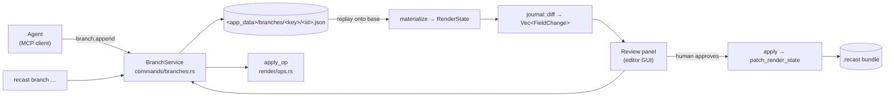
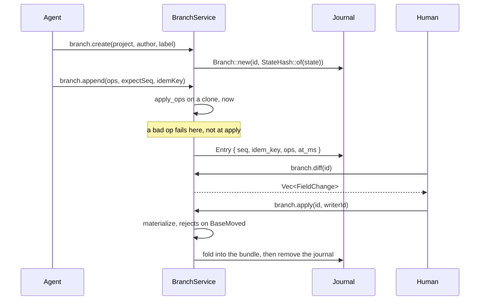

## Overview

An agent does not write the project. It appends typed `Op`s to a **branch**, a
journal keyed to the content hash of the state it forked from, and a human
applies or discards it.

Three things forced this, all of them behind the ordinary
`patch_render_state` path and none of them about transport:

1. `project::writer::update_project_edits` rewrites the **whole `.recast` zip**
   per call, raw-copying `recording.mp4`. An agent paid that per verb: fifty
   edits on a 600 MB project is roughly 30 GB of copying.
2. `try_acquire_write_lock` had no same-writer check, so an agent's second edit
   inside the 60s TTL failed with `editor_locked` naming *itself* as the holder.
   Every multi-step agent edit was broken until `classify_claim`
   (`commands/editor_session.rs`) landed.
3. Undo lived only in the frontend store. Nothing outside the GUI could take an
   edit back.

A branch fixes all three: it never touches the bundle, it never takes the write
lock, and `truncate_after` is undo.

Rejected, deliberately: CRDTs and multi-writer merge (one human decides),
splitting media out of the `.recast` (the bundle is the unit users move around),
and a per-project lock map (agents never take the lock now, so the single slot
costs nothing).

## Diagram





## Key components

| Component | File | Responsibility |
|---|---|---|
| `Op` | `render/ops.rs` | 16 variants: trim, cuts, zoom, split points, speed, annotations, scene anims, generic `Set`, whole-state `Replace` |
| `apply_op` | `render/ops.rs` | `(&mut RenderState, &Op) -> Result<Value, OpError>`; pure, no clock, no IO |
| `apply_ops` | `render/ops.rs` | All-or-nothing batch over a clone; a mid-batch failure leaves the branch untouched |
| `OpError` | `render/ops.rs` | `thiserror`; index-out-of-range, selector-missing, not-found, `FieldTypeMismatch` |
| `StateHash` | `project/journal.rs` | `[u8; 32]` sha256 of the serialized `RenderState`, hex in JSON via `hex_bytes` |
| `BranchId` | `project/journal.rs` | Client-chosen name, validated because it is also the journal's file stem |
| `Entry` / `Branch` | `project/journal.rs` | `{seq, idem_key, ops, at_ms}` on one `base: StateHash` |
| `Branch::append` | `project/journal.rs` | `expect_seq` check, idem-key replay, returns `Append::Recorded` or `AlreadyApplied` |
| `Branch::materialize` | `project/journal.rs` | Replays entries onto the base; `JournalError::BaseMoved` if the hash shifted |
| `Branch::compact` | `project/journal.rs` | Past `COMPACT_AFTER_ENTRIES` (512) collapses to one `Op::Replace`, **keeping the base** |
| `Branch::truncate_after` | `project/journal.rs` | Server-side undo: drop every entry past `seq` |
| `BranchStore` | `project/journal.rs` | One directory of `<id>.json`; `list` skips unparseable files so one corrupt journal cannot hide the rest |
| `project_key` | `project/journal.rs` | Maps a `.recast` path to its journal directory name |
| `BranchService` | `commands/branches.rs` | The shared layer: 8 methods, called by socket dispatch, Tauri commands, and MCP |
| `BranchService::apply` | `commands/branches.rs` | Materializes *inside* `patch_render_state`'s closure, so the fold is one atomic bundle write |
| `Server::handle` | `mcp/protocol.rs` | Pure `(&Value, &impl ToolHost) -> Option<Value>`; testable with no socket and no process |
| `TOOLS` | `mcp/tools.rs` | 17 tool descriptors, each a closed JSON Schema: one to discover projects, reads, `check`, perception, two intent tools, and the branch verbs |
| `agent::guard` | `agent/guard.rs` | `ProjectPath` (extension, traversal, existence), `MAX_OPS_PER_APPEND` (200), `within_budget` (cuts the largest array and says what it dropped) |
| `agent::schema` | `agent/schema.rs` | One table of op specs that generates the `ops` JSON Schema; a test parses each row's document into an `Op`, so the schema cannot drift from serde |
| `agent::receipt` | `agent/receipt.rs` | `Receipt { seq, recorded, compacted, base, head, changes, timeline, introduced }`; property-tested so patching a read with a receipt reproduces the written state |
| `agent::check` | `agent/check.rs` | Tier 1 findings with stable codes and both clocks: validator errors, never-visible zooms and annotations, lanes without inputs, extreme speeds, tiny output |
| `agent::perception` | `agent/perception.rs` | Transcript words and detected silences projected onto the output clock as guarded, windowed `TrackView`s, labelled as recording content |
| `agent::intents` | `agent/intents.rs` | `cuts_for_silences` (padded, merged, skips existing cuts) and `zoom_op` (output seconds in, a full `ZoomRegion` out) |
| `agent::instructions` | `agent/instructions.rs` | The MCP `instructions` text and the installable `recast-editing` skill; a test asserts the skill names every tool |
| `resources/*` | `mcp/protocol.rs` | Each project as a `recast://project/<encoded path>` resource, so a client can attach state without spending a tool call |
| `Store` | `crates/recast-project/store.rs` | v3 directory projects: the in-memory document, monotonic `seq`, per-batch WAL, atomic checkpoint, a 256-entry ring for `since(seq)`, and `apply_expecting` (`Stale { seq, hash, since }` on a mismatch) |
| `diff` | `crates/recast-project/diff.rs` | `diff(from, to)` turns a whole-state save or an edited file into one op batch; property-tested over random edit sequences |
| `Address` | `crates/recast-project/address.rs` | Op targets: an id, `id/kind[n]`, or `/kind/kind[n]` from the root, so id-less elements (`background`, `shadow`, `enter`) are reachable |
| `Documents` | `project/documents.rs` | The core's document owner: one `Store` per open project, every writer sequenced through it, checkpoint 500 ms after the last op and on exit |
| `control::doc` | `control/doc.rs` | `doc.show / apply / since / flush` for the socket, the Tauri commands and the CLI (`recast project rcx`, `recast project ops`) |

## Control / data flow

`Op` is a wire contract, not an internal enum:

```rust
#[serde(tag = "op", rename_all = "camelCase", rename_all_fields = "camelCase")]
pub enum Op { /* … */ }
```

Those names are serialized into journals on disk. Renaming a variant or a field
invalidates every journal that exists.

**Append validates twice, immediately.** `BranchService::append` replays the
incoming ops onto a materialized clone, then runs `validate_render_state` over
the result, before writing the entry. The first catches an op that cannot apply:

```rust
Err(JournalError::Replay { branch, seq, source: OpError::CutIndexOutOfRange { .. } })
```

The second catches an op that applies cleanly and still produces nonsense, such
as a trim past the end of the source. Both return before `store.save`, so a
rejected append leaves the journal on disk untouched and the agent can correct
the op and retry. Without the second check the failure surfaced at apply time,
in front of the reviewer, who could do nothing about it.

A retried `idem_key` skips validation. It proposes nothing new, so re-judging it
would let a project edited out of band turn a settled no-op into a failure.

**Every write returns a receipt, not a status.** `Receipt.changes` is the
field-level delta between the branch before and after the entry, `timeline` is
the new output duration and kept segments (a cut moves every output time after
it), and `introduced` is what `check` would now flag that it did not before. An
agent patches its model with the receipt instead of re-reading; the property
test in `agent/receipt.rs` folds random ops and asserts the patched read equals
the written state. A retried `idem_key` returns `recorded: false` with no
changes, so an ignored batch never looks like success.

**A write names the read it was built on.** `expectBase` carries the hash from
`recast_project_head`; a project that moved refuses with both hashes and the
next step, before anything touches the journal. That is the stale-read check
Claude Code's hooks make at edit time, done in the service so every transport
has it.

**Intent tools convert clocks.** `recast_remove_silences` runs detection, pads
each silence inward, merges ones that still touch, skips ranges already cut,
and appends the cuts; it refuses rather than journaling an empty entry.
`recast_add_zoom` takes an output second, maps it to the recording's clock
through the same `TimeMap` the preview uses, and fills every default. Raw ops
stay available through `recast_branch_append` for what no intent covers, with
the op vocabulary in the tool schema.

**Perception is windowed and labelled.** `recast_transcript` and
`recast_silences` return rows on the output clock with `n` and `span` for the
whole track, a `window` when sliced, a one-line `note` when the window is empty,
and a `label` saying the rows are recording content. Results over the budget
lose the tail of their largest array and say what to call instead.

**Concurrency is optimistic, retries are idempotent.** `expect_seq` rejects a
stale writer with `SeqMismatch { expected, actual }`; an `idem_key` already on
the branch returns `Append::AlreadyApplied { seq }` instead of duplicating the
edit, so a network retry is free.

**Apply is fast-forward only.** `materialize` recomputes `StateHash::of(current)`
and refuses if it moved:

```text
branch forked from 9f2c… but the project is now at 41ab…
```

That catches a GUI save landing between fork and apply, and a bundle edited out
of band. On success the journal is deleted: a branch is consumed, not archived.

## Invariants & gotchas

- **`apply_op` must stay pure.** No `SystemTime`, no randomness, no filesystem.
  Journals are replayed to rebuild state, so an id minted from the clock at edit
  time diverges on replay. The `annotations.add` fallback id and the zoom
  defaults are resolved at the **dispatch edge** and baked into the op.
- **Compaction keeps the fork point.** The first design moved the base forward,
  which would make `materialize` reject the exact project state the branch
  applies to. It collapses into one `Op::Replace` on the original base instead.
- **There is no revision counter.** `StateHash` subsumes one, catches
  out-of-band edits, and needs no project-format migration. Per-branch `seq`
  supplies the ordering a counter would have.
- **Journals live under the app data dir**, not beside the `.recast`. Pending
  human review is not temporary work and must not be reclaimed by the temp-dir
  sweeper.
- **Sweep only discards provably worthless branches**: empty (created, never
  appended) and older than `EMPTY_BRANCH_MAX_AGE_MS` (24h). A branch carrying
  ops is never auto-deleted; past `STALE_AFTER_MS` (7d) it is flagged `stale`
  and the reviewer decides. Unreadable journals are left alone, because we
  cannot tell whether they hold work. It runs from `list`, the one call every
  surface makes, rather than a background timer.
- **Discovery is the entry point.** `recast_project_list` is the only tool that
  takes no arguments, and every other project tool needs a path. Without it an
  agent could work only on a path a human pasted, which made the whole surface
  unreachable on its own. `a_project_path_is_discoverable_without_already_having_one`
  (`mcp/tools.rs`) pins that there is always such a way in.
- **`create` refuses rather than overwrites.** Reusing the id of a branch that
  holds ops returns `BranchExists`; reusing one that holds none re-forks it, so
  an agent that crashed between create and its first append can simply retry.
  The unguarded `BranchStore::save` still exists for writing back a branch that
  was loaded, but forking goes through `BranchStore::create`.
- **The branch cap bounds the reviewer, not the disk.** Journals are KB-scale.
  `MAX_BRANCHES_PER_PROJECT` (32) exists so a looping agent cannot bury a human
  under a review list, and it sweeps abandoned empty branches before it counts,
  so the cap measures live work.
- **Listing resources never fails.** A client calls `resources/list` on connect;
  an unreachable app answers with an empty library rather than an error, which
  would read as a broken server.
- **Guards run before any read.** A tool `path` must end in `.recast`, contain
  no `..`, and exist (`ProjectPath`); an append carries at most 200 ops; a
  result is cut to about 15k tokens with a `truncated` note naming the narrower
  call. Deny-first, deterministic, no prompt in the loop.
- **The schema is the wire.** `agent/schema.rs` is one table; a test builds each
  row's document and parses it into `Op`, and another asserts the row count, so
  adding a variant without a row fails the build rather than the agent.
- **No MCP tool writes.** `branch.apply`, the `editor.*` mutators, `rec.*` and
  `export.*` are absent from `TOOLS`, and `no_tool_writes_the_project_directly`
  (`mcp/tools.rs`) asserts it. Failing verbs return `isError: true` with the
  message intact so the model can read `editor_locked: …` and back off.
- **`rmcp` is not used.** Its current release needs rustc 1.88 while this crate
  pins `rust-version = "1.82.0"`, so cargo silently resolves to 2.2.0 rather
  than failing. The protocol is ~200 lines; the silent downgrade is not worth
  it. Revisit if the MSRV moves for another reason.
- **Proposing is free.** `proposing_edits_leaves_the_bundle_untouched` byte-compares
  the `.recast` before and after an append.
- **On a v3 directory the core's copy is the truth.** Every write, the GUI's
  whole-state save included, becomes a sequenced op batch on `Documents`; the
  file is a checkpoint at most half a second behind. `recast_doc_show` and
  `recast_doc_since` read from that copy. The raw `doc.apply` stays off MCP
  (the same `no_tool_writes_the_project_directly` test pins it); what MCP gets
  is `recast_doc_apply` over `agent.apply`, which the core refuses unless the
  user turned on "Let agents edit the open project live" and has that project
  open. Then the batch lands as one undo step, the editor's replica adopts it,
  and an overlap on the same property is toasted with the editor's value kept.
- **The file is a writer too.** `project.rcx` is watched; an outside edit is
  read back as ops against the last checkpoint (never a revert of edits
  sequenced since), our own checkpoint echoes back and is ignored, and a file
  that does not parse is reported with its line and column, not loaded.

## Related

- [State and the project format](/architecture/state-project-format): what a
  branch forks from and folds back into.
- [CLI and the control socket](/architecture/cli-control-socket): the transport
  the branch verbs and MCP share.
- [IPC and the Tauri boundary](/architecture/ipc-tauri-boundary): how the GUI
  reaches the same service.
