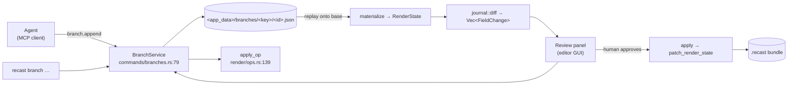
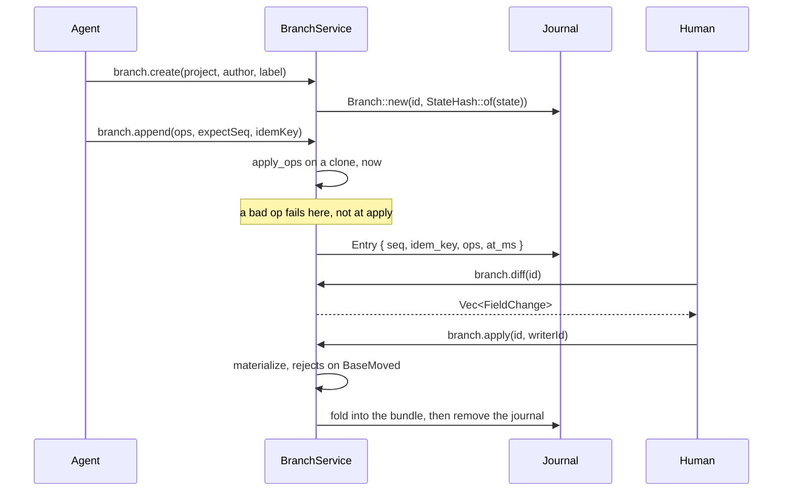

## Overview

An agent does not write the project. It appends typed `Op`s to a **branch**, a
journal keyed to the content hash of the state it forked from, and a human
applies or discards it.

Three things forced this, all of them behind the ordinary
`patch_render_state` path and none of them about transport:

1. `project::writer::update_project_edits` rewrites the **whole `.recast` zip**
   per call, raw-copying `recording.mp4`. An agent paid that per verb: fifty
   edits on a 600 MB project is roughly 30 GB of copying.
2. `try_acquire_write_lock` had no same-writer check, so an agent's second edit
   inside the 60s TTL failed with `editor_locked` naming *itself* as the holder.
   Every multi-step agent edit was broken until `classify_claim`
   (`commands/editor_session.rs:137`) landed.
3. Undo lived only in the frontend store. Nothing outside the GUI could take an
   edit back.

A branch fixes all three: it never touches the bundle, it never takes the write
lock, and `truncate_after` is undo.

Rejected, deliberately: CRDTs and multi-writer merge (one human decides),
splitting media out of the `.recast` (the bundle is the unit users move around),
and a per-project lock map (agents never take the lock now, so the single slot
costs nothing).

## Diagram





## Key components

| Component | File:line | Responsibility |
|---|---|---|
| `Op` | `render/ops.rs:67` | 16 variants: trim, cuts, zoom, split points, speed, annotations, scene anims, generic `Set`, whole-state `Replace` |
| `apply_op` | `render/ops.rs:139` | `(&mut RenderState, &Op) -> Result<Value, OpError>`; pure, no clock, no IO |
| `apply_ops` | `render/ops.rs:290` | All-or-nothing batch over a clone; a mid-batch failure leaves the branch untouched |
| `OpError` | `render/ops.rs:24` | `thiserror`; index-out-of-range, selector-missing, not-found, `FieldTypeMismatch` |
| `StateHash` | `project/journal.rs:108` | `[u8; 32]` sha256 of the serialized `RenderState`, hex in JSON via `hex_bytes` |
| `BranchId` | `project/journal.rs:80` | Client-chosen name, validated because it is also the journal's file stem |
| `Entry` / `Branch` | `project/journal.rs:143,153` | `{seq, idem_key, ops, at_ms}` on one `base: StateHash` |
| `Branch::append` | `project/journal.rs:236` | `expect_seq` check, idem-key replay, returns `Append::Recorded` or `AlreadyApplied` |
| `Branch::materialize` | `project/journal.rs:282` | Replays entries onto the base; `JournalError::BaseMoved` if the hash shifted |
| `Branch::compact` | `project/journal.rs:310` | Past `COMPACT_AFTER_ENTRIES` (512) collapses to one `Op::Replace`, **keeping the base** |
| `Branch::truncate_after` | `project/journal.rs:269` | Server-side undo: drop every entry past `seq` |
| `BranchStore` | `project/journal.rs:332` | One directory of `<id>.json`; `list` skips unparseable files so one corrupt journal cannot hide the rest |
| `project_key` | `project/journal.rs:499` | Maps a `.recast` path to its journal directory name |
| `BranchService` | `commands/branches.rs:79` | The shared layer: 8 methods, called by socket dispatch, Tauri commands, and MCP |
| `BranchService::apply` | `commands/branches.rs:207` | Materializes *inside* `patch_render_state`'s closure, so the fold is one atomic bundle write |
| `Server::handle` | `mcp/protocol.rs:63` | Pure `(&Value, &impl ToolHost) -> Option<Value>`; testable with no socket and no process |
| `TOOLS` | `mcp/tools.rs:29` | 10 branch-scoped tool descriptors, each a closed JSON Schema |

## Control / data flow

`Op` is a wire contract, not an internal enum:

```rust
#[serde(tag = "op", rename_all = "camelCase", rename_all_fields = "camelCase")]
pub enum Op { /* … */ }
```

Those names are serialized into journals on disk. Renaming a variant or a field
invalidates every journal that exists.

**Append validates immediately.** `BranchService::append` replays the incoming
ops onto a materialized clone before writing the entry, so a bad op comes back
while the agent is still in the loop rather than surfacing at review time:

```rust
Err(JournalError::Replay { branch, seq, source: OpError::CutIndexOutOfRange { .. } })
```

**Concurrency is optimistic, retries are idempotent.** `expect_seq` rejects a
stale writer with `SeqMismatch { expected, actual }`; an `idem_key` already on
the branch returns `Append::AlreadyApplied { seq }` instead of duplicating the
edit, so a network retry is free.

**Apply is fast-forward only.** `materialize` recomputes `StateHash::of(current)`
and refuses if it moved:

```text
branch forked from 9f2c… but the project is now at 41ab…
```

That catches a GUI save landing between fork and apply, and a bundle edited out
of band. On success the journal is deleted: a branch is consumed, not archived.

## Invariants & gotchas

- **`apply_op` must stay pure.** No `SystemTime`, no randomness, no filesystem.
  Journals are replayed to rebuild state, so an id minted from the clock at edit
  time diverges on replay. The `annotations.add` fallback id and the zoom
  defaults are resolved at the **dispatch edge** and baked into the op.
- **Compaction keeps the fork point.** The first design moved the base forward,
  which would make `materialize` reject the exact project state the branch
  applies to. It collapses into one `Op::Replace` on the original base instead.
- **There is no revision counter.** `StateHash` subsumes one, catches
  out-of-band edits, and needs no project-format migration. Per-branch `seq`
  supplies the ordering a counter would have.
- **Journals live under the app data dir**, not beside the `.recast`. Pending
  human review is not temporary work and must not be reclaimed by the temp-dir
  sweeper.
- **Sweep only discards provably worthless branches**: empty (created, never
  appended) and older than `EMPTY_BRANCH_MAX_AGE_MS` (24h). A branch carrying
  ops is never auto-deleted; past `STALE_AFTER_MS` (7d) it is flagged `stale`
  and the reviewer decides. Unreadable journals are left alone, because we
  cannot tell whether they hold work. It runs from `list`, the one call every
  surface makes, rather than a background timer.
- **No MCP tool writes.** `branch.apply`, the `editor.*` mutators, `rec.*` and
  `export.*` are absent from `TOOLS`, and `no_tool_writes_the_project_directly`
  (`mcp/tools.rs:251`) asserts it. Failing verbs return `isError: true` with the
  message intact so the model can read `editor_locked: …` and back off.
- **`rmcp` is not used.** Its current release needs rustc 1.88 while this crate
  pins `rust-version = "1.82.0"`, so cargo silently resolves to 2.2.0 rather
  than failing. The protocol is ~200 lines; the silent downgrade is not worth
  it. Revisit if the MSRV moves for another reason.
- **Proposing is free.** `proposing_edits_leaves_the_bundle_untouched` byte-compares
  the `.recast` before and after an append.

## Related

- [State and the project format](/architecture/state-project-format): what a
  branch forks from and folds back into.
- [CLI and the control socket](/architecture/cli-control-socket): the transport
  the branch verbs and MCP share.
- [IPC and the Tauri boundary](/architecture/ipc-tauri-boundary): how the GUI
  reaches the same service.
