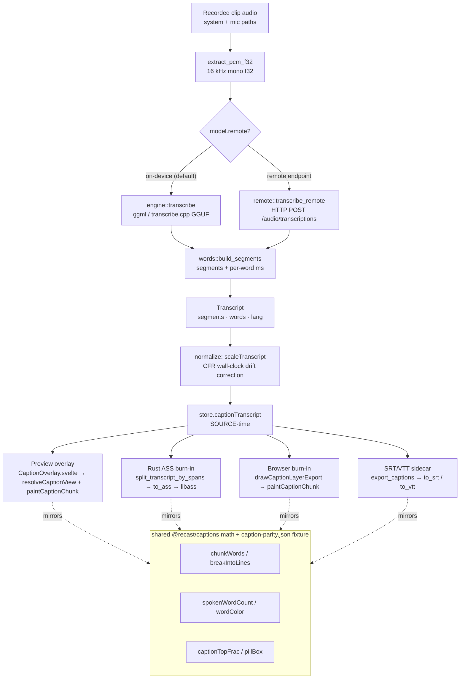
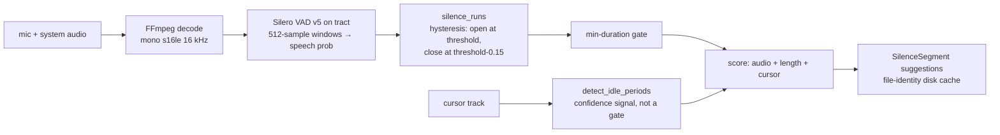

## Overview

Recast turns a recorded clip's audio into styled, animated captions entirely on-device (with an optional remote fallback), and separately suggests silent ranges to cut. The subsystem has three concerns:

1. **Transcription (ASR)**: decode a clip's audio to 16 kHz mono f32, run it through the on-device **ggml / transcribe.cpp** engine (default) or a **remote OpenAI-compatible** endpoint, and produce a `Transcript` (segments + per-word timings). Rust owns this; it never captures a live mic (that would be dictation, out of scope). See `transcription/mod.rs`.
2. **Caption rendering**: a shared, pure model (`@recast/captions`) drives three surfaces that must agree: the **preview overlay** (canvas 2D), the **export burn-in**, and **SRT/VTT sidecars**. Loom-style progressive word highlight + a rounded "pill" background are the default look.
3. **Silence detection**: a Silero VAD (v5) model on the pure-Rust **tract** runtime scores per-frame speech probability; non-speech runs become cut *suggestions* (`silence.rs`).

Two parallel burn-in implementations exist and are kept in lock-step by a shared fixture:

- **Rust ASS path** (`transcription/subtitles.rs`) → FFmpeg `ass`/`subtitles` filter → libass paints pixels. This is the shipped export burn-in.
- **Browser canvas path** (`caption-layer-export.ts` + `caption-render.ts`) → paints onto the same comp-native 2D layer the preview uses, so *preview == export by construction*. Wired and flag-ready under the browser-RenderCore migration (captions currently gated to Rust; see `con7_export_overlays` / `browser_render_migration`).

The `CaptionStyle` / `CaptionAnimation` shapes are duplicated across the TS/Rust boundary (no shared source); the Rust defaults are asserted to mirror `DEFAULT_CAPTION_STYLE` (`transcription/mod.rs`, guard test `mod.rs`).

## Diagram

### Audio → transcript → captions

### Silence / VAD flow

## Key components

| Area | File · symbol | Role |
| --- | --- | --- |
| ASR commands | `transcription/mod.rs` `transcribe_project` | Gate availability, decode audio, dispatch remote vs local, stream `extracting/transcribing/done` phases on an IPC channel. |
| Transcript model | `transcription/mod.rs` | `TranscriptWord` / `TranscriptSegment` / `Transcript` serde types (camelCase over IPC). |
| Caption style (Rust) | `transcription/mod.rs` `CaptionStyle` / `CaptionAnimation` | Mirror of the TS caption model; `#[serde(default)]` on newer fields for old-project back-compat; `Default` = Loom preset. |
| Model registry | `transcription/models.rs` `registry` | Built-in GGUF catalog (Parakeet V3 default, V2, Nemotron, Whisper base/small/medium) hosted on HF `handy-computer`. |
| Model download | `transcription/models.rs` `download_file` | Streamed `.tmp` + sha256 verify + atomic rename; per-byte progress. Hashes mostly `None` (skip-verify, logged) pending release pinning. |
| Inference seam | `transcription/engine.rs` `transcribe` / `transcribe_at_path` | Resolves the single GGUF and hands to ggml; `--no-default-features` build returns "unavailable". |
| ggml engine | `transcription/ggml.rs` `transcribe_gguf` | transcribe.cpp `Model::load` → `session.run`; native `CancelToken` abort; maps raw ms segments/words via `words::build_segments`. |
| Timing post-process | `transcription/words.rs` `build_segments` | Three-tier normalizer: real word timing → group flat stream; segment-only → synthesize words; text-only → whole-clip block. Cleans/monotonizes/min-durations so animated captions always have clean timing. |
| Remote ASR | `transcription/remote.rs` `transcribe_remote` (called at `mod.rs`) | OpenAI-compatible `/audio/transcriptions` multipart POST (`verbose_json`, `timestamp_granularities[]=word,segment`); endpoint config persisted to `remote-asr.json`, API key in OS keyring (`com.kanakkholwal.recast`, write-only, never crosses IPC); catalog id `remote:<id>`. Compiles in every build. |
| Extension models | `transcription/packs.rs` `to_caption_model` | Turns asset-pack `contributes.captionModels[]` into `CaptionModel`s; closed serde enums (can only select an existing engine/runtime, never add code) and **required** sha256 (stricter than built-ins). |
| Subtitle serializers | `transcription/subtitles.rs` `to_srt` /  `to_vtt` /  `to_ass` | SRT/VTT sidecars + ASS burn-in script (styled from `CaptionStyle`, rounded-pill vector path). |
| Cut-splitting (Rust) | `transcription/subtitles.rs` `kept_spans` /  `split_transcript_by_spans` | Split every segment across kept spans before ASS emission, mirror of the TS version. |
| Caption model (TS) | `packages/captions/src/*` | Pure data + arithmetic; `chunking.ts`, `highlight.ts`, `linebreak.ts`, `geometry.ts`, `layout.ts`, `word-render.ts`, `presets.ts`, `types.ts`. |
| Shared renderer | `packages/editor/src/lib/captions/caption-render.ts` `resolveCaptionView` /  `paintCaptionChunk` | One resolve+paint path for preview overlay AND browser burn-in. |
| Preview overlay | `packages/editor/src/components/_components/CaptionOverlay.svelte` | Canvas 2D over the preview; rides the rAF-smooth `previewTime` clock; paused entrance-replay for the Motion tab. |
| Web-player overlay | `packages/captions/src/CaptionBox.svelte` | DOM (not canvas) caption overlay for the web player; component-scoped CSS (kept out of the pure-TS barrel so `@recast/captions` imports cleanly in Node/vitest, import from `@recast/captions/box`). Not used by the desktop preview/export canvas path. |
| Export layer (browser) | `packages/editor/src/lib/export/caption-layer-export.ts` `drawCaptionLayerExport` | Thin wrapper over the shared renderer for the browser export path. |
| Cut-splitting (TS) | `packages/editor/src/lib/captions/clip-with-cuts.ts` `splitSegmentAcrossSpans` /  `activeClippedSegment` | Per-frame preview clip + batch sidecar split; kept-span merge memoized. |
| Sidecar time-map | `packages/editor/src/lib/captions/output-time.ts` `toOutputTimeTranscript` | Split-then-map transcript onto the OUTPUT axis for sidecars. |
| CFR normalize | `packages/editor/src/lib/captions/normalize.ts` `transcriptTimeScale` /  `scaleTranscript` | Rescale audio-timed transcript onto video-source axis (recording is count-based CFR). |
| Silence detection | `apps/desktop/src-tauri/src/silence.rs` `detect_silence` | Silero VAD on tract → non-speech runs → `SilenceSegment` suggestions; cursor-idle confidence; disk-cached. |
| Waveform | `silence.rs` `extract_waveform` | Peak envelope for the timeline (visual only). |

## Control / data flow

**Transcribe.** The Captions tab calls `has_transcribable_audio` (`mod.rs`) to gate its Generate UI, then `transcribe_project`. That command:

1. Gates availability, remote needs a stored key; local needs the `ggml` feature built (`models::runtime_status`), device caps to pass (`evaluate`, `mod.rs`), and files present (`is_installed`).
2. Emits phase `extracting`, then `audio::extract_pcm_f32` decodes system+mic to 16 kHz mono f32 on a blocking thread.
3. Emits `transcribing`. Remote → `remote::transcribe_remote` (async, key read in Rust). Local → `engine::transcribe` on a blocking thread → `ggml::transcribe_gguf` → `words::build_segments` normalizes whatever timing shape the model returns (segments+words / words-only / text-only).
4. Cancellation is checked after extract and after inference; ggml uses a native `CancelToken` (`ggml.rs`) so Cancel actually stops the CPU burn, not just hides the result. `cancel_transcription` requests it.

**Store the transcript.** The frontend applies `scaleTranscript` (`normalize.ts`) to correct linear CFR drift (audio wall-clock vs video count-based duration, clamped to ±5%), holding the result as `store.captionTranscript` in SOURCE time.

**Render / highlight (preview).** `CaptionOverlay.svelte` derives the active `CaptionView` via `resolveCaptionView` at the smoothed source-time playhead: it finds the kept span containing `t` (`captionSpanAt`), the active clipped segment, resolves the animation, chunks words (`chunkWords`), picks the active chunk/word and `spokenWordCount`. `paintCaptionChunk` measures text on the canvas, computes the pill (`pillBox`) and vertical placement (`captionTopFrac`), then paints each word with `wordColor` (progressive = spoken base / unspoken muted). The **entrance** clock is OUTPUT time (via the time-map) so it plays at viewer-rate across speed changes.

**Burn-in at export.** Rust path: `split_transcript_by_spans` breaks each segment at real cut boundaries, then `to_ass` writes an ASS script (font size/margins in the composite pixel space; layer-0 vector pill + layer-1 text when a single line + measurable font; per-word `\c` overrides for progressive/accent) that FFmpeg burns via libass *before* the cut/speed stage, so `select`/`setpts` re-times the burned pixels and `offset`/`clip_len` map source→trimmed axis (`subtitles.rs`). Browser path: `drawCaptionLayerExport` runs the identical resolve+paint per output frame.

**Sidecars.** `export_captions` writes `to_srt` / `to_vtt`. VTT carries inline per-word `<HH:MM:SS.mmm>` tags for progressive highlight in the web player, and stays compatible with tag-blind players. `toOutputTimeTranscript` (`output-time.ts`) produces output-axis timings for sidecars shipped alongside an edited export.

## Invariants & gotchas

- **Cut-splitting must agree across all four surfaces.** A caption straddling a real cut must be *split*, not stretched across the seam carrying words the export removed. This is enforced in: the Rust ASS path (`split_transcript_by_spans`, `subtitles.rs`), the TS sidecar/browser path (`splitSegmentAcrossSpans`, `clip-with-cuts.ts`), and the output-time mapper (`output-time.ts`). A split piece gets its own id (`seg.id:i`) and only the words actually spoken in that piece. Regression tests exist on both sides (`subtitles.rs`, `clip-with-cuts.test.ts`).
- **…but the live preview deliberately shows the WHOLE segment.** `resolveCaptionView` gates visibility on the containing span (so a caption never *outlasts* a cut) yet renders the segment's full word list, not the words clipped to the span (`caption-render.ts`). This was an owner decision ("just show the caption") after clipping made straddling captions read as "gone" and suppressed later captions. Preview word content therefore differs from the burned/sidecar content for a straddling cue, intentional.
- **Break only at REAL cuts, not every split/speed boundary.** The time map carries one span per segment; naive splitting against it would break a cue at every split. `keptCaptionSpans` (`clip-with-cuts.ts`) merges contiguous spans first (memoized on the spans array identity). Rust's `kept_spans` uses the matching `SPAN_EPS = 1e-4` (`subtitles.rs`) so both sides agree on a boundary.
- **Browser vs Rust burn-in parity is fixture-locked.** `@recast/captions` is pure TS math; the Rust ASS generator re-implements the same `chunk_words`, `break_into_lines`, `word_color`, `spoken_word_count`, `caption_top_frac`, pill geometry, and the shared `packages/captions/src/__fixtures__/caption-parity.json` is asserted by BOTH a Rust test and `parity.test.ts`. Change a heuristic → update the fixture and both sides. Absolute-px effects (measurement) can differ but line breaks are measurement-free (`linebreak.ts`) so they can't drift.
- **Two mirrored `CaptionStyle`/`CaptionAnimation` definitions, no shared source.** The Rust `Default` (`mod.rs`) must equal `DEFAULT_CAPTION_STYLE`; a guard test pins the key fields. Update both together.
- **Offset anchor clamping.** `captionTopFrac` (`layout.ts`, mirrored `subtitles.rs`) anchors the caption baseline at the *clamped on-frame edge* so a full-bleed video keeps the whole Offset slider live; anchoring on the raw video edge dead-clamped the entire positive range. Positive Offset moves the caption inward over the video; negative tucks it outward into padding. (Note: the `types.ts` doc-comment describes the sign the opposite way and is stale; `layout.ts` and Rust are the authority. This is the "Caption Offset Anchor" fix in memory.)
- **Two caption clocks.** Chunks resolve at SOURCE time (`store.currentTime`); the entrance animates on OUTPUT time via the time-map, so it plays at viewer-rate even on sped-up segments. The overlay rides the rAF-smooth `previewTime`, not the ~25 Hz-throttled `store.currentTime`, a sub-second entrance would otherwise fall between throttled samples and never render (`CaptionOverlay.svelte`).
- **Silero tract migration + v5 state I/O.** Silence detection moved off `ort` (native ONNX Runtime) to pure-Rust **tract** so the always-on path builds on every target incl. Intel Mac (`silence.rs`). Silero **v5** merged v4's separate `h`/`c` LSTM tensors into one `state` in/out; feeding v4's `h`/`c` crashed the v5 model with "No node named h". The graph is pinned to inputs `input`/`state`/`sr` → outputs `output`/`stateN`, fixed 512-sample window @16 kHz, `STATE = [2,1,128]` carried between windows.
- **VAD replaced an RMS gate; cursor is confidence, not a gate.** Room tone/breathing/keyboard noise sit above any energy floor, so the old envelope both leaked false silences and swallowed quiet speech. Hysteresis (`RELEASE_MARGIN = 0.15`) stops one dipping frame fracturing speech. An idle cursor *raises* the score but a moving cursor no longer vetoes a candidate, so talking-head recordings still get suggestions (`silence.rs`, `375`, `452`). Nothing is auto-cut. Results are served from a file-identity disk cache keyed on all input files + options.
- **Silero model is fetched at runtime, not bundled**, from the snakers4 GitHub raw URL, sha256 not yet pinned (`silence.rs`, TODO). The integration test skips unless `RECAST_SILERO_PATH` is set.
- **ggml build claimed cross-OS but unverified off-Windows.** `ggml.rs` states transcribe.cpp compiles from vendored source via CMake on every OS including Intel Mac (the reason it was chosen over `ort`). Per project memory (`caption_model_extensions`) that non-Windows build is still unverified, treat the cross-platform claim as untested outside Windows.
- **Models need timestamps or they're useless for captions.** A `TimestampGranularity::None` model returns bare text that `words.rs` spreads evenly across the clip, drifting further the longer you talk. 34 of 65 upstream catalog models are `None`; a guard test rejects any built-in that can't time its captions (`models.rs`). Canary 180M and Cohere Transcribe were shipped and pulled for exactly this.
- **Model hashes are mostly unpinned.** Only `whisper-base` carries a sha256; every other built-in is `None` → downloaded without verification (logged warning at `models.rs`). Pin via `tools/dev/pin-model-sha256.ps1` before release. A mismatch is caught at both download and the `is_installed` gate and auto-redownloads.
- **All ASR work is async + `spawn_blocking`.** Sync Tauri commands freeze the macOS WKWebView; extract and local inference run on blocking threads, the remote HTTP call stays async (never on a blocking thread) (`mod.rs`, `499`, `526`).

### Building the on-device engine

The GGML engine crashes with an illegal instruction on any CPU missing the SIMD
extensions the build machine had. Portable x64 builds must disable native
tuning; the release smoke test catches the failure mode, which presents as a
missing badge and a misleading FFmpeg error in the log.

## Related

- [`05-timeline-model.md`](/architecture/timeline-model): time-map, cuts, per-segment speed; the kept-span math captions clip against.
- [`06-export-pipeline.md`](/architecture/export-pipeline): FFmpeg graph, ASS burn-in stage ordering, sidecar writing.
- [`03-preview-and-rendercore.md`](/architecture/preview-rendercore): preview compositor + the browser RenderCore export path the browser caption layer plugs into.
