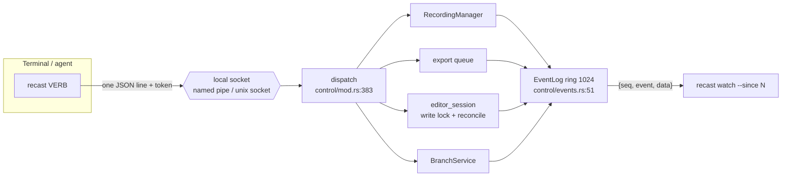

## Overview

One binary is both the GUI and the CLI. `main` looks at `argv[1]`, and a verb in
`CLI_VERBS` (`cli.rs:23`) takes the headless path; anything else opens a window.

Tauri's single-instance plugin forwards argv to a running app, but that channel
is one-way, so it cannot answer `recast project show`. A running app therefore
hosts a server on an OS local socket, `\\.\pipe\com.kanakkholwal.recast.cli.sock`
on Windows and a Unix socket elsewhere (`control/mod.rs:33`, via
`interprocess`). The protocol is one JSON request line in, one response line
out.

Auth is two layers. The socket or pipe ACL gates it to the same OS user; on top
of that `run_server` writes a random token to a 0600 file in the temp dir
(`token_path`, `control/mod.rs:37`) that the CLI reads and echoes in every
request. The token is defence in depth, not the boundary.

The target consumer is an agent: introspect, edit through the branch layer,
export, and follow what happened without polling.

## Diagram



## Key components

| Component | File:line | Responsibility |
|---|---|---|
| `CLI_VERBS` | `cli.rs:23` | The list `main` matches `argv[1]` against to stay headless. Hand-maintained, separate from clap |
| `Command` | `cli.rs:109` | The clap tree: `select`, `set`, `project`, `editor`, `branch`, `export`, `screenshot`, `transcribe`, `watch`, `mcp`, `install` |
| `run_server` | `control/mod.rs:103` | Binds the socket, writes the token, registers the event listeners **once** for the process |
| `dispatch` | `control/mod.rs:383` | `(app, method, params) -> Result<Value, String>`; arms stay thin and delegate to shared services |
| `EVENT_GROUPS` | `control/mod.rs:188` | One table mapping `rec`/`selection`/`profiles`/`editor`/`export` to event names; drives both the filter and the feed |
| `handle_watch` | `control/mod.rs:244` | Cursor replay, group filter, 15s keepalive, lagged frame |
| `EventLog` | `control/events.rs:51` | `Mutex<VecDeque<LoggedEvent>>` + `Condvar`, capacity `RING_CAPACITY` = 1024 |
| `EventLog::since` | `control/events.rs:101` | Returns `Replay { events, cursor, missed }` for a cursor and a name filter |
| `EventLog::wait_past` | `control/events.rs:123` | Blocks on the condvar until `seq > cursor` or the timeout fires |
| `classify_claim` | `commands/editor_session.rs:137` | `Vacant` / `Reentrant` / `Expired` / `Held`; only `Held` is a refusal |
| `EditorLockError` | `commands/editor_session.rs:115` | `thiserror`; the message names the holder, the age, and the remaining TTL |

## Control / data flow

Verbs split into reads and writes. Reads (`project show`, `selection`,
`export list`) take nothing. Writes take the editor write lock, edit, release.
An agent that wants several edits to land together uses the branch layer, which
never takes the lock at all.

The lock is a single slot with a TTL, and a claim is classified before it is
refused:

```rust
fn classify_claim(session: &EditorSession, writer_id: &str, now_ms: i64) -> Claim {
    if session.writer.is_none() { return Claim::Vacant; }
    if now_ms - session.last_activity_at_ms > EditorSession::TTL_MS { return Claim::Expired; }
    if session.writer_id == writer_id { return Claim::Reentrant; }
    Claim::Held
}
```

A refusal carries everything needed to act on it, which is why the message names
the escape hatch:

```text
editor_locked: project 'demo.recast' held by 'agent-7' (acquired 2140 ms ago);
use `recast project unlock --force` to reclaim or wait 60s for TTL.
```

**Streaming is a cursor, not a firehose.** Every frame is one JSON line:

| Frame | Meaning |
|---|---|
| `{"event":"watch.ready","data":{"events":[…],"cursor":N}}` | First frame; `cursor` is where this stream starts |
| `{"seq":N,"event":"…","data":{…}}` | An app event; `seq` is monotonic across all groups |
| `{"event":"watch.lagged","data":{"missed":N}}` | `--since` predates the ring; `N` events are gone |
| `{"event":"ping","cursor":N}` | 15s keepalive |

A client records the highest `seq` it processed and passes it back as `--since`
on reconnect. `seq` restarts at 1 when the app restarts, so a cursor larger than
the reported one means a restart, and the client must re-snapshot.

## Invariants & gotchas

- **`CLI_VERBS` is not derived from clap.** A subcommand present in the clap
  tree but missing from that list makes `main` open the GUI instead of running.
  This silently broke `recast branch`;
  `every_subcommand_routes_to_the_headless_cli` (`cli.rs:2074`) now walks the
  clap tree and asserts the list covers it.
- **One listener set, registered in `run_server`, not per connection.** Doing it
  per connection leaked N listeners per watch *and* made replay meaningless,
  because nothing was recorded while no client was attached. Registering for the
  process lifetime is exactly what lets `--since` replay across a disconnect.
- **The lock must be re-entrant.** Without the `writer_id` comparison, an
  agent's second edit inside the TTL is refused by its own earlier claim.
- **An unknown watch group matches nothing** rather than erroring, so a newer
  CLI against an older app degrades to silence instead of failing.
- **A lagged frame is not a hiccup.** The gap exceeded 1024 events, so the
  client must re-read state with `recast project show`; continuity is gone.
- **The single-instance mutex is keyed on the app identifier**, which is the
  same string in `tauri dev` and `tauri build`. Without a guard a developer's
  running iteration forwards its argv to the *installed* production app. The
  plugin is `#[cfg]`-gated out of dev builds; do not undo that without a
  replacement.

## Related

- [Agentic edits and MCP](/architecture/agentic-edits-mcp): the branch verbs
  this transport carries, and the MCP adapter over the same core.
- [IPC and the Tauri boundary](/architecture/ipc-tauri-boundary): the other
  boundary into the same services.
- [Recording pipeline](/architecture/recording-pipeline): what the recording
  verbs drive.
