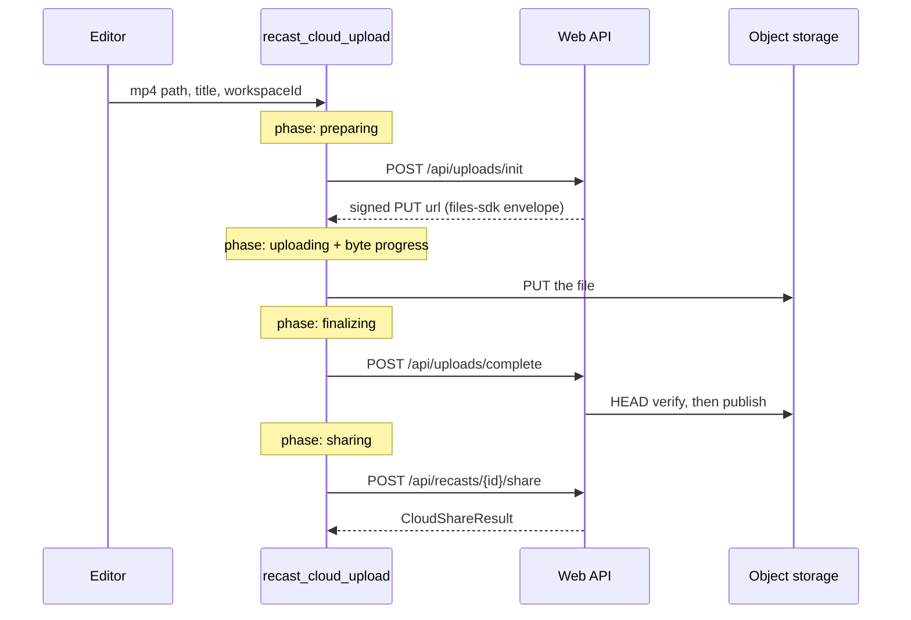
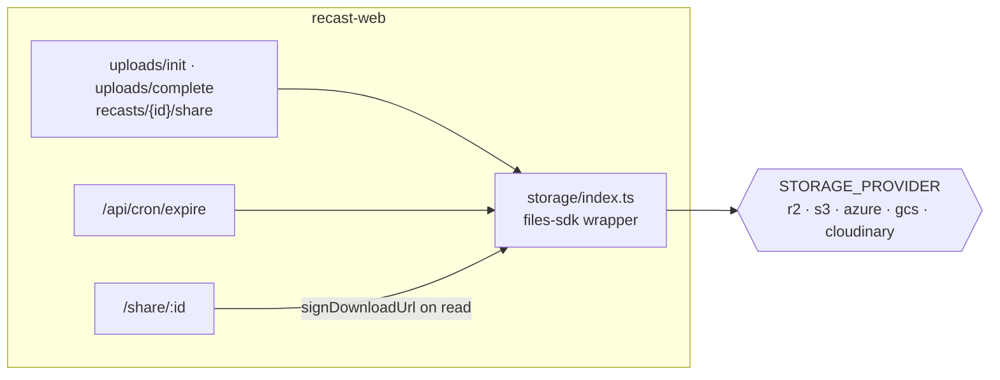

## Overview

Cloud is strictly additive. Recording, editing and export never touch it, never
require an account, and never require a network. The `.recast` on disk stays the
source of truth; the cloud holds a **derived MP4** and nothing else, which is
why losing a share loses nothing.

The split is deliberate: the frontend orchestrates the export, Rust does the
network, and the web app owns storage and delivery. The desktop never hands the
raw bearer token to the WebView; `commands/cloud.rs` reads it from the OS
keyring (`current_session_token`) inside the command.

Extensions live in the same document because they share a trust posture: content
arrives from outside the app, so it is **validated, not sandboxed**. That is
only defensible because a pack contains no executable code.

## Diagram





## Key components

| Component | File:line | Responsibility |
|---|---|---|
| `recast_cloud_upload` | `commands/cloud.rs:240` | The four-step flow; async command, streams progress on its own `Channel` |
| `CloudUploadEvent` | `commands/cloud.rs:166` | `Phase { phase }` and `Progress { bytes_sent, total_bytes }`; one channel per upload, so no path correlation is needed |
| `cloud_client` | `commands/cloud.rs:42` | 30s connect timeout, **no overall timeout** |
| `fail` | `commands/cloud.rs:182` | Returns the message *and* emits `recast-cloud:error`, so the promise and a detached notification both learn |
| `CloudUploadRecord` / `read_manifest` | `commands/cloud.rs:96,111` | Local record of what this machine has uploaded, keyed by local path |
| `recast_cloud_update_share` | `commands/cloud.rs:524` | Visibility and expiry changes after the fact |
| `Files` wrapper | `apps/web/src/lib/storage/index.ts` | Provider chosen by `STORAGE_PROVIDER`; the adapter is required dynamically so unused providers need no peer dep |
| `recastObjectKey` / `posterObjectKey` | `storage/index.ts:211,222` | The keys that get persisted |
| `signUploadUrl` / `signDownloadUrl` | `storage/index.ts:273,289` | Sign on write and on read; the row stores the key, never a URL |
| `statObject` | `storage/index.ts:302` | The HEAD that `uploads/complete` verifies with before publishing |
| `install_extension` | `commands/extensions.rs:256` | Fetch, validate, hash-verify, write `extension.lock.json` and `state.json` |
| `url_allowed` | `commands/extensions.rs:112` | HTTPS only; `http` allowed for `localhost`, `127.0.0.1`, `::1` |
| `validate_manifest` | `commands/extensions.rs:171` | `kind == "asset-pack"`, **empty `permissions`**, safe id, safe filenames |
| `RESERVED_NAMES` | `commands/extensions.rs:128` | The 22 Windows device names a pack filename may not be |
| `verify_signature` | `commands/extensions.rs:199` | Reserved seam for Ed25519 publisher signing; currently accepts |

## Control / data flow

**The upload client cannot share the auth client.** `auth.rs` uses a 15s overall
timeout, which is right for a token exchange and fatal for a 150 MB PUT on a
slow link. The upload client keeps a generous connect timeout and no overall
one:

```rust
reqwest::Client::builder()
    .user_agent(user_agent())
    .connect_timeout(Duration::from_secs(30))
    .build()
```

**Progress is a request-scoped channel, not a global event.** One `Channel` per
invocation means a second concurrent upload cannot be mistaken for the first,
so no path correlation is needed on the receiving side. The long, granular part
of the wait is the export that happens *before* this command, which reports on
its own `export-state`.

**Storage keys are persisted; URLs are signed on read.** Persisting a public CDN
URL is what made poster images start 404ing after a provider path changed. The
row holds `recastObjectKey(workspaceId, recastId)` and every read calls
`signDownloadUrl`. Swapping `STORAGE_PROVIDER` then changes no consumer code,
which matters because delivery, not storage, is the metered dimension in the
pricing model.

**An extension pack needs no render code.** The render boundary already accepts
absolute file paths for backgrounds and rasterized cursor sprites, so a pack is
an installer plus a registry entry. Packs land under
`<app_data>/extensions/<extId>/` with the resolved manifest as
`extension.lock.json` and an enable flag in `state.json`.

## Invariants & gotchas

- **Offline stays offline.** Nothing on the record, edit or export path may
  acquire a dependency on an account or the network. This is the product
  promise, not a preference.
- **Store keys, not URLs.** See above; this one has already cost us a bug.
- **A pack ships assets, never code.** `validate_manifest` rejects a non-empty
  `permissions` array outright, so an executable-plugin tier cannot blur into
  the asset-pack tier by accident. Trust is HTTPS plus per-asset SHA256 plus
  schema validation, with no isolation layer, and that is only sound while the
  no-code rule holds.
- **Filename validation is Windows-shaped.** A bare filename is required: no
  separators, no parent refs, no drive prefixes, no control characters, no
  trailing dot or space (Windows trims them), and nothing in `RESERVED_NAMES`.
- **Publisher signing is a seam, not a feature.** `verify_signature` exists and
  the manifest carries the field, but v1 accepts everything. Do not describe
  packs as signed.
- **Allowances are finite by design.** An unlimited tier makes a
  delivery-metered product impossible to reason about, so no plan carries an
  infinite limit.

## Related

- [Export pipeline](/architecture/export-pipeline): produces the file that gets
  uploaded.
- [State and the project format](/architecture/state-project-format): why the
  local bundle stays authoritative.
