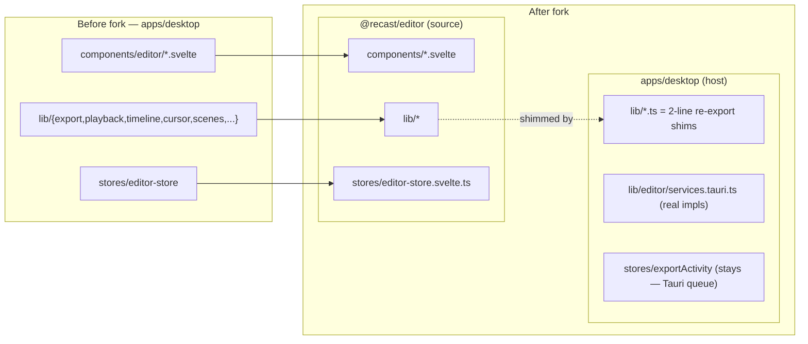
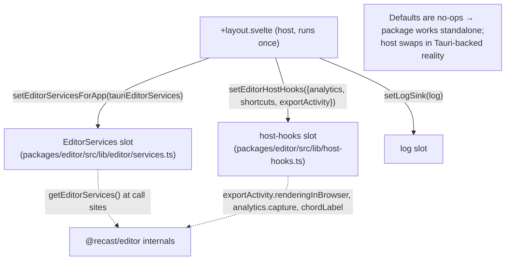

## Overview

The video-editor engine was extracted out of the desktop app into the **`@recast/editor`** package (commits `177f5aa2` → `45227f53` → `91cd4617` → `f903d018`, branch `web-editor`). The goal is a **reusable, Tauri-free editor** that both `recast-desktop` and `recast-web` can mount, with all platform-specific capability (native file I/O, the Rust export queue, analytics, shortcuts) supplied by the *host* at runtime rather than imported by the package.

The extraction moved **155 files** (~50k lines) out of `apps/desktop/src/{components/editor,lib/*}` into `packages/editor/src`. To avoid rewriting every `$lib/...` import across the app, most moved modules were left behind as **2-line re-export shims**; the editor route imports components directly from `@recast/editor`. Three new files were added to the desktop as the **host adapter seam**.

The package must never `import "@tauri-apps/..."` directly. Instead it declares two contracts — an **`EditorServices`** interface (imperative native calls) and **host-hooks** (analytics / shortcuts / export-render flag) — each with a no-op default. The desktop installs the real, Tauri-backed implementations at startup. This is the seam that keeps the package portable while the desktop stays fully native.

## Diagram

### What moved where

### The host seam (installed once at app startup)

## Key components

| Component | File | Responsibility |
|-----------|------|----------------|
| Editor engine | `packages/editor/src/**` | All editor UI + logic (Tauri-free), shipped as source via `exports` map |
| Package entry | `packages/editor/package.json` `exports` | Subpath exports point at `./src/...` (`svelte`/`types`/`default`) |
| Host wiring | `apps/desktop/src/routes/+layout.svelte:25-33` | Installs services + host-hooks + log sink once, app-scoped |
| Services contract | `packages/editor/src/lib/editor/services.ts` | `EditorServices` interface + `setEditorServicesForApp` / `getEditorServices` |
| Tauri services impl | `apps/desktop/src/lib/editor/services.tauri.ts` | Real Tauri/IPC implementations of every `EditorServices` member |
| Services injection point | `apps/desktop/src/lib/editor/services.ts` | Desktop-side adapter that installs `tauriEditorServices` |
| Host-hooks contract | `packages/editor/src/lib/host-hooks.ts` | `analytics`, `shortcuts`, `exportActivity.renderingInBrowser`; no-op defaults + `setEditorHostHooks` |
| Re-export shims | e.g. `apps/desktop/src/lib/export/browser-export.ts` | `export * from "@recast/editor/lib/export/browser-export"` — keeps old `$lib` import paths working |
| Store shim | `apps/desktop/src/lib/stores/editor-store.svelte.ts` | 2-line re-export of the package store (was ~3,400 lines) |
| Export queue (NOT forked) | `apps/desktop/src/lib/stores/exportActivity.svelte.ts` | Tauri-coupled export queue — stays in the host by design |
| Editor route | `apps/desktop/src/routes/editor/[file]/+page.svelte:36` | Imports editor components from `@recast/editor`; owns host-route logic |

## Control / data flow

1. **App boot** — `+layout.svelte` runs once and installs the three seams: `setEditorServicesForApp(tauriEditorServices)`, `setEditorHostHooks({ analytics, shortcuts, exportActivity })`, `setLogSink(log)`. Before this, the package's defaults are no-ops (so `recast-web`, or a test, still gets a working editor with those capabilities inert).
2. **Editor mount** — the route `editor/[file]/+page.svelte` imports `VideoPreview`, `Timeline`, `ExportPanel`, etc. from `@recast/editor` and mounts them. Component *props/callbacks* are still passed the normal Svelte way (the extraction left the host markup byte-identical).
3. **Native capability call** — inside the package, code that needs the filesystem / IPC / analysis calls `getEditorServices().<member>(...)`, which resolves to the installed `tauriEditorServices`. The package never touches `@tauri-apps` itself.
4. **Host-hook read** — the packaged `VideoPreview` reads `exportActivity.renderingInBrowser` (via host-hooks) to pause its decode loop during a browser export; `EditorToolbar` reads `chordLabel(id)` for shortcut labels.

## Invariants & gotchas

- **Edit the package, not the shim.** `apps/desktop/src/lib/**` editor modules are 2-line re-export shims or were deleted; the canonical source is `packages/editor/src`. Editing a shim edits dead code.
- **The package must not import `@tauri-apps` directly** — every native call goes through `EditorServices`; every optional host capability goes through host-hooks. A default no-op means the feature silently degrades, not crashes, when a host forgets to install it.
- **The export queue is host code and stays in the desktop.** `exportActivity.svelte.ts` calls `enqueueExport` (Tauri IPC) + Tauri event listeners; it cannot live in a Tauri-free package. It feeds the package only a thin `renderingInBrowser` flag through host-hooks.
- **`@recast/*` packages ship SOURCE** (`exports` → `./src`), so the consuming app compiles their `.svelte`/`.ts`. Two consequences bit real builds: source-shipping worker-spawning packages must be in Vite `optimizeDeps.exclude` **and** covered by `server.fs.allow` (see [04-media-decode-and-workers.md](/architecture/media-decode-workers)); and Rust tests that `include_str!` shared TS↔Rust parity fixtures had to be repointed into `packages/editor` (crate-root-anchored via `env!("CARGO_MANIFEST_DIR")`).
- **Green ≠ runtime-verified.** The fork type-checked, unit-tested, and bundled clean while three cross-boundary path references were runtime-broken (two Vite, one Rust) — all only surfaced by actually running the app / `cargo check --all-targets`.

## Related

- [07-ipc-and-tauri-boundary.md](/architecture/ipc-tauri-boundary) — the `EditorServices` contract + Tauri command surface behind it
- [04-media-decode-and-workers.md](/architecture/media-decode-workers) — the Vite worker gotcha the fork exposed
- [06-export-pipeline.md](/architecture/export-pipeline) — why `exportActivity` stays host-side
- [08-state-and-project-format.md](/architecture/state-project-format) — the editor store that moved into the package
