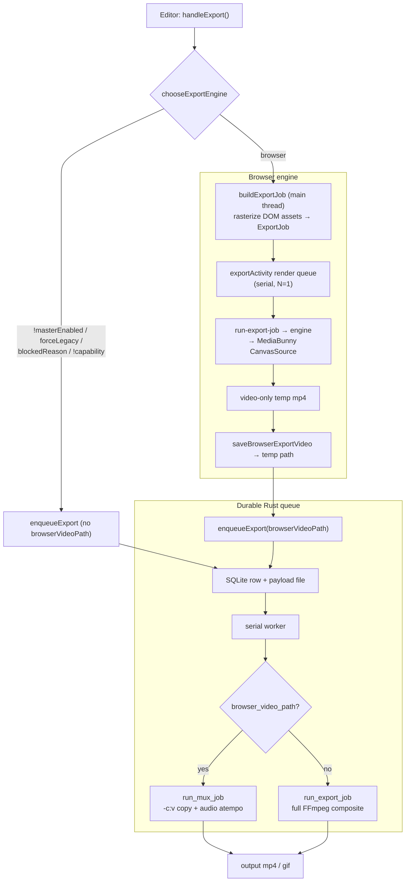
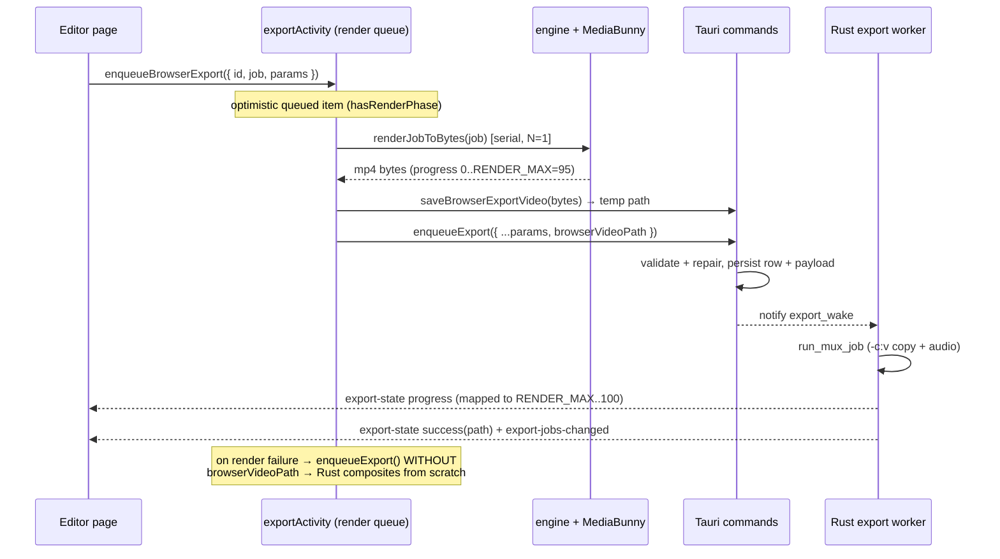

## Overview

Recast has **one compositor**. The browser renders every output frame through the
same wasm engine the live preview draws with and WebCodecs-encodes them to a
**video-only temp mp4**; Rust/FFmpeg then only **muxes** the processed audio in
with `-c:v copy`. Because a single renderer produces both preview and export,
the two can't visually diverge.

The same engine also runs **natively**, behind the `engineExport` flag
(`export_engine.rs`): no browser window, no resolution ceiling, and the encode
goes through `recast-codec-mf` and `recast-mux` rather than FFmpeg.

The legacy Rust/FFmpeg `filter_complex` compositor still exists and runs as the
**fallback**: chosen for the user rather than by them. It is selected when both
engine flags are off, or when a path is blocked, incapable, or fails mid-render,
and only for a project it can draw whole.

That fallback can no longer draw everything the engine can.
`unsupported_by_graph` (`commands/editor.rs`) names every such feature, not just
the first: camera layouts, pointer dodging, graphics components, a lit material,
a non-identity 3D transform, bindings and a composition. `route_for_graph_gaps`
sends a project with any of them to the native engine, at enqueue and again in
`run_export_job`, whatever the flags say; only `RECAST_ENGINE_EXPORT=0` refuses
instead, listing them. The graph cannot grow into this: its camera placement is
a sampled expression LUT already at `av_expr_parse`'s term budget, with no room
for a second moving rect.

Two independent serial queues cooperate:

- **App-scoped render queue** (`exportActivity.svelte.ts`): composites browser
  jobs one at a time in this window, so a render survives closing its editor and
  two encoders never contend for the GPU.
- **Durable Rust export queue** (`commands::export_queue`): a SQLite row + a
  payload file + a single serial worker thread. It owns every export's
  lifecycle, survives an app restart, and drives both the mux tail (browser
  path) and the full Rust composite (fallback path).

Engine selection (`chooseExportEngine`) is a pure resolver behind the
`browserExportBeta` experimental flag. Both it and `engineExport` are off by
default, so an untouched install composites in FFmpeg unless the project needs
the engine.

## Diagram

## Key components

| Component | File | Role |
| --- | --- | --- |
| `chooseExportEngine` | `packages/editor/src/lib/export/choose-export-engine.ts` | Pure resolver: browser vs rust, first-match precedence + telemetry reason |
| `browserExportBlockedReason` / `resolveExportFps` | `packages/editor/src/lib/export/browser-export-eligibility.ts` /  | Throughput gate (`SAFE_EXPORT_THROUGHPUT`) + effective export fps |
| `probeBrowserExportCapability` | `packages/editor/src/lib/export/export-capability.ts` | Cached WebCodecs H.264-encode probe |
| `buildExportJob` | `packages/editor/src/lib/export/build-export-job.ts` | **Producer** (main thread): snapshot scene, rasterize DOM assets → serializable `ExportJob` |
| `ExportJob` + bitmap helpers | `packages/editor/src/lib/export/export-job.ts` | Handoff contract; `collectTransferables` / `closeJobBitmaps` |
| `runExportJob` | `packages/editor/src/lib/export/run-export-job.ts` | **Consumer** (DOM-free): wire the job's assets to the renderer and drive it |
| `renderTimelineToVideo` | `packages/editor/src/lib/export/offscreen-export.ts` | Offline engine + WebCodecs loop → mp4 bytes |
| `videoEncodingConfigFor` | `packages/editor/src/lib/export/browser-export-plan.ts` | Quality-tier → MediaBunny `VideoEncodingConfig` |
| `runBrowserExport` / `renderToBytes` / `renderJobToBytes` | `packages/editor/src/lib/export/browser-export.ts` /  /  | Orchestrator + worker-vs-main-thread render + worker→main fallback |
| `exportActivity` store | `apps/desktop/src/lib/stores/exportActivity.svelte.ts` | App-scoped serial render queue + read-model over the Rust queue |
| `run_mux_job` / `mux_browser_gif` | `apps/desktop/src-tauri/src/commands/editor.rs` /  | `-c:v copy` + audio mux; 2-pass GIF palette on the browser video |
| `export_queue` commands + worker | `apps/desktop/src-tauri/src/commands/export_queue.rs` | Durable SQLite queue, serial worker, `save_browser_export_video`, reconcile/sweep |
| Rust composite fallback | `apps/desktop/src-tauri/src/commands/export/*.rs` | `run_export_job` full FFmpeg compositor (cuts/speed, captions, camera, blur, codec) |
| Native engine export | `apps/desktop/src-tauri/src/export_engine.rs` | The wgpu compositor plus `recast-codec-mf`/`recast-mux`, behind `engineExport` or for a project the graph cannot draw |
| Graph routing | `unsupported_by_graph` / `route_for_graph_gaps` in `apps/desktop/src-tauri/src/commands/editor.rs` | Names every feature the FFmpeg graph cannot draw and sends such a project to the engine |
| Host needs | `crates/recast-compositor/src/host_needs.rs` | `wanted_faces`, `wanted_images`, `fallback_face`: what a scene needs uploaded, read by the native export and, through wasm, the preview |
| Font resolver | `resolve_engine_font` in `apps/desktop/src-tauri/src/fonts.rs` | Installed face first, else the Google family; the preview calls it through `engine_font_bytes` |

## Control / data flow

### Browser export (the default path when eligible)

1. **Decide**: `handleExport` (editor `+page.svelte`) reads
   `browserExportBeta`, probes capability only if the flag is on, then calls
   `chooseExportEngine({ masterEnabled, blockedReason, capabilitySupported })`.
   First matching guard wins: disabled → `forceLegacy` → feature-blocked →
   capability, else `browser` (`choose-export-engine.ts`).
2. **Build render state**: `buildExportRenderState(store, { skipVisualRaster:
   engine === "browser" })` (`+page.svelte`); the browser engine composites
   visuals itself, so the Rust-side text→PNG / cursor pre-render is skipped.
3. **Build the job**: `buildExportJob` (`build-export-job.ts`) snapshots the
   scene and rasterizes every DOM-bound asset (background bitmap, cursor SVG
   sprites, annotation images, caption webfont) to transferable `ImageBitmap`s,
   then de-proxies each store-sourced field with `toStatic` (`$state.snapshot`).
   The result is plain data + bitmaps, zero closures.
4. **Enqueue render**: `exportActivity.enqueueBrowserExport`
   pushes an optimistic `queued` item (`hasRenderPhase: true`) and the job onto
   the app-scoped `renderQueue`, then `pumpRenderQueue` (`exportActivity`).
5. **Render**: `pumpRenderQueue` runs one job at a time via `renderJobToBytes`
   (`browser-export.ts`): worker when supported, else main thread; a worker
   failure retries the same job main-thread. `renderTimelineToVideo`
   (`offscreen-export.ts`) composites each output frame through the engine
   into a MediaBunny `CanvasSource` and WebCodecs-encodes to mp4. Render progress
   maps to `0..RENDER_MAX` (95).
6. **Persist**: `saveBrowserExportVideo(exact)` (`exportActivity` →
   `export_queue.rs`) writes the mp4 bytes to a temp file and returns its path.
7. **Enqueue mux**: `enqueueExport({ ...params, browserVideoPath, exportId })`
   (`exportActivity`) hands off to the durable Rust queue.
8. **Mux**: the worker sees `browser_video_path` and calls `run_mux_job`
   (`export_queue.rs` → `editor.rs`): input 0 is the browser video
   (`-c:v copy`, `editor.rs`); audio inputs (source/system/mic/music) are
   built, warped to the output timeline with `atempo`/cuts, AAC-encoded, and
   muxed. `+faststart`. The browser temp video is deleted on success
   (`editor.rs`). GIF instead runs `mux_browser_gif`, a 2-pass palette
   (`palettegen`→`paletteuse`) on the already-composited browser video, no audio.
9. **Report**: the worker emits `export-state` (progress mapped onto the
   `RENDER_MAX..100` tail, `exportActivity`) and `export-jobs-changed`;
   `finishFeedback` fires the success toast + telemetry once.

### Rust export (fallback)

Chosen when `chooseExportEngine` returns `rust`, **or** when a browser render
throws (GPU context loss on a long/heavy source): `pumpRenderQueue`'s catch
clears `hasRenderPhase` and calls `enqueueExport({ ...params, exportId })`
**without** `browserVideoPath` (`exportActivity`).

1. `enqueue_export` (`export_queue.rs`) probes source metadata, auto-repairs
   the render state (clamps stale `trim_end`), runs `validate_render_state`,
   then atomically writes the payload file + inserts a `queued` row and notifies
   `export_wake`. On the way in, `route_for_graph_gaps` switches a project the
   graph cannot draw to the engine, and with the engine off
   `undrawable_by_the_graph` refuses text the graph has no shaper for.
2. The serial worker (`spawn_export_worker`, own thread + current-thread
   runtime) claims the oldest queued row (`claim_next_queued`) and, seeing no
   `browser_video_path`, calls `run_export_job`. That routes again (a payload
   may have been queued before the rule) and runs the native engine when
   `engine_export` is set; otherwise the full FFmpeg `filter_complex`
   compositor under `commands/export/*.rs` (cuts/speed, burned captions, camera
   burn-in, blur, codec selection).
3. Success writes the output path + `success`; failure keeps the payload for
   retry; a "cancel"-containing error records `cancelled`.

## Invariants & gotchas

- **Producer/consumer split is load-bearing.** `build-export-job.ts` is the ONE
  place that touches the store/DOM; `run-export-job.ts` is intentionally
  DOM-free so it can move verbatim into a render worker. Don't reach into the
  store from the consumer.
- **`structuredClone` hazards.** Everything in `ExportJob` must be
  structured-cloneable or a transferable bitmap. Two specific traps:
  - Svelte `$state` proxies throw `DataCloneError` on `postMessage`, so every
    store-sourced field is run through `toStatic` (`$state.snapshot`) in the
    producer (`build-export-job.ts`). `staticAnnotation` snapshots around the
    bitmaps so it doesn't clone them.
  - MediaBunny's `Quality` is a **branded** object that doesn't survive
    `postMessage`. Only the plain `ExportQuality` **tier** rides in the job; the
    consumer rebuilds the encoder config with `videoEncodingConfigFor(job.quality)`
    (`run-export-job.ts`).
- **Context-loss handling.** A lost GL context turns uploads/draws into silent
  no-ops (a black-from-here mp4) and can strand `source.add` forever.
  `offscreen-export.ts` guards three ways: an `isContextLost()` check per frame
  , a `webglcontextlost` listener that rejects a `lostPromise` raced
  against the encoder awaits, and a one-time
  `unhandledrejection` guard swallowing MediaBunny's benign "closed codec"
  double-close. A layer-draw throw is caught per-layer so one bad
  annotation/caption frame doesn't abort (and silently fall back): it logs once
  and keeps rendering.
- **Decoder efficiency.** `sink.getSample(t)` builds a fresh `VideoDecoder` per
  call; the loop uses `samplesAtTimestamps` so each packet decodes at most once
  (`offscreen-export.ts`). Retaining a `VideoFrame` silently starves the
  decoder, every `toVideoFrame()` is `close()`d in a `finally`.
- **Throughput gate routes heavy sources to Rust.** `width*height*fps >
  SAFE_EXPORT_THROUGHPUT` (`1920*1080*60`) → `blockedReason` → Rust
  (`browser-export-eligibility.ts`). 1080p60 is the verified ceiling; 1080p120
  and 4K land on the reliable Rust compositor.
- **Browser-fail → Rust fallback is automatic and lossless to the user.** On a
  render throw (non-abort), `exportActivity` re-enqueues the same params without
  `browserVideoPath`; the Rust compositor rebuilds from scratch
  (`exportActivity`). The worker-vs-main-thread layer also self-heals: a
  worker failure rebuilds a fresh job (bitmaps were transferred away) and retries
  main-thread (`browser-export.ts`).
- **Anything new the engine draws goes into `unsupported_by_graph` in the same
  change, with a test.** Nothing else ties the two lists together, and one
  project would have lost seven components, a material and a 3D transform with
  no error. A value that draws nothing (an unlit material, an identity
  transform) is not counted.
- **Text is shaped by the engine or rasterised by the DOM, never a mix.**
  `engineCanShapeText` is all or none: the engine takes annotation text only when
  the export will use it and every face resolved; otherwise the editor
  rasterises every text annotation to an image before enqueue.
- **Queue durability.** The heavy `ExportRequest` payload is a file under
  `export_queue/<id>.json`; the SQLite row holds only metadata + that path.
  Enqueue is atomic (`write_atomic`). A job survives closing its editor (the
  render queue is app-scoped, the mux queue is backend-owned) and an app restart, `reconcile_on_load` flips orphaned `running` rows to `interrupted`
  (`export_queue.rs`); `sweep_stale_jobs` GCs terminal rows + orphan payloads
  . The render queue's own items are local-only until handoff, so
  `refreshList` preserves them across reconciles (`exportActivity`).
- **`-c:v copy` ⇒ the browser must render at source-composition resolution.** The
  mux never re-scales video, so the browser renders at the canvas/comp resolution
  the output needs; only the audio graph is (re)built server-side. The browser
  video is already warped to the output timeline, so `run_mux_job` applies
  cuts/speed to **audio only** (`editor.rs`).
- **Unified progress bar.** Browser render owns `0..RENDER_MAX` (95); the backend
  mux is the fast `RENDER_MAX..100` tail. `hasRenderPhase` is a local-only field
  carried across `refreshList` so the mapping and total-time telemetry stay
  correct (`exportActivity`).
- **`renderingInBrowser`** freezes the preview (it shares this GPU + decoder) so
  it stops fighting the export (`exportActivity`; `store.isPlaying = false`
  at `+page.svelte`).

## The native engine path

A third route, behind the `engineExport` experimental flag and taken on its own
for a project the FFmpeg graph cannot draw: the SAME compositor run natively in
Rust rather than in the preview window. `export_engine.rs`
drives `Session` -> `FrameLoop` -> a codec backend.

It exists because the browser route has a ceiling. Above 1080p60 the throughput
gate sends work to the FFmpeg compositor, and WebCodecs is not always present.
The native route has no ceiling and needs no browser, so the two together are a
ladder rather than a duplicate: preview-window export for ordinary sources, the
native engine for heavy ones.

- **One renderer, two runtimes.** `browserExportBeta` loads
  `recast_engine_webgpu.wasm`; `engineExport` links the same crates natively.
  Neither is the old TypeScript compositor, which is deleted.
- **Codec backends.** Media Foundation in process on Windows; elsewhere the
  bundled FFmpeg encodes frames piped to its stdin (`recast-export::ffmpeg`).
  Both are selectable at runtime, so the piped path is testable on the platform
  that has a native one.
- **RGBA becomes NV12 on the GPU** in a compute pass, byte-identical to the CPU
  encoder it replaced and about nine times faster at 1080p. A canvas whose width
  is not a multiple of four falls back to the CPU.
- **Only a Windows MP4 is finished in process.** Every other format and platform
  renders a video-only intermediate and hands it to `run_mux_job`, the same
  mux-only tail the preview-window route uses.
- **Every export logs what it did**: codec backend, pixel path, canvas, the
  source size a quality cap shrank from, audio and captions. Quote that line
  when an export looks wrong.
- **The flag has to survive every hop.** The desktop `enqueueExport` wrapper
  once rebuilt the request field by field and left `engineExport` out, so every
  editor export ran on FFmpeg until 0.4.7. It spreads the payload now, and
  `ipc.enqueue-export.test.ts` asserts every key `exportPayload` builds reaches
  `invoke`.
- **Fonts and images come from the scene.** `host_needs::wanted_faces` lists
  the faces of visible text annotations, of component text sampled across each
  component's life, and of composition text; `wanted_images` lists annotation
  and composition images. The export resolves each face with
  `resolve_engine_font` (installed first, else the Google family with
  `X Variable` read as `X`, downloaded once) and supplies `fallback_face`, the
  caption style, as the default.
- **Blank text is an error, not a result.** After the faces are supplied,
  `Session::unshapeable_faces` names any family still without one and the export
  fails with `EngineExportError::MissingFont`. That is not `Unsupported`, so it
  never falls back to the graph.
- **A decline does not fall back when the graph cannot draw the project.** An
  engine `Unsupported` or `Encode` error on such a project fails with both
  reasons. `RECAST_ENGINE_EXPORT=1` forces the engine on and `0` forces it off.

### Where contributors can take it

Deliberately incremental, and none of it blocks the rest of the pipeline:

- **VideoToolbox on macOS** behind the same `Sink`/`Pictures` seam, which would
  drop the FFmpeg encode pass and leave only the mux. The seam takes it with no
  further change.
- **Zero-copy on Windows**: render straight into a D3D11 shared texture for the
  Media Foundation encoder, skipping the readback entirely. Proven viable in
  `crates/spike-d3d11-wgpu`, which measures 0.170 ms a frame for the fence round
  trip on a hybrid-GPU laptop.
- **Retiring more FFmpeg spawns**: thumbnails, posters and the faststart remux
  still shell out. GIF (`palettegen`/`paletteuse`) and WebM (VP9, Opus) have no
  Rust replacement and are expected to keep using it.

## Related

- [preview-engine.md](/architecture/preview-engine): the one compositor that
  paints both preview and export frames.
- [media-decode-workers.md](/architecture/media-decode-workers): MediaBunny
  decode, `samplesAtTimestamps`, and worker ownership.
- [07-ipc-and-tauri-boundary.md](/architecture/ipc-tauri-boundary): the
  `export-state` / `export-jobs-changed` event streams, `AppError` boundary, and
  the raw-bytes `save_browser_export_video` invoke.
