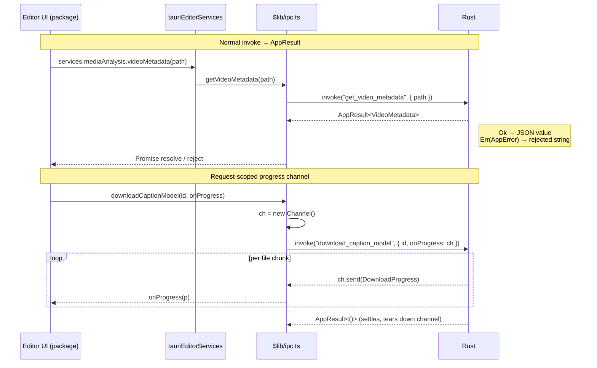
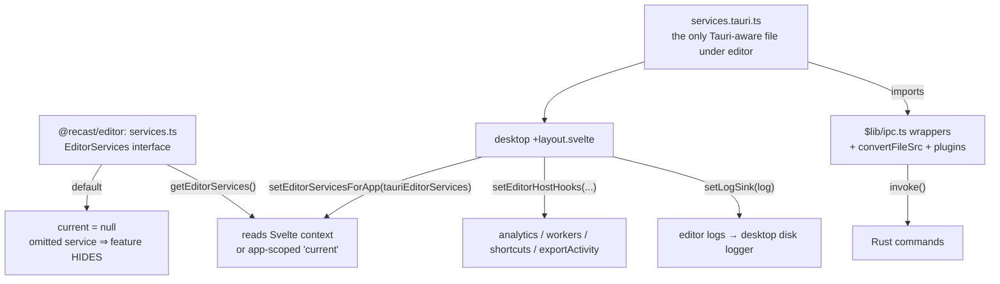

## Overview

The WebView frontend (`apps/desktop/src`) talks to the Rust core (`apps/desktop/src-tauri/src`) over Tauri's `invoke()` IPC. Two design rules shape this boundary:

1. **The desktop app owns all Tauri knowledge.** Every `invoke()` call, plugin import, and `convertFileSrc` lives in `apps/desktop/src/lib`. The frontend never scatters raw `invoke("some_command")` strings, they funnel through the typed wrappers in `$lib/ipc.ts`.
2. **The `@recast/editor` package is Tauri-free.** The package declares capability *interfaces* (`EditorServices`, host hooks, `LogSink`) with no-op or hidden defaults. The desktop host injects real Tauri-backed implementations at startup. The package never imports `@tauri-apps/*`, so the same editor tree runs on the web with a reduced feature set and zero platform conditionals.

The Rust side groups commands into modules under `commands/` (`assets`, `auth`, `cloud`, `editor`, `editor_session`, `export`, `export_queue`, `extensions`, `ffmpeg`, `files`, `gdrive`, `intent`, `profiles`, `recording`, `screenshot`, `system`, `types`), all registered in one `generate_handler!` list in `lib.rs`. Errors cross the boundary as `AppError` (`commands/error.rs`), which carries a machine `code` but currently serializes to a plain string for back-compat. Long-running commands stream progress on a request-scoped `ipc::Channel` rather than a global event.

## Diagram

## Key components

| Component | Path | Role |
| --- | --- | --- |
| Command modules | `src-tauri/src/commands/*.rs` | `#[tauri::command]` fns, grouped by domain; registered in `lib.rs` |
| `AppError` / `AppResult` | `commands/error.rs` | Typed IPC error (thiserror); `code` for branching, serializes to string for back-compat |
| `configure_silent_command` | `ffmpeg.rs` | Sets `CREATE_NO_WINDOW` so FFmpeg/ffprobe spawns never flash a console (Windows focus theft) |
| Typed invoke wrappers | `src/lib/ipc.ts` | One exported fn per command; the only place raw `invoke()` strings live |
| Wire types | `src/lib/ipc-types.ts` / `@recast/editor/lib/wire-types` | Request/response shapes, kept type-only to avoid ESM cycles |
| `EditorServices` | `packages/editor/src/lib/editor/services.ts` | Capability interface + `setEditorServicesForApp` / `getEditorServices` |
| `tauriEditorServices` | `src/lib/editor/services.tauri.ts` | Desktop impl; **only** file under the editor that imports `@tauri-apps` |
| Host hooks | `packages/editor/src/lib/host-hooks.ts` | `analytics`, `workers`, `shortcuts`, `exportActivity`, no-op defaults, host installs real ones |
| `LogSink` | `packages/editor/src/lib/log.ts` | Console default; `setLogSink` forwards to the desktop disk logger |
| Host install site | `src/routes/+layout.svelte` | Calls `setEditorServicesForApp`, `setEditorHostHooks`, `setAgentSessionDriver`, `setLogSink` |
| Asset protocol | `tauri.conf.json` (`assetProtocol`, scope `**`) | Serves local media files to the WebView via `convertFileSrc` |

## Control / data flow

### Normal invoke
A UI panel calls a method on the injected service, e.g. `services.mediaAnalysis.videoMetadata(path)`. `tauriEditorServices` (`services.tauri.ts`) forwards to `getVideoMetadata` in `$lib/ipc.ts`, which is a one-line `invoke<VideoMetadata>("get_video_metadata", { path })`. The Rust command returns `AppResult<T>`: `Ok` becomes the resolved JSON value; `Err(AppError)` rejects the promise with the error's string form. Args are camelCase on the JS side and mapped to the command's parameter names (Tauri handles snake/camel via serde renames).

### Request-scoped progress channel
For streaming work (downloads, transcription, OCR, cloud/gdrive uploads), the wrapper constructs a `new Channel<T>()`, wires `channel.onmessage = onProgress`, and passes it as a normal invoke argument (`downloadCaptionModel`, `ipc.ts`). The Rust command receives `on_progress: Channel<DownloadProgress>` (`transcription/mod.rs`) and calls `on_progress.send(...)` per tick. The channel is scoped to this one invocation, one channel per download, so callers never correlate ticks to an id, and it is torn down when the call settles. This replaced older global events like `captions:download-progress`. (Coarse, cross-cutting state instead uses broadcast events via `listen()`, e.g. `export-state`, `capture-intent:changed`.)

### Package reaching native capability through injection
The editor package cannot import Tauri. Instead:
- At startup, `+layout.svelte` calls `setEditorServicesForApp(tauriEditorServices)`, storing the impl in the module-scoped `current` fallback; the editor component additionally sets it into Svelte context (`setEditorServices`, `editor/[file]/+page.svelte`).
- Package code calls `getEditorServices()` (context first, then app-scoped `current`) and invokes methods on it. Panels gate on `services.x !== undefined`: an **omitted** service means the feature *hides*, never that it throws (`services.ts`).
- `resolveAssetUrl` is the media path: a stored file path is turned into a WebView-loadable URL through `convertFileSrc`, while `data:`/`blob:`/`http(s):`/`asset:` refs pass through untouched.
- Host hooks (`host-hooks.ts`) cover cross-cutting host concerns the editor must not *require*: analytics `capture`, host-owned `Worker` creation, shortcut chord labels/handlers, and `exportActivity.renderingInBrowser` (true while a browser export composites, so the preview pauses and the two don't fight the GPU). Defaults are no-ops (except `workers.create`, which throws loudly, a silently missing worker degrades to no decode).

## Invariants & gotchas

- **`AppError` serializes to a string for back-compat.** `commands/error.rs` serializes to `serializer.serialize_str(&self.to_string())` so existing frontend `String(err)` sites keep working. The type already carries a machine `code`; flipping the `Serialize` impl to `{code, message}` (plus a frontend invoke wrapper) is a single coordinated change once the command layer is fully migrated. Anyhow chains use `{:#}` Display to preserve the full `.context()` chain.
- **Sync Tauri commands freeze macOS.** A synchronous `#[tauri::command]` runs on the main thread, blocking the macOS WKWebView. Any heavy command MUST be `async` and offload CPU work with `tauri::async_runtime::spawn_blocking` (used across `commands/cloud.rs`, `editor.rs`, `export/`, `export_queue.rs`, `recording.rs`, `system.rs`).
- **The package must NEVER import `@tauri-apps` directly.** `services.tauri.ts` is the single Tauri-aware file *under the editor*, and it lives in `apps/desktop`, not the package. A `new URL(…, import.meta.url)` worker inside the package resolves outside the app root and only fails in dev, hence workers are host-owned via `WorkerHost` (`host-hooks.ts`).
- **The host installs everything in `+layout.svelte`.** Services, host hooks, agent-session driver, and log sink are installed app-scoped at layout init (`+layout.svelte`), before any editor component reads them. App-scoped (not just context) because the export queue and pure asset helpers run outside any editor component.
- **`convertFileSrc` + the asset protocol serve local media.** `assetProtocol` is enabled with scope `**` in `tauri.conf.json`; `convertFileSrc(path)` rewrites a filesystem path to an `asset:`/`tauri:` URL the sandboxed WebView can `fetch`/``/`<video>`. Never hand a raw disk path to the WebView.
- **FFmpeg spawns must be silent.** Every FFmpeg/ffprobe `Command` calls `configure_silent_command` (`ffmpeg.rs`) to set `CREATE_NO_WINDOW`; without it a console window flashes and steals focus on Windows ("window freeze"). Long-lived FFmpeg children additionally need their stderr drained (`StderrTail`, `ffmpeg.rs`) or the pipe fills and the encoder deadlocks.
- **Large binary payloads ride the invoke body, not JSON.** Export mp4 bytes are passed as a raw `ArrayBuffer` (`saveBrowserExportVideo`) so they ship as a binary body instead of a giant JSON number array. The camera preview runs the same trade in reverse: `start_camera_preview` takes an `ipc::Channel` and answers with `InvokeResponseBody::Raw` BGRA frames, downscaled first because capture-resolution frames are 110 MB/s at 720p30.

### Rules that hold the boundary

- **No `unwrap` or `expect` on a path reachable from a command.** The command
  layer returns `AppResult<T>`; there is no `catch_unwind` around a
  `#[tauri::command]`, so a panic there aborts the process.
- **Never hold a lock across `spawn_blocking` or an async filesystem call.**
  `parking_lot::Mutex` does not poison, so it is not a deadlock, but it can
  stall unrelated threads for as long as an FFmpeg spawn takes. Snapshot into a
  local, drop the guard, then do the slow work.
- **Windows WebView2 has a watchdog** that kills a process blocking the main
  thread for more than five seconds. A sync command, sync filesystem work inside
  a command, or a sync sleep in setup will trip it. This is the same rule as the
  macOS freeze, arriving as a kill rather than a hang.

## Related

- [02-editor-forking-and-host-seam.md](/architecture/editor-host-seam): the package/host split this boundary enforces
- [06-export-pipeline.md](/architecture/export-pipeline): export queue, `enqueue_export`, and `export-state` events
- [08-state-and-project-format.md](/architecture/state-project-format): project load/save commands and the `.recast` format
