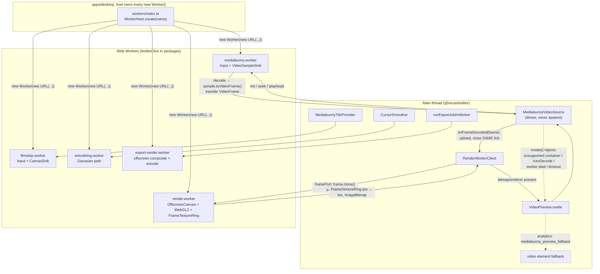
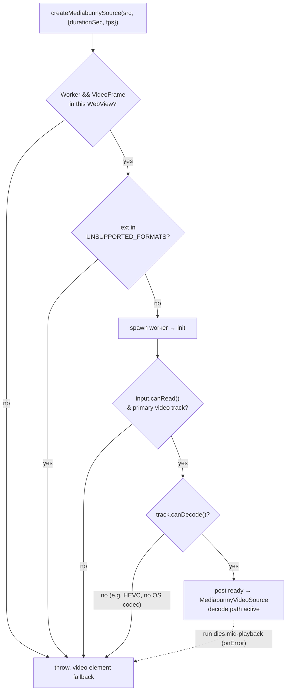

## Overview

The editor preview decodes video frame-accurately off the main thread with
[MediaBunny](https://mediabunny.dev) (WebCodecs under the hood), uploads each
decoded `VideoFrame` straight into a GPU texture, and closes the frame in the
same tick. Nothing on the main thread ever retains a decoded frame; that is the
load-bearing rule (`packages/media/src/playback/source.ts`,
`packages/editor/src/lib/playback/frame-textures.ts`).

Five Web Workers do the heavy lifting. They all follow one convention: **the host
app spawns the worker, the package supplies the worker body.** `@recast/editor`
and `@recast/media` ship SOURCE (their `exports` point at `./src`) and would spawn
workers via `new Worker(new URL("./x.worker", import.meta.url))`; a `new URL`
inside a package resolves against the package, not the app, and breaks in dev. So
each package exports a `startXWorker()` entry, and the desktop app owns every
`new Worker(...)` call (`apps/desktop/src/lib/workers/index.ts`,
`packages/editor/src/lib/host-hooks.ts`).

Decode is capability-gated. `MediabunnyVideoSource.create` rejects known-bad
containers up front and the worker calls `track.canDecode()` before committing;
any failure rejects, and `VideoPreview.svelte` falls back to a plain `<video>`
element (`packages/media/src/playback/source.ts`,
`packages/media/src/playback/worker.ts`,
`packages/editor/src/components/VideoPreview.svelte`).

## Diagram

### canDecode fallback decision

## Key components

| Component | File | Role |
|---|---|---|
| mediabunny decode worker | `packages/media/src/playback/worker.ts` | Owns `Input` + `VideoSampleSink`; a `seek` starts a forward-streaming decode run, `playhead` only releases backpressure; transfers `VideoFrame`s back |
| render worker | `packages/editor/src/lib/playback/render-worker.ts` | Off-thread WebGL2 compositor on its own `OffscreenCanvas`; holds the `FrameTextureRing`; composites and transfers an `ImageBitmap` back |
| filmstrip worker | `packages/editor/src/lib/timeline/filmstrip-worker.ts` | Range-streams the source via MediaBunny `CanvasSink` to decode clip-bar thumbnails + storyboard sprite |
| smoothing worker | `packages/editor/src/lib/cursor/smoothing-worker.ts` | Runs the O(N·window) Gaussian cursor-path pass off the UI thread |
| export-render worker | `packages/editor/src/lib/export/export-render.worker.ts` | One-shot: composites an `ExportJob` (bitmaps transferred) and returns encoded mp4 bytes |
| `FrameTextureRing` | `packages/editor/src/lib/playback/frame-textures.ts` | Ring of GPU textures; `put()` uploads a `VideoFrame` synchronously so the frame can close; `pickSlot`/`bind` choose the newest slot in `[floorUs, tUs]` |
| unsupported-formats list | `packages/media/src/cache/unsupported-formats.ts` | Curated container/codec gap (AVI, FLV, WMV/VC-1, RealVideo, 3GP); drives up-front rejection + PII-safe fallback telemetry tag |

Worker hosts: `apps/desktop/src/lib/workers/index.ts` (`workerHost`) is installed
via `setEditorHostHooks({ workers })` in `apps/desktop/src/routes/+layout.svelte`.
The no-op default throws loudly if a host installs nothing
(`packages/editor/src/lib/host-hooks.ts`).

## Control / data flow

### Decode path (steady state)

1. `VideoPreview` calls `createMediabunnySource(src, { durationSec, fps })`,
   passing ffprobe metadata so the worker skips `computeDuration()` /
   `computePacketStats()` (both O(file) on a fragmented MP4)
   (`packages/editor/src/lib/playback/mediabunny.ts`,
   `packages/media/src/playback/worker.ts`).
2. `create` guards `Worker`/`VideoFrame` availability, rejects unsupported
   containers via `isUnsupportedContainer(ext)`, then spawns the host worker and
   posts `init` (`packages/media/src/playback/source.ts`).
3. The worker builds `Input({ source: mediaRefSource(src), formats: ALL_FORMATS })`,
   asserts `canRead()` and a primary video track, then gates on `track.canDecode()`, parsing proves nothing (HEVC parses then throws on first decode). It picks
   `prefer-hardware` only when `VideoDecoder.isConfigSupported` confirms it, builds
   a `VideoSampleSink`, and posts `ready` with `{width,height,durationSec,fps}`
   (`packages/media/src/playback/worker.ts`).
4. Per rendered frame the source calls `advanceTo(sec)`: a real jump posts `seek`
   (rate-limited to ~20/s so a scrub doesn't build/tear ~60 decoders/s); steady
   playback posts `playhead` (backpressure only, never restarts decode)
.
5. `runFrom` iterates `sink.samples(startSec)`; for each `VideoSample` it calls
   `sample.toVideoFrame()`, closes the sample, and **transfers** the `VideoFrame`
   back keyed on its real presentation timestamp. It parks when more than
   `lookaheadSec` (a frame count derived from the texture ring, not a fixed
   duration) ahead of the playhead.
6. `#onMessage` hands the frame to `onFrameDecoded(frame, tsUs)` and closes it in
   a `finally`, same tick. The consumer (`VideoPreview`) forwards it to
   `RenderWorkerClient.putFrame` (which `clone()`s + transfers a copy over the
   frame `MessagePort`, since the source closes the original), or uploads directly
   into a main-thread `FrameTextureRing.put` when there is no render worker
   (`packages/media/src/playback/source.ts`,
   `packages/editor/src/components/VideoPreview.svelte`,
   `packages/editor/src/lib/playback/render-worker-client.ts`).
7. The render worker uploads into its own ring and composites (reusing the same
   `WebGL2Backend`+`RenderCore` as the on-screen path), then transfers an
   `ImageBitmap` the client presents via a `bitmaprenderer` (`alpha:false`)
   context, latest-wins mailbox so a slow frame never queues lag
   (`packages/editor/src/lib/playback/render-worker-client.ts`).

### `<video>` fallback

`create` rejects (unavailable APIs / unsupported container / unreadable input /
`!canDecode` / worker load failure / 30s init timeout), so
`VideoPreview.svelte`'s `.catch` disposes the dead ring, classifies the error with
`classifyMbError` (PII-safe enum; never the raw message), fires
`mediabunny_preview_fallback`, and the `<video>` element drives preview instead. A
run that dies *after* `create` resolved goes through `source.onError`: a transient
GPU reset gets a bounded auto-rebuild, a permanent codec failure falls back to
`<video>` (`packages/editor/src/components/VideoPreview.svelte`,,
`packages/editor/src/components/video-preview.logic.ts`).

## Invariants & gotchas

- **HIGHEST VALUE: the desktop Vite config must accommodate source-shipping
  worker packages (dev only; the prod build emits worker chunks fine):**
  - **`optimizeDeps.exclude` must list `@recast/editor` and `@recast/media`**
    (`apps/desktop/vite.config.ts`). If esbuild pre-bundles them, the
    `new URL("./x.worker", import.meta.url)` inside the package no longer resolves
    to a real emitted worker module → "worker script failed to load".
  - **`server.fs.allow` must cover the workspace root**, or the dev server refuses
    to serve a sibling package's worker source ("outside serving allow list").
    Note that `apps/desktop/vite.config.ts` does **not** set `server.fs.allow`
    explicitly: the `@sveltejs/kit/vite` plugin auto-allows the workspace root, so
    the requirement is satisfied implicitly. A non-SvelteKit host, or one that
    tightens `fs.allow`, must add it by hand. See
    [the host seam](/architecture/editor-host-seam).
- **Never retain a decoded `VideoFrame`.** A `VideoFrame` is one of the decoder's
  few output surfaces; holding a handful at 4K starves the pool and the decoder
  goes silent (accepts input, emits nothing) after a second or two. Setting
  `onFrameDecoded` switches off the frame cache on purpose; upload synchronously
  and close. If the source is disposed, an in-flight transferred frame is still
  closed on arrival (`packages/media/src/playback/source.ts`,
  `packages/editor/src/lib/playback/frame-textures.ts`).
- **Host-spawns-worker.** Packages export `startXWorker()` bodies; every
  `new Worker(new URL(...))` is a literal string in `apps/desktop/src/lib/workers/`
  so the bundler statically emits each chunk. `createWorker` / the `WorkerHost`
  hook keeps the URL resolving against the app root
  (`packages/media/src/playback/source.ts`,
  `apps/desktop/src/lib/workers/index.ts`).
- **`classifyMbError` buckets diverge on purpose**
  (`packages/editor/src/components/video-preview.logic.ts`):
  - `worker_failed`, "worker script failed to load" / "worker-died": a **build**
    problem (the Vite gotcha above), split out first so it doesn't masquerade as a
    codec issue and send devs chasing the user's video.
  - `unsupported`, message mentions "unavailable" / "worker" / "videoframe": the
    WebView lacks the API surface, not a codec limitation.
  - `codec_unsupported`, "codec" / "config" / "decoder": a **real** undecodable
    codec (e.g. HEVC on a Windows box without the extension), caught by
    `track.canDecode()`.
- **Post the real presentation timestamp, not the requested one.** The ring/cache
  key on `sample.timestamp` and read nearest-at-or-before; the `floorUs` argument
  is load-bearing: it stops a cut boundary from stepping the picture back into
  deleted content (`packages/media/src/playback/worker.ts`,
  `packages/editor/src/lib/playback/frame-textures.ts`).
- **Supersede before waking.** A decode run parked on backpressure only re-checks
  `runId` once woken; bumping `runId` *then* notifying prevents it re-parking and
  sitting on its `VideoDecoder` (`packages/media/src/playback/worker.ts`).
- **`texStorage2D` is immutable.** `FrameTextureRing.put` allocates sized storage
  once per slot; a resolution change deletes and re-creates the texture rather than
  re-`texImage2D`-ing every frame (which re-specified 33 MB per 4K frame)
  (`packages/editor/src/lib/playback/frame-textures.ts`).

### The cache cap is load-bearing

Every `VideoFrame` needs exactly one close path, and that path is LRU eviction
in the media cache plus the bulk clear and replace calls. This is not
hypothetical: the cache shipped with **no in-memory cap at all**. Nothing was
ever closed, and the disposal path deliberately kept frames. It survived three
reviews because the performance test asserting the cap never imported any
package code.

If you touch the cache, add a test that inserts past the cap and asserts the
frames were closed.

## Related

- [03-preview-and-rendercore.md](/architecture/preview-rendercore): the shared
  `WebGL2Backend`/`RenderCore` compositor the render + export workers reuse
- [05-timeline-model.md](/architecture/timeline-model): cuts/segments and the `floorUs`
  the decode path honors; filmstrip virtualization
- [06-export-pipeline.md](/architecture/export-pipeline): the export-render worker and why
  `exportActivity` stays host-side
