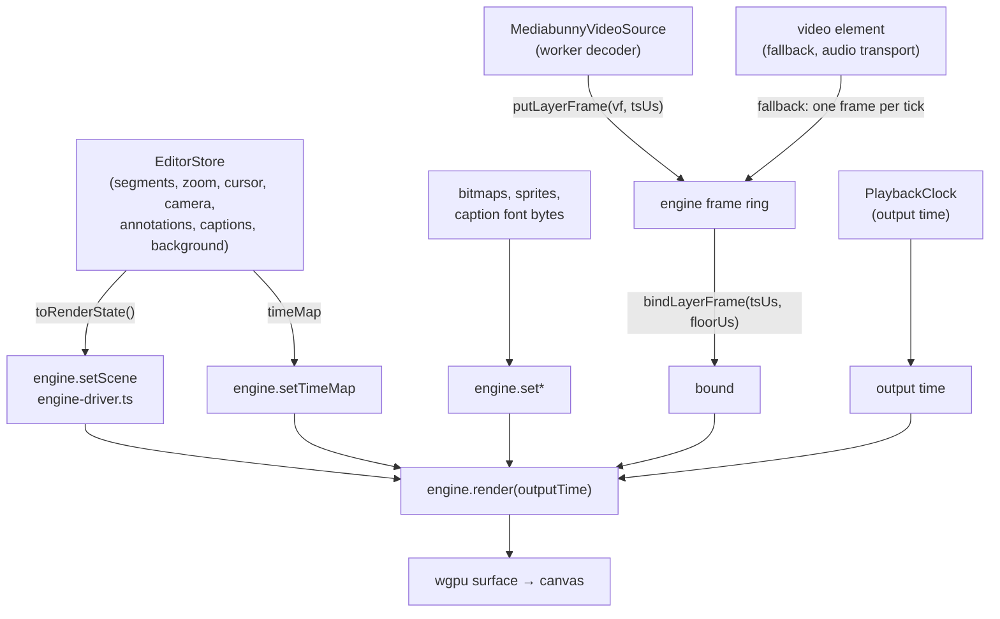
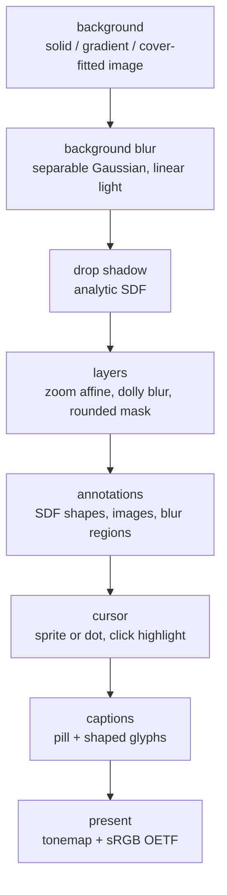

## Overview

There is **one compositor**: `recast-compositor`, a Rust crate over wgpu. It is
compiled twice, to wasm for the browser and natively for the desktop export, and
both builds run the same evaluator, the same WGSL and the same golden frames. A
visual bug is fixed once, and preview/export parity is structural rather than
something a test has to keep checking after the fact.

The host's job is deliberately small. It hands the engine a scene, a time map
and whatever assets wasm cannot fetch, then per frame it picks a decoded frame,
binds it, and asks for an output time. Everything below `setScene` (geometry,
zoom, animation, the drop shadow, the cursor, the camera bubble, annotations and
captions) is evaluated in Rust.

Two things are deliberately decoupled from the `<video>` element:

- **Picture time is a free-running clock, not `<video>.currentTime`.** A
  `<video>` element's `currentTime` stalls during its own seek, so borrowing it
  as the clock freezes the picture at every cut. `PlaybackClock` is a wall-clock
  integrator over gapless *output* time; the render loop samples it and asks the
  decoder for the matching frame (`clock.ts`, `VideoPreview.svelte`).
- **Frame pixels come from a decoder we own (MediaBunny), not the `<video>`
  element.** MediaBunny decodes into the engine's own frame ring; the `<video>`
  element is kept paused as a seek/audio transport and is the fallback when
  MediaBunny cannot demux or decode the file.

## Diagram

Draw path (store → engine → canvas):



Inside the engine, one frame is an ordered pass list
(`recast-compositor/src/render.rs`):



Composition happens in a linear-light `Rgba16Float` working texture and is
encoded to sRGB once, at the end. A source frame arriving as Y'CbCr is decoded
to linear in its own pass first (`recast-compositor/src/yuv.rs`), so no later
pass has to know about subsampling.

## Key components

| Component | File | Responsibility |
| --- | --- | --- |
| `VideoPreview.svelte` | `components/VideoPreview.svelte` | Owns the on-screen canvas, the rAF draw loop, the picture clock, AV-sync, the MediaBunny source lifecycle, and the `<video>` fallback. |
| `PreviewEngineDriver` | `lib/playback/engine-driver.ts` | Host-side handle: dedupes scene, cursor, sprite and asset uploads so an unchanged value never crosses into wasm. |
| `PreviewEngine` | `packages/engine/src/preview-engine.ts` | Typed wrapper over the wasm surface: backend probe, module load, marshalling, lifecycle. No render logic. |
| `recast-compositor` | `crates/recast-compositor/` | The frame graph, the pure scene-to-uniforms evaluator, and the WGSL passes. Native and wasm. |
| Component registry | `crates/recast-scene/src/component.rs` | Every vetted recipe: name, version, surface, typed parameters. First-party and in-repo; a document names one, it never carries code. |
| `recast-ffi-wasm` | `crates/recast-ffi-wasm/` | `wasm-bindgen` surface: frame ring, asset slots, scene JSON in, nothing else. |
| `PlaybackClock` | `lib/playback/clock.ts` | Wall-clock integrator over gapless output time; the picture master on the MediaBunny path. |
| `resolveAvSync` | `lib/playback/av-sync.ts` | Pure drift policy: audio is master, re-anchor the picture past 60 ms drift. |
| `renderTimelineToVideo` | `lib/export/offscreen-export.ts` | Offline export: drives the same engine on an `OffscreenCanvas` and WebCodecs-encodes to mp4. |
| `buildExportJob` | `lib/export/build-export-job.ts` | The only DOM-bound half of export: snapshots the scene and rasterises assets into a transferable job. |

## Control / data flow

**rAF draw loop (per frame).** `startVideoFrameLoop` drives `draw()` off
`requestAnimationFrame`, deliberately not the `<video>` element's
`requestVideoFrameCallback`: rVFC stalls during the seek issued at a cut, the
exact moment painting must continue. A bad frame is tolerated (logged once)
rather than killing the loop. When paused there is no loop; edits schedule a
single coalesced redraw via `requestRedraw`, and `stopVideoFrameLoop` paints
once on the way out so a mid-playback change is not stranded.

**How `playbackTime` derives** (`draw()`, `VideoPreview.svelte`):

- *MediaBunny + playing*: the picture clock is master. External scrubs re-seat
  the clock; audio drift is corrected via `resolveAvSync`; the end of the edited
  timeline asks the host (loop?) *before* stopping. `store.currentTime` is
  published at ~25 Hz, since an every-rAF fan-out starved frame delivery.
- *MediaBunny + paused*: the store owns time.
- *`<video>` fallback*: the element owns time, and `handleSeeked` re-anchors the
  picture clock so resuming continues from the scrub.

Note the two axes. The engine takes **output** time, because it evaluates the
scene and the scene is authored on the output timeline. The host uses
**original** time only to pick which decoded frame to bind. Binding also carries
a floor, the end of the most recent cut, so the picture can never step back
into removed content.

**How export reuses the engine** (`offscreen-export.ts`). Export creates a
`PreviewEngine` on an `OffscreenCanvas` in a worker, sets the same scene the
preview would, and for every output frame pulls a decoded sample
(`samplesAtTimestamps`, one decode per packet), binds it, renders, and reads the
canvas into a WebCodecs `CanvasSource`. The producer/consumer split is the only
structure left: `build-export-job.ts` touches the store and the DOM,
`run-export-job.ts` is pure and runs in the worker.

## Camera layouts

A clip can arrange the screen and the camera four ways beyond the floating
bubble: side by side, stacked, screen only, camera only. `recast-compositor`
resolves each to one struct, so a change between them is a lerp of a few values
rather than a second render target:

```rust
LayoutRects { screen, camera, screen_opacity, camera_opacity, camera_rounding }
```

`LayerParams` already carries `dest` and `opacity`, so this feeds the existing
card pass: no new shaders, and layouts place rects INSIDE the canvas without
touching canvas geometry. The screen **fits** its half, because cropping would
hide the edge of what is being demonstrated; the camera **covers** its own, as
the bubble already does.

Three rules are easy to get wrong and are each pinned by a test:

- **Two time axes.** A layout is anchored to its clip's ORIGINAL start, the same
  key `SegmentSpeed` and `SegmentAnim` use, so re-deriving segments
  re-associates by start. A transition is timed on the OUTPUT axis, because a
  cross-fade is what the viewer sees: reading the boundary on the original axis
  starts the move late by the length of every cut before it.
- **An anchor is resolved against the segments**, not against raw time. A cut
  that leaves a key on no clip drops it rather than applying it from its own
  timestamp, which is the rule the editor's timeline labels already used.
- **A hidden camera layer decides nothing.** `to_scene` marks the layer hidden
  rather than removing it, so the evaluator has to skip it or switching the
  camera off leaves a split reserving half an empty frame.

The bubble's rounding and shadow are not a boolean. `camera_rounding` blends
with the rects, so the camera rounds down as it grows into its half instead of
squaring its corners on the first frame of the move. The pointer and
annotations are anchored to the screen card, so they carry the screen's own
opacity and leave with it when a layout hides it.

Layouts and pointer dodging are engine-only. The FFmpeg graph places the camera
with a sampled expression LUT already at its parser's term budget, so it
refuses them by name rather than drawing something else. See
[Export pipeline](/architecture/export-pipeline).

## Components

A `<graphic>` or `<shader>` in the document is an instance of a **component**: a
name, a pinned `major.minor`, and typed parameters. The registry
(`recast-scene/src/component.rs`) holds the manifests; the recipes are arms of a
single `component.wgsl` compiled with everything else, so nothing is compiled at
render time and an unsupported feature is a build error rather than a black
frame.

A component may carry words as well as pixels: a title card and a lower third
draw their panel through the component pass and their text through the caption
pass, and a counter draws no panel at all. What holds the two halves together
is that the wipe envelope is computed once, on the CPU, and handed to the
shader; deriving it in both places is how a panel and its title drift apart.

Resolution is deliberate about versions. Patch and minor both move underneath a
pin, because a minor only adds parameters and an unset parameter takes its
declared default. A major difference, or a pin ahead of the registry, does not
render the recipe: it renders the placeholder, a hatched box in the instance's
own rect, and `check` says why. An instance never silently disappears.

The manifest's `surface` decides where an instance draws. An overlay recipe
covers the canvas; a screen recipe takes the screen card's rect, corner radius
and tilt, so a gloss stays on the card when the card is rotated. Time reaches a
recipe as progress through the instance's own window, not as timeline seconds.

`<vars>` is the other half. An attribute whose whole value is `$name` resolves
against the document's declared variables on the way into the engine, and only
on the way in: the file keeps the reference, so a variable survives every round
trip and the compositor never sees one.

## Lighting

A layer can carry a small material block: `contact` darkens the parts of a
tilted card that recede, `rim` lifts its edge. It is not a light model, and
there is no third term for a specular sweep because that is a component
(`sweep`), which composes and animates where a fixed lane would not.

Contact is the one term a component cannot provide, since only the card knows
its own depth. The card shader carries each corner's depth over the card's mean
as a vertex output, which is 1 on the flat path, so an untilted card is
untouched by construction. Absent means unlit, which is how every project made
before this renders.

## Fonts

A session holds a registry of faces, not one face. A key is a CSS family stack
plus a weight, and the first name is what gets matched, since the resolver takes
one name rather than a fallback list. Ids are handed out once per key and never
reused, because the glyph atlas keys on the face id: two families sharing one
would read each other's glyphs back.

A family that resolves to nothing, or an empty one, falls back to the face the
host supplied. In the browser nothing resolves at all, so the host's face is the
only one there is. That is why a composition item or a text component can name a
font and still draw on a machine that does not have it.

Text annotations are the exception: the engine does not draw them. They are
rendered by a DOM layer in the editor and reach an export pre-rasterised into an
image, which is what keeps the preview and the export showing the same pixels.

## Compositions

A document either edits a recording or composes a sequence, never both: the
validator refuses a file with a `<screen>` and a `<sequence>` in it. A
composition's items sit on the OUTPUT clock, since there is no recording to
measure against, and reading one sets the timeline's end to the composition's
own end so every clock downstream keeps working unchanged.

Items draw through passes that already existed. An image item produces the same
parameters an image annotation does, so the host resolves its source the way it
already resolves annotation images, and the shape carries a `fit` (cover,
contain, fill). A text item is shaped by the caption shaper into the caption
atlas and rides back in the caption frame, so a composition has one font: the
host's if it set one, else the caption style's.

That reuse has one consequence worth knowing: text draws in the caption pass
and images in the annotation pass, so a title is always above an image whatever
the document order says.

A dissolve is not a blend of one item into another. Each item has its own rise
and fall, capped at half its length so a short item still reaches full, and the
two simply overlap. Nothing has to know which one is leaving.

## Invariants & gotchas

- **Picture clock is master, not `<video>`.** On the MediaBunny path the gapless
  output clock drives the picture; the `<video>` element is a paused seek/audio
  transport that *follows*. Reading `videoEl.currentTime` as the clock
  reintroduces the cut-freeze bug.
- **The host draws nothing.** The preview once had four renderers (the engine, a
  WebGL2 render worker, main-thread WebGL2, and the `<video>` element) behind a
  flag. Three are gone. A flag whose other side nobody runs is not a fallback,
  it is an untested second implementation waiting to drift.
- **Export must preserve the drawing buffer on WebGL2.** `CanvasSource.add`
  captures the canvas synchronously, and a WebGL2 drawing buffer is cleared at
  the end of the task that drew it. The export creates the context itself with
  `preserveDrawingBuffer` so wgpu adopts it; WebGPU keeps its presented image by
  spec and needs nothing (`offscreen-export.ts`).
- **Suspend during browser export.** The play effect checks
  `exportActivity.renderingInBrowser` and suspends the continuous 60 fps decode
  loop while an in-browser export runs: that loop is what starved the export's
  shared GPU and decoder context. `isPlaying` is left untouched so playback
  auto-resumes; paused scrubs stay live.
- **The engine does not smooth the cursor.** It draws the track it is given, so
  the host must hand it the *smoothed* path. The export used to ship the raw
  samples, which put the recorded jitter back into the exported pointer while
  the preview looked fine.
- **Captions need font BYTES, not a `FontFace`.** The engine shapes with
  rustybuzz, which cannot read the woff2 the DOM loads. The host resolves a TTF
  natively and uploads it (`lib/fonts/engine-font.ts`); the font has to land
  before the track, because the layout measures glyphs.
- **Text annotations are rasterised before the scene reaches the engine.**
  Neither the engine nor Rust has a font rasteriser for arbitrary annotation
  text, so `expandTextAnnotations` substitutes an image annotation at
  composition resolution. This is the same substitution the native export does.
- **Zoom lives in more than one evaluator.** The wasm compositor, the native
  compositor and the Rust export graph must stay in lockstep; the compositor's
  golden frames are what hold them there.

## Related

- `media-decode-workers`, the MediaBunny source, the decoder pool, and worker
  ownership.
- `timeline-model`, segments, cuts, `timeMap`, and the output-to-original
  mapping.
- `export-pipeline`, the offline export job, audio warp and mux.
