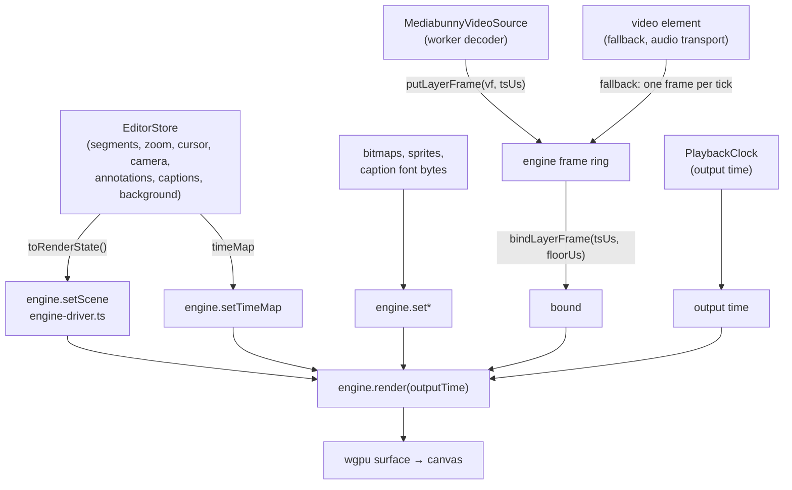
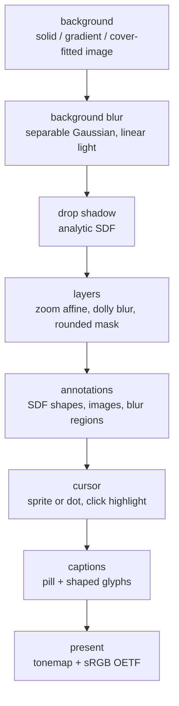

## Overview

There is **one compositor**: `recast-compositor`, a Rust crate over wgpu. It is
compiled twice, to wasm for the browser and natively for the desktop export, and
both builds run the same evaluator, the same WGSL and the same golden frames. A
visual bug is fixed once, and preview/export parity is structural rather than
something a test has to keep checking after the fact.

The host's job is deliberately small. It hands the engine a scene, a time map
and whatever assets wasm cannot fetch, then per frame it picks a decoded frame,
binds it, and asks for an output time. Everything below `setScene` — geometry,
zoom, animation, the drop shadow, the cursor, the camera bubble, annotations and
captions — is evaluated in Rust.

Two things are deliberately decoupled from the `<video>` element:

- **Picture time is a free-running clock, not `<video>.currentTime`.** A
  `<video>` element's `currentTime` stalls during its own seek, so borrowing it
  as the clock freezes the picture at every cut. `PlaybackClock` is a wall-clock
  integrator over gapless *output* time; the render loop samples it and asks the
  decoder for the matching frame (`clock.ts`, `VideoPreview.svelte`).
- **Frame pixels come from a decoder we own (MediaBunny), not the `<video>`
  element.** MediaBunny decodes into the engine's own frame ring; the `<video>`
  element is kept paused as a seek/audio transport and is the fallback when
  MediaBunny cannot demux or decode the file.

## Diagram

Draw path (store → engine → canvas):

Inside the engine, one frame is an ordered pass list
(`recast-compositor/src/render.rs`):

Composition happens in a linear-light `Rgba16Float` working texture and is
encoded to sRGB once, at the end. A source frame arriving as Y'CbCr is decoded
to linear in its own pass first (`recast-compositor/src/yuv.rs`), so no later
pass has to know about subsampling.

## Key components

| Component | File | Responsibility |
| --- | --- | --- |
| `VideoPreview.svelte` | `components/VideoPreview.svelte` | Owns the on-screen canvas, the rAF draw loop, the picture clock, AV-sync, the MediaBunny source lifecycle, and the `<video>` fallback. |
| `PreviewEngineDriver` | `lib/playback/engine-driver.ts` | Host-side handle: dedupes scene, cursor, sprite and asset uploads so an unchanged value never crosses into wasm. |
| `PreviewEngine` | `packages/engine/src/preview-engine.ts` | Typed wrapper over the wasm surface: backend probe, module load, marshalling, lifecycle. No render logic. |
| `recast-compositor` | `crates/recast-compositor/` | The frame graph, the pure scene-to-uniforms evaluator, and the WGSL passes. Native and wasm. |
| `recast-ffi-wasm` | `crates/recast-ffi-wasm/` | `wasm-bindgen` surface: frame ring, asset slots, scene JSON in, nothing else. |
| `PlaybackClock` | `lib/playback/clock.ts` | Wall-clock integrator over gapless output time; the picture master on the MediaBunny path. |
| `resolveAvSync` | `lib/playback/av-sync.ts` | Pure drift policy: audio is master, re-anchor the picture past 60 ms drift. |
| `renderTimelineToVideo` | `lib/export/offscreen-export.ts` | Offline export: drives the same engine on an `OffscreenCanvas` and WebCodecs-encodes to mp4. |
| `buildExportJob` | `lib/export/build-export-job.ts` | The only DOM-bound half of export: snapshots the scene and rasterises assets into a transferable job. |

## Control / data flow

**rAF draw loop (per frame).** `startVideoFrameLoop` drives `draw()` off
`requestAnimationFrame`, deliberately not the `<video>` element's
`requestVideoFrameCallback`: rVFC stalls during the seek issued at a cut, the
exact moment painting must continue. A bad frame is tolerated (logged once)
rather than killing the loop. When paused there is no loop; edits schedule a
single coalesced redraw via `requestRedraw`, and `stopVideoFrameLoop` paints
once on the way out so a mid-playback change is not stranded.

**How `playbackTime` derives** (`draw()`, `VideoPreview.svelte`):

- *MediaBunny + playing*: the picture clock is master. External scrubs re-seat
  the clock; audio drift is corrected via `resolveAvSync`; the end of the edited
  timeline asks the host (loop?) *before* stopping. `store.currentTime` is
  published at ~25 Hz, since an every-rAF fan-out starved frame delivery.
- *MediaBunny + paused*: the store owns time.
- *`<video>` fallback*: the element owns time, and `handleSeeked` re-anchors the
  picture clock so resuming continues from the scrub.

Note the two axes. The engine takes **output** time, because it evaluates the
scene and the scene is authored on the output timeline. The host uses
**original** time only to pick which decoded frame to bind. Binding also carries
a floor — the end of the most recent cut — so the picture can never step back
into removed content.

**How export reuses the engine** (`offscreen-export.ts`). Export creates a
`PreviewEngine` on an `OffscreenCanvas` in a worker, sets the same scene the
preview would, and for every output frame pulls a decoded sample
(`samplesAtTimestamps`, one decode per packet), binds it, renders, and reads the
canvas into a WebCodecs `CanvasSource`. The producer/consumer split is the only
structure left: `build-export-job.ts` touches the store and the DOM,
`run-export-job.ts` is pure and runs in the worker.

## Invariants & gotchas

- **Picture clock is master, not `<video>`.** On the MediaBunny path the gapless
  output clock drives the picture; the `<video>` element is a paused seek/audio
  transport that *follows*. Reading `videoEl.currentTime` as the clock
  reintroduces the cut-freeze bug.
- **The host draws nothing.** The preview once had four renderers (the engine, a
  WebGL2 render worker, main-thread WebGL2, and the `<video>` element) behind a
  flag. Three are gone. A flag whose other side nobody runs is not a fallback,
  it is an untested second implementation waiting to drift.
- **Export must preserve the drawing buffer on WebGL2.** `CanvasSource.add`
  captures the canvas synchronously, and a WebGL2 drawing buffer is cleared at
  the end of the task that drew it. The export creates the context itself with
  `preserveDrawingBuffer` so wgpu adopts it; WebGPU keeps its presented image by
  spec and needs nothing (`offscreen-export.ts`).
- **Suspend during browser export.** The play effect checks
  `exportActivity.renderingInBrowser` and suspends the continuous 60 fps decode
  loop while an in-browser export runs: that loop is what starved the export's
  shared GPU and decoder context. `isPlaying` is left untouched so playback
  auto-resumes; paused scrubs stay live.
- **The engine does not smooth the cursor.** It draws the track it is given, so
  the host must hand it the *smoothed* path. The export used to ship the raw
  samples, which put the recorded jitter back into the exported pointer while
  the preview looked fine.
- **Captions need font BYTES, not a `FontFace`.** The engine shapes with
  rustybuzz, which cannot read the woff2 the DOM loads. The host resolves a TTF
  natively and uploads it (`lib/fonts/engine-font.ts`); the font has to land
  before the track, because the layout measures glyphs.
- **Text annotations are rasterised before the scene reaches the engine.**
  Neither the engine nor Rust has a font rasteriser for arbitrary annotation
  text, so `expandTextAnnotations` substitutes an image annotation at
  composition resolution. This is the same substitution the native export does.
- **Zoom lives in more than one evaluator.** The wasm compositor, the native
  compositor and the Rust export graph must stay in lockstep; the compositor's
  golden frames are what hold them there.

## Related

- `media-decode-workers`, the MediaBunny source, the decoder pool, and worker
  ownership.
- `timeline-model`, segments, cuts, `timeMap`, and the output-to-original
  mapping.
- `export-pipeline`, the offline export job, audio warp and mux.
