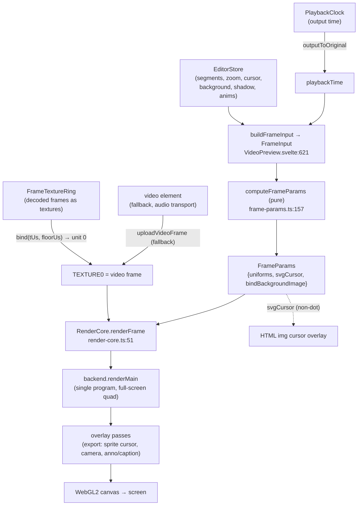
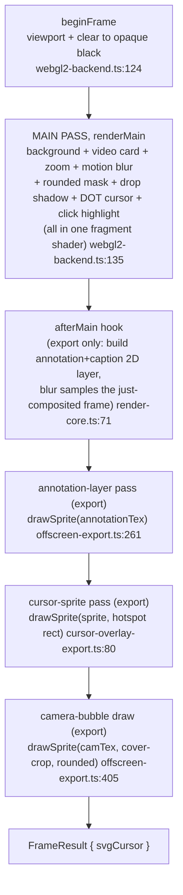

## Overview

The preview compositor draws exactly one output frame: it takes the editor
scene at a moment in time, evaluates it into a flat uniform set, and paints
`background → video card (zoom/blur/shadow/mask/dot-cursor) → overlay quads`
into a WebGL2 canvas. The same code path renders every frame the offline
export encodes. That is the load-bearing design choice: **there is one
compositor** (`RenderCore` over `WebGL2Backend`), so preview and export
cannot diverge, a visual bug is fixed once, and parity is structural rather
than tested after the fact.

Two things are deliberately decoupled:

- **Picture time is a free-running clock, not `<video>.currentTime`.** A
  `<video>` element's `currentTime` stalls during its own seek, so borrowing
  it as the clock freezes the picture at every cut. `PlaybackClock` is a
  wall-clock integrator over gapless *output* time; the render loop samples it
  and asks the decoder for the matching frame (`clock.ts`,
  `VideoPreview.svelte`).
- **Frame pixels come from a decoder we own (MediaBunny), not the `<video>`
  element.** MediaBunny decodes into a `FrameTextureRing` we sample; the
  `<video>` element is kept paused as a seek/audio transport and is the
  fallback when MediaBunny can't demux/decode the file
  (`VideoPreview.svelte`, `882-901`).

The pure scene→uniforms evaluator (`computeFrameParams`, `frame-params.ts`)
is DOM-free, GL-free and store-free, so it unit-tests in plain Node and is the
single definition shared by preview, the render worker, and export.

## Diagram

Draw path (store → FrameInput → RenderCore pass list → WebGL2 → canvas):

Ordered pass list (`RenderCore.applyFrameParams`, `render-core.ts`):

Preview registers **no** overlay passes, its pass array is empty. The dot
cursor and click highlight are drawn inside the main shader; the sprite cursor
and camera bubble are DOM overlays over the canvas. Export registers the pass
list, so the same overlays are folded into GL for pixel parity.

## Key components

| Component | File | Responsibility |
| --- | --- | --- |
| `VideoPreview.svelte` | `components/VideoPreview.svelte` | Owns the on-screen canvas, the rAF draw loop, the picture clock, AV-sync, MediaBunny source lifecycle, and the `<video>` fallback. |
| `draw()` | `VideoPreview.svelte` | Per-frame: derive `playbackTime`, pick/upload the frame texture, build `FrameInput`, call `RenderCore`. |
| `RenderCore` | `components/render-core.ts` | The one frame entry point: `computeFrameParams` → main pass → ordered overlay passes. Drives preview + export. |
| `WebGL2Backend` | `components/webgl2-backend.ts` | Owns the single compositor program + full-screen quad; `renderMain`, texture uploads, `drawSprite`. |
| `computeFrameParams` | `components/frame-params.ts` | Pure `(scene, geom, time) → FrameUniforms + svgCursor`. Mirrors the GLSL and the Rust export twin 1:1. |
| Compositor shader | `components/video-preview.shaders.ts` | Fragment shader: gradient, rounded-rect mask, zoom, motion blur, dot cursor, click highlight, drop shadow. |
| `OverlayQuad` | `components/overlay-quad.ts` | Textured-quad blitter (straight-alpha, rounded/circle mask) for export overlay passes. |
| `FrameTextureRing` | `lib/playback/frame-textures.ts` | Ring of GPU textures holding decoded frames; `bind(tUs, floorUs)` picks the newest in-segment frame. |
| `PlaybackClock` | `lib/playback/clock.ts` | Wall-clock integrator over gapless output time; the picture master on the MediaBunny path. |
| `resolveAvSync` | `lib/playback/av-sync.ts` | Pure drift policy: audio is master, re-anchor the picture past 60 ms drift. |
| `RenderWorkerClient` / `render-worker` | `lib/playback/render-worker-client.ts`, `render-worker.ts` | Phase-3 off-thread compositor: worker owns GL on its own `OffscreenCanvas`, transfers an `ImageBitmap` back, presented via `bitmaprenderer`. Same `WebGL2Backend`+`RenderCore`. |
| `renderTimelineToVideo` | `lib/export/offscreen-export.ts` | Offline export: composites every frame through `RenderCore` and WebCodecs-encodes to mp4. |
| `cursorOverlayFactory` | `lib/export/cursor-overlay-export.ts` | Export sprite-cursor pass, GL twin of the preview's DOM ``. |

## Control / data flow

**rAF draw loop (per frame).** `startVideoFrameLoop` drives `draw()` off
`requestAnimationFrame`, deliberately not the `<video>` element's
`requestVideoFrameCallback`, rVFC stalls during the seek issued at a cut, the
exact moment painting must continue (`VideoPreview.svelte`). A bad
frame is tolerated (logged once) rather than killing the loop. When paused,
there is no loop; edits schedule a single coalesced redraw via `requestRedraw`
, and `stopVideoFrameLoop` paints once on the
way out so a mid-playback change isn't stranded (`991-999`).

**How `playbackTime` derives** (`draw()`, `VideoPreview.svelte`):

- *MediaBunny + playing*, the picture clock is master. External scrubs
  re-seat the clock; audio drift is corrected via `resolveAvSync`; the end of
  the edited timeline asks the host (loop?) *before* stopping. `playbackTime =
  outputToOriginal(timeMap, picClock.time)`. `store.currentTime` is published
  at ~25 Hz (every-rAF fan-out starved frame delivery); the paused `<video>`
  is nudged to stay roughly aligned for a fallback handoff.
- *MediaBunny + paused*, the store owns time: `playbackTime = store.currentTime`.
- *Legacy `<video>` path*, the element owns time: `playbackTime =
  videoEl.currentTime`; `handleSeeked` re-anchors the picture clock so resuming
  continues from the scrub.

The frame texture is chosen separately from time: `mbSource.advanceTo(t)` then
`frameRing.bind(tUs, floorUs)`, where `floorUs` = end of the most recent cut,
so the picture never steps back into removed content
(`VideoPreview.svelte`, `frame-textures.ts`). If no in-segment frame
is ready yet, `bindLast()` holds the last displayed frame.

**Play/pause effect**. On the paused→playing
transition it seeds `picClock` (duration = output length of the kept region)
and starts the loop; a `!picClock.playing` guard stops incidental re-runs
(cuts/outPoint changes) from re-seeding the clock backward mid-playback (the
old ~8 fps reset-thrash bug). The `<video>` element is force-paused whenever
MediaBunny is live, so it never decodes a second copy competing for the
decoder's output surfaces.

**How export reuses RenderCore** (`offscreen-export.ts`). Export builds a
`WebGL2Backend` on an `OffscreenCanvas`, constructs `RenderCore` *with* the
overlay pass list (annotation layer, sprite cursor, camera), and for every
output frame calls `renderCore.renderFrame(frameInput, ctx, afterMain)`. It
pulls decoded frames deterministically (`samplesAtTimestamps`, one decode per
packet), uploads each to unit 0 via `backend.uploadFrame`, and reads the
composited canvas into a WebCodecs `CanvasSource`. Same `computeFrameParams`,
same shader, same uniforms, so what plays is what encodes. The `afterMain`
hook builds the annotation/caption 2D layer after the main pass so blur can
sample the just-composited frame (`render-core.ts`, `offscreen-export.ts`).

## Invariants & gotchas

- **Picture clock is master, not `<video>`.** On the MediaBunny path the
  gapless output clock drives the picture; the `<video>` element is a
  paused seek/audio transport that *follows*. Reading `videoEl.currentTime` as
  the clock reintroduces the cut-freeze bug (`clock.ts`,
  `VideoPreview.svelte`).
- **`preserveDrawingBuffer: false` on the on-screen canvas** (`VideoPreview.svelte`).
  An early return from `draw()` clears to black, so the last frame is
  re-rendered rather than left stale (guarded by `hasRenderedFrame`). Any
  cross-canvas read of the composite (blur mirror, `captureFrame`) must happen
  **in the same JS task** as `draw()`; an out-of-task `drawImage` samples a
  cleared buffer (`VideoPreview.svelte`, `1001-1042`). Export uses
  `preserveDrawingBuffer: true` since it reads back offline and perf is moot
  (`offscreen-export.ts`).
- **Suspend during browser export.** The play effect checks
  `exportActivity.renderingInBrowser` and suspends the continuous 60 fps decode
  loop while an in-browser export runs, that loop is what starved the export's
  shared GPU/decoder context. `isPlaying` is left untouched so playback
  auto-resumes; paused scrubs stay live.
- **The on-screen canvas is never `transferControlToOffscreen`-d.** The Phase-3
  render worker composites on its *own* `OffscreenCanvas` and hands back an
  `ImageBitmap` presented via a `bitmaprenderer` context; the main-thread
  canvas stays a normal canvas so the blur mirror can still read it back.
  Transferring control is one-shot/irreversible and would break that read, so
  it is deliberately avoided (`render-worker-client.ts`, `49`,
  `render-worker.ts`).
- **Zoom/cursor evaluator sync.** The cursor UV, click highlight, and SVG-cursor
  overlay all re-apply the *same* zoom affine as the video sampling, so the
  sprite tracks the dot pixel-for-pixel and the highlight lands on the zoomed
  click point (`frame-params.ts`, `shaders`). Zoom lives in
  four evaluators (preview shader, `frame-params`, export overlays, Rust) that
  must stay in lockstep; the shader and `computeFrameParams` explicitly mirror
  the Rust export rasteriser 1:1 (`frame-params.ts`, `shaders`).
- **Dot cursor is in the shader; every other cursor style is an overlay.**
  `computeFrameParams` sets `cursorVisible = 0` for non-dot styles and emits
  `svgCursor` instead (`frame-params.ts`); preview draws it as a DOM
  ``, export as a textured-quad pass. Keep the two placements identical.
- **Frame ring floor.** `bind(tUs, floorUs)` must reject frames before the
  current segment start, or the picture steps back into deleted content at each
  cut (`frame-textures.ts`). Textures use `texStorage2D` (immutable) +
  `texSubImage2D` to avoid reallocating storage per 4K frame.
- **MediaBunny↔`<video>` fallback is automatic and one-way per source.** A
  decode failure leaves `mbSource` null and `draw()` samples the `<video>`
  element; a *recoverable* GPU reset (TDR) triggers a bounded auto-rebuild, a
  permanent failure (unsupported codec) toasts once and stays on `<video>`
  (`VideoPreview.svelte`, `1197-1332`). Context loss makes every GL call
  a silent no-op, so the loss event is `preventDefault`-ed to request
  restoration, and the dead ring is dropped.

## Related

- `04-media-decode-and-workers.md`, MediaBunny source, decoder pool, the frame
  ring's decoder-starvation rationale, and worker ownership.
- `05-timeline-model.md`, segments, cuts, `timeMap`, and `outputToOriginal`
  that map the output clock to original media time.
- `06-export-pipeline.md`, the offline export job, audio warp/mux, and the Rust
  compositor twin the shader mirrors.
