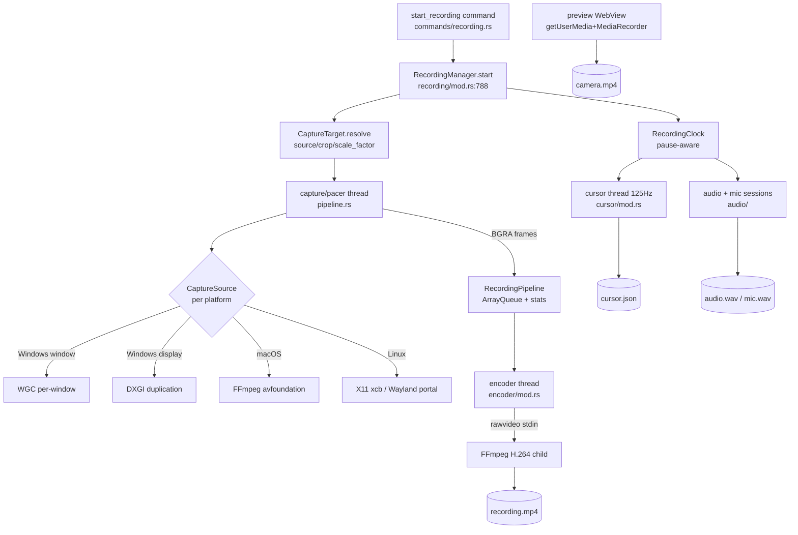
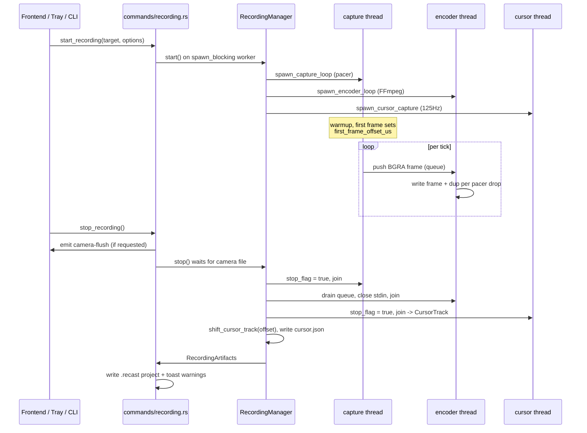

## Overview

The recording pipeline is the Rust backend that turns a screen/window/region
selection plus optional audio and camera into a set of on-disk artifacts the
editor later opens. It lives under `apps/desktop/src-tauri/src/` and is driven
from the `start_recording` / `stop_recording` Tauri commands
(`commands/recording.rs`). A single `RecordingManager`
(`recording/mod.rs:541`) owns at most one live `RecordingSession` at a time and
is stored in `AppState` behind an `Arc` so the blocking start/stop bodies can run
on `spawn_blocking` workers rather than the UI thread.

A session runs three joined threads plus separate OS capture sessions:
a **capture/pacer** thread (`recording/pipeline.rs`), an **encoder** thread
(`encoder/mod.rs`), and a **cursor** sampler thread (`cursor/mod.rs`). The
capture thread pulls raw BGRA frames from a platform `CaptureSource`
(`capture/`), paces them to a constant frame rate, and hands them to the encoder
thread through a bounded `ArrayQueue` (`RecordingPipeline`). The encoder pipes
those frames to a long-lived FFmpeg child for H.264 encoding. Audio (system
loopback + microphone) is captured by independent OS sessions (`audio/`). The
camera is *not* opened by Rust at all; it is recorded in a preview WebView via
`getUserMedia` → `MediaRecorder` and delivered to disk before stop.

The pipeline's central design constraint is **wall-clock ↔ video-PTS ↔
cursor-clock equality**: 1 real second of recording must equal 1 second of video
presentation time and 1 second of cursor-track time, so the editor's stylized
cursor, clicks, zoom triggers, and audio all stay in sync
(`recording/mod.rs:25-31`, `recording/pipeline.rs:105-131`). This drives the
count-based CFR pacer, the dropped-frame compensation in the encoder, and the
first-frame-offset re-basing of the cursor track.

All timing flows from a single pause-aware `RecordingClock`
(`recording/mod.rs:39`) whose `effective_elapsed()` excludes every paused
interval, keeping the video pacer, cursor sampler, and audio writers on one
gap-free timeline across pause/resume.

## Diagram

## Key components

| Component | File:line | Responsibility |
|---|---|---|
| `RecordingManager` | `recording/mod.rs:541` | Owns the single live session; `start`/`stop`/`pause`/`resume`; camera-ready gate; shutdown reaping |
| `RecordingSession` | `recording/mod.rs:635` | Handles for the 3 threads + audio/mic sessions, clock, paths, camera overlay tracker |
| `RecordingClock` | `recording/mod.rs:39` | Pause-aware wall clock; `effective_elapsed()` subtracts every paused interval |
| `CaptureTarget` / `resolve*` | `recording/mod.rs:121-424` | Resolves display/window/region to `source`+`crop`+`scale_factor` in physical pixels |
| `spawn_capture_loop` | `recording/pipeline.rs:132` | Count-based CFR pacer; drains `CaptureSource`, emits exactly `fps` frames/sec |
| `RecordingPipeline` | `recording/pipeline.rs:45` | Bounded `ArrayQueue<VideoFrame>` + captured/dropped/encoded stats |
| `spawn_encoder_loop` | `encoder/mod.rs:179` | Pipes BGRA rawvideo to FFmpeg H.264; dropped-frame duplication; GOP + quality tiers |
| `pump_stderr_tail` | `encoder/mod.rs:38` | Drains FFmpeg stderr on a side thread (deadlock avoidance, diagnostics tail) |
| `H264Encoder` / `codec_args` | `encoder/h264.rs` | Per-encoder (NVENC/AMF/QSV/VideoToolbox/libx264) FFmpeg arg generation |
| `CaptureSource` trait | `capture/mod.rs:13` | Platform-independent full-`source`-sized BGRA frame source; `set_target_fps` hint |
| Windows capture | `capture/platform/windows.rs` | WGC per-window (`WgcSource`), DXGI monitor duplication (`DxgiSource`), xcap fallback |
| macOS capture | `capture/platform/macos.rs` | Long-lived FFmpeg avfoundation child streaming BGRA to a reader thread |
| Linux capture | `capture/platform/linux_x11.rs`, `linux_wayland.rs` | xcb `GetImage` on root; xdg-desktop-portal + PipeWire on Wayland |
| `spawn_cursor_capture` | `cursor/mod.rs:191` | 125Hz deadline sampler; virtual-desktop→frame mapping; click tracking |
| `sample_cursor_state` | `cursor/platform/` | Win32 `GetCursorPos`/`GetCursorInfo`/`GetAsyncKeyState`; `device_query` on macOS/Linux |
| `shift_cursor_track` | `cursor/mod.rs:334` | Re-bases whole track earlier by `first_frame_offset_us` so cursor t=0 == video frame 0 |
| `detect_idle_periods` / `detect_zoom_triggers` | `cursor/smoothing.rs:23,471` | Post-capture idle windows (2s/5px) and scored auto-zoom candidates |
| Audio sessions | `audio/mod.rs`, `audio/platform/` | WASAPI loopback+mic (Windows); FFmpeg avfoundation/pulse + SCKit (macOS/Linux) |
| `write_camera_track` | `recording/mod.rs:1248` | Normalizes the WebView MediaRecorder blob (MP4/WebM) to plain H.264 MP4, atomic rename |
| `configure_silent_command` | `ffmpeg.rs:223` | `CREATE_NO_WINDOW` on every FFmpeg/ffprobe spawn (Windows console-flash / focus-steal) |

## Control / data flow

**Start** (`commands/recording.rs:28` → `recording/mod.rs:788`):

1. `start_recording` resolves the output dir and pushes the entire blocking body
   onto `spawn_blocking` (sync commands run on the UI thread; on macOS/Linux the
   WebView renders there, so inline work froze the window, `commands/recording.rs:37-45`).
2. On Wayland the xdg-desktop-portal dialog is negotiated up front and its stream
   stashed for the capture thread; the portal dimensions are authoritative
   (`commands/recording.rs:59-90`). Elsewhere `CaptureTarget::resolve[_region]`
   enumerates monitors/windows via xcap and computes `source`/`crop`.
   `apply_device_scale` lifts logical coords to physical pixels (macOS Retina;
   no-op at scale 1.0 on Windows/Linux, `recording/mod.rs:176`).
3. `RecordingManager::start` checks screen-recording permission (macOS TCC),
   resolves fps (`24..=240`, default 60) and quality tier, sizes the frame queue
   by a 256 MB BGRA budget clamped to 30-180 frames (`recording/mod.rs:842-847`),
   then spawns the capture, encoder, and cursor threads and starts the
   system-audio and microphone OS sessions (each gated by its option toggle).
   Camera is recorded intent only (`camera_requested`); `camera_ready` is reset.
4. On success the command acquires a power/wake hold and emits `recording:started`.

**Steady state**: the capture pacer emits exactly `fps` frames/sec, duplicating
the cached last frame when the source has no new pixels; the encoder writes each
frame to FFmpeg and re-emits one duplicate per pacer-dropped frame to keep
`encoded == captured`. The cursor thread samples at 125Hz off the pause-aware
clock. `pause()`/`resume()` (`recording/mod.rs:1201`) flip `pause_flag` and
freeze/unfreeze the clock; all producer threads skip work while paused.

**Stop** (`commands/recording.rs:128` → `recording/mod.rs:1055`):

1. If a camera was requested and the preview window exists, `stop_recording`
   emits `camera-flush`, then the worker waits (≤30s) on `wait_for_camera` for
   the MediaRecorder bytes to land (`finish_camera_flush` releases it early).
2. `RecordingManager::stop` sets `stop_flag`, joins all three threads, and stops
   the audio/mic sessions, **reaping everything before surfacing any error** so
   a failed thread never orphans an FFmpeg child or a held device
   (`recording/mod.rs:1062-1089`).
3. The captured `CursorTrack` is re-based by `first_frame_offset_us` via
   `shift_cursor_track`, then written atomically to `*.cursor.json`.
4. System audio resolves to the captured WAV or a generated silence WAV (so the
   muxer always has a track); mic/camera resolve by presence, pushing non-fatal
   warnings on failure. `RecordingArtifacts` is returned.
5. The command computes media duration from encoded-frame-count ÷ fps (not wall
   clock), writes the `.recast` project (media + metadata + default render
   state), releases the power hold, and toasts any warnings.

**Artifacts** (paths minted in `recording/mod.rs:825-830`):
`{stem}.recording.mp4` (H.264 video), `{stem}.cursor.json` (samples + clicks +
idle periods + zoom triggers), `{stem}.audio.wav` (system loopback or silence),
`{stem}.microphone.wav` (optional), `{stem}.camera.mp4` (optional, from the
WebView). These are then packaged into the `.recast` project by `write_project`.

## Invariants & gotchas

- **Count-based CFR is the sync backbone.** The encoder declares a fixed
  `-framerate` and feeds timestamp-less rawvideo, so every pushed frame is
  exactly 1/fps of video PTS regardless of capture wall-time. DXGI/WGC only
  deliver on desktop change (a static screen is <1 fps), so the pacer duplicates
  the cached frame to hit the rate; otherwise a 10s low-motion capture would
  encode as 1-2s and race the cursor track (`recording/pipeline.rs:105-131`).

- **Dropped-frame compensation preserves duration.** When the queue saturates
  (encoder behind capture), `RecordingPipeline::push` drops the overflow and
  counts it. The encoder re-emits one duplicate of the last frame per drop
  (bounded per iteration, residual flushed after the loop) so `encoded ==
  captured` and the video never plays back sped-up / desynced
  (`encoder/mod.rs:272-360`; unit-tested `total_emitted == captured`).

- **Cursor clock re-basing.** The cursor thread ticks from recording start, but
  video frame 0 is whatever the capture-source warmup produced first, i.e.
  video t=0 is wall-clock `first_frame_offset_us`, not 0. Without correction the
  whole cursor track (and clicks/highlights) runs ahead of the video by the
  warmup (~half a second). `stop()` subtracts the recorded offset via
  `shift_cursor_track`, saturating early samples to 0 (`recording/pipeline.rs:196-208`,
  `recording/mod.rs:1096-1097`, `cursor/mod.rs:323-351`).

- **Virtual-desktop → frame coordinate mapping.** `GetCursorPos` returns
  virtual-desktop coordinates; the video is frame-relative pixels. The cursor
  loop maps `raw * scale - origin`, records `visible=false` for samples outside
  the frame (secondary monitor / cropped region) so the editor hides the cursor
  cleanly rather than clamping it to an edge (`cursor/mod.rs:230-244`). The
  `scale` factor lifts macOS logical points into physical pixels (1.0 elsewhere).

- **Deadline scheduling everywhere, computed in integer ns.** Both the pacer
  (`tick_at`, `recording/pipeline.rs:161-163`) and the 125Hz cursor sampler
  (`cursor/mod.rs:284-295`) target absolute tick instants rather than sleeping a
  fixed period, and reset the baseline if they fall >1 period behind (no burst
  catch-up after a stall/pause). The pacer specifically uses `k*1e9/fps` ns to
  avoid the ~0.004%/s drift from truncating `1_000_000/fps` µs.

- **FFmpeg silent-spawn on Windows.** Every FFmpeg/ffprobe `Command` must call
  `configure_silent_command` before spawn, which sets `CREATE_NO_WINDOW`
  (`0x08000000`). Otherwise a console window flashes and steals focus on
  Windows, read by users as the app "freezing" (`ffmpeg.rs:223`).

- **FFmpeg stderr must be drained continuously.** The encoder's `pump_stderr_tail`
  runs on its own thread for the whole child lifetime. If stderr isn't read, the
  ~64KB OS pipe buffer fills on a long recording, FFmpeg blocks on its stderr
  write, stops reading stdin, and the encoder's `stdin.write_all` deadlocks, freezing capture mid-recording. macOS/Linux hit it sooner (smaller pipe
  buffers). The same reasoning applies to the macOS avfoundation capture child
  (`encoder/mod.rs:22-66`, `capture/platform/macos.rs:181`).

- **`CaptureSource` contract: emit full-`source`-sized frames; the encoder
  crops.** A backend must return `source`-dimensioned BGRA, never pre-cropped: the encoder is configured for `source` dims and applies its own crop filter.
  The X11 backend once pre-cropped, double-cropping and corrupting every
  region/window recording; there are regression tests pinning this
  (`capture/platform/linux_x11.rs:94-267`, `recording/mod.rs:1519-1537`).

- **WGC readback throttling.** Windows Graphics Capture delivers a frame per
  window repaint (well above encode rate); each GPU→CPU readback maps GPU memory
  (a GPU stall). `set_target_fps` sets a min-extract interval so surplus frames
  are drained-and-closed cheaply and only one is read back per interval
  (`capture/mod.rs:24-31`, `capture/platform/windows.rs:466-518`).

- **Camera is never opened by Rust.** Opening the webcam a second time via
  FFmpeg while the preview WebView already holds it fails on single-consumer
  devices. The track is recorded in the preview (`getUserMedia` → `MediaRecorder`),
  delivered via `save_recorded_camera` → `write_camera_track` (which sniffs
  MP4 vs WebM by magic bytes and stream-copies or transcodes to plain H.264 MP4
  with an atomic rename) *before* stop, and gated by the `camera_ready` flag
  (`recording/mod.rs:1012-1020`, `1145-1160`, `1248-1319`).

- **Shutdown reaping.** Quitting from the tray goes through `app.exit(0)` →
  `std::process::exit`, which runs no destructors. `abort_for_shutdown` must be
  called explicitly from the exit handler, and `Drop for RecordingManager` reaps
  a session left live by a panicking owner, otherwise the audio/mic/camera
  children keep running and hold the device (`recording/mod.rs:560-626`).

## Related

- [03-preview-and-rendercore.md](/architecture/preview-rendercore): how the editor
  previews `recording.mp4` and composites the stylized cursor / camera overlay
  from the sidecar tracks this pipeline writes.
- [05-timeline-model.md](/architecture/timeline-model): the render state and cursor /
  zoom-trigger model the recording feeds into.
- [06-export-pipeline.md](/architecture/export-pipeline): where the separate camera
  stream is composited and the final video is re-encoded.
