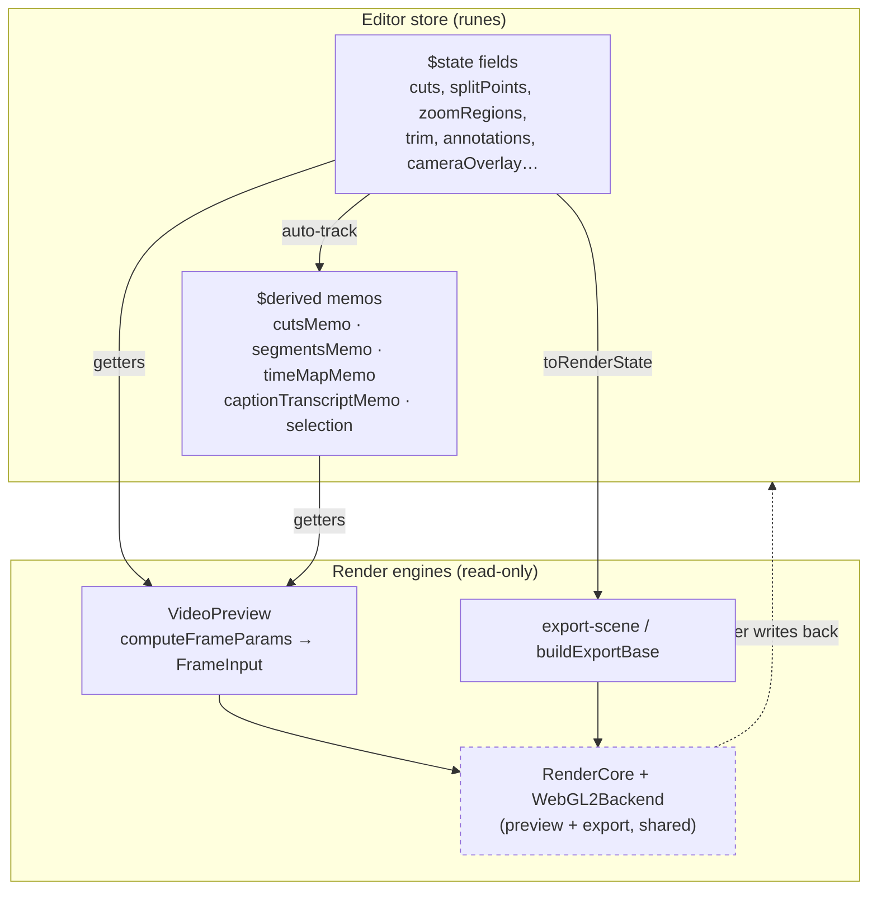
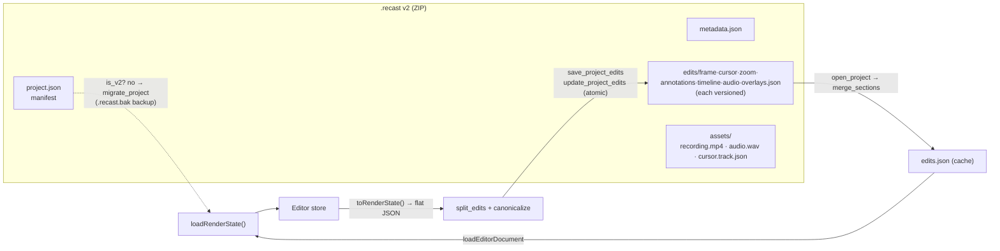

## Overview

The editor keeps its entire document in one reactive store, `createEditorStore()`
in `packages/editor/src/stores/editor-store.svelte.ts`, built on Svelte 5
runes. `$state`/`$state.raw` fields hold the raw document; `$derived`/`$derived.by`
memos compute everything downstream of it (kept segments, the output time-map, the
caption rescale, the current selection). Nothing outside the store writes those
fields except through the store's own methods.

State flows **one way**. The store is the single source of truth; the preview and
export engines *read* a snapshot of it (`FrameInput` params or an
`EditorRenderState`) and composite frames, but never write back into the store.
The document model itself is runes-free and Tauri-free; it lives in
`packages/editor/src/lib/editor/render-state.ts` (`EditorRenderState`, all its
types, defaults, and pure helpers) so the wire/IPC layer and unit tests can import
the shape without pulling in reactivity (`render-state.ts`).

Persistence crosses into Rust. `store.toRenderState()` serializes the document to a
flat camelCase JSON blob; Rust splits it into per-concern, versioned sections inside
a `.recast` ZIP (format **v2**: a `project.json` manifest + `edits/<section>.json`
files + `assets/` media). Reads fan the sections back into one `edits.json`;
`store.loadRenderState()` rehydrates the store. Legacy v1 bundles (single root
`edits.json`) are migrated in place behind a dialog. All writes are atomic
(temp-file + rename, never remove-before-rename).

## Diagram

## Key components

| Component | Location | Role |
|---|---|---|
| `createEditorStore()` | `editor-store.svelte.ts` | The reactive document store; returns getters/setters + methods |
| `$state`/`$state.raw` fields | `editor-store.svelte.ts`-`373` | Raw document state; `.raw` for replace-only large arrays (`transcript`, `thumbnailStrip`, `cursorSamplesRaw`, undo stacks ) |
| `captureSettings()` | `editor-store.svelte.ts` | The exact set of **undoable** fields; must stay in sync with `applySnapshot` |
| `pushUndoState` / `withoutUndo` / `pushUndoStateCoalesced` | , ,  | Undo history (`$state.raw` stacks, `$state.snapshot` clones, bound to 50); suppression + coalescing |
| `cutsMemo` / `segmentsMemo` / `timeMapMemo` / `renderMap` | , , ,  | Memoized cut→segment→time-map chain; exposed via `effectiveCuts`/`segments`/`timeMap` getters |
| `captionTranscriptMemo` |  | Transcript rescaled onto the video/time axis; every caption surface reads this |
| `annotationsByZOrdered` / `selection` | ,  | Memoized z-sorted overlay list; single exclusive selection |
| `toRenderState()` | `editor-store.svelte.ts` | Serialize store → `EditorRenderState` (de-proxied, orphan anchors pruned) |
| `loadRenderState()` | `editor-store.svelte.ts` | Rehydrate store from a (partial) `EditorRenderState`, applying `??` back-compat defaults; clears `isDirty`, sets `savedSnapshot` |
| `markSaved` / `revertToSaved` / `savedSnapshot` | , ,  | Dirty tracking + revert-to-disk baseline |
| `EditorRenderState` | `render-state.ts` | The persisted document shape (runes-free, Tauri-free) |
| `handleSave` / load / migration | `+page.svelte`, ,  | Desktop wiring: serialize→IPC→`markSaved`; load→`loadRenderState`; v1→migration dialog |
| IPC: `saveProjectEdits`/`autosaveProject`/`migrateProject` | `apps/desktop/src/lib/ipc.ts`, ,  | Tauri command wrappers; save returns saved-at unix ms |
| `format.rs` (sections, split/merge, canonicalize) | `apps/desktop/src-tauri/src/project/format.rs` | v2 layout, `section_for_key`, `split_edits`, `merge_sections`, `canonicalize`, `is_v2` |
| `writer.rs` (`write_project`, `update_project_edits`) | `project/writer.rs`,  | Atomic ZIP writes; edits-only rewrite raw-copies media |
| `reader.rs` (`open_project`) | `project/reader.rs` | Extract to temp cache, fan sections → `edits.json` |
| `mod.rs` (`is_legacy_project`, `migrate_project`) | `project/mod.rs`,  | v1 detection + in-place re-pack with `.recast.bak` |

## Control / data flow

### An edit updates the preview

1. A UI action calls a store method (e.g. `addCut`, `splitAt`, `updateZoomRegion`)
   or a setter. Mutating methods call `pushUndoState()` (or a coalesced/`withoutUndo`
   variant) and reassign a `$state` field with a fresh array/object, never
   index-mutate (`editor-store.svelte.ts`).
2. Reassigning a `$state` field invalidates every `$derived` memo that read it.
   The `cuts → cutsMemo → segmentsMemo → timeMapMemo` chain recomputes lazily on
   next read; the pure math (`deriveSegments`, `timeMapFromSegments`) is unchanged,
   only re-run when an input actually changed.
3. `VideoPreview.svelte` reads store getters (`timeMap`, `zoomRegions`,
   `cameraOverlay`, `captionTranscript`, …) inside its draw effect, builds a
   `FrameInput` via `computeFrameParams`, and hands it to `RenderCore`
   (`components/render-core.ts`, driven by the render worker). The scene evaluators
   (`lib/scenes/eval.ts`) are pure functions of that input, they hold no store
   reference, so the engine cannot mutate state. This is the one-way boundary.
4. Export takes the same path: `store.toRenderState()` → `buildExportBase` /
   `export-scene.ts` → the *same* `RenderCore`, so preview and export composite
   identically (`lib/export/export-scene.ts`).

### Loading a project

1. `loadEditorDocument(path)` (IPC) → Rust `open_project` extracts the ZIP to a
   per-path temp cache and, for v2, merges `edits/*.json` back into one flat
   `edits.json` (`reader.rs`). v1 bundles return `needs_migration=true`.
2. The desktop route resets the store, and if `document.needsMigration` is set it
   **stops** and shows the migration dialog instead of loading
   (`+page.svelte`). Otherwise it sets `metadata` then calls
   `store.loadRenderState(document.renderState)`.
3. `loadRenderState` copies each field into fresh state with `??` defaults for
   fields absent in older projects, sets `isDirty=false`, and snapshots
   `savedSnapshot` as the revert baseline.

### Saving a project

1. `handleSave` serializes `store.toRenderState()` to JSON and calls
   `saveProjectEdits(documentPath, editsJson)`.
2. Rust `save_project_edits` runs `update_project_edits` on a `spawn_blocking`
   thread, clears the autosave shadow, and returns the save timestamp
   (`commands/editor.rs`).
3. `update_project_edits` opens the existing v2 archive, **raw-copies** every
   non-`edits/` entry (manifest, metadata, media, no decode/re-encode), rewrites
   only the `edits/` sections (`split_edits` + `canonicalize`), writes to a
   `.recast.tmp`, and atomically renames over the original (`writer.rs`).
4. Back in JS, `store.markSaved(savedAt)` clears `isDirty`, records `lastSavedAt`,
   and refreshes `savedSnapshot`.

Autosave (`autosaveProject`, `analysis.ts`) writes the same `toRenderState()`
JSON to a separate recovery shadow, gated on `isDirty`.

## Invariants & gotchas

- **Only `$state` that affects output belongs in the reactive graph.** Fields read
  by the renderer are `$state`; transient/UI-only fields (`timeMode`,
  `isTrimming`, selection ids) are still `$state` but are deliberately excluded
  from `captureSettings`/`toRenderState` so they neither undo nor persist. Large
  replace-only arrays use `$state.raw` (`transcript`, `thumbnailStrip`,
  `cursorSamplesRaw`, undo stacks): deep-proxying tens of thousands of entries is
  pure overhead; only array identity needs reactivity.
- **One-way flow: the engine never mutates the store.** `RenderCore` / the WebGL2
  backend / scene evaluators are pure over `FrameInput`/`EditorRenderState` and hold
  no store reference. External seeks must go through `store.seek()` (moves playhead
  *and* transport), never `store.currentTime =` alone, which the next playback
  publish overwrites.
- **`$effect` that writes store state must `untrack` + `withoutUndo`.** A live-preview
  effect (e.g. previewing a preset as the cursor moves) writes through `withoutUndo`
  so it records no undo entry and does not flip `isDirty`; the committed change is
  made outside that scope (`withoutUndo`; live setters `setBackgroundLive`,
  `updateCameraOverlayLive`). Continuous gestures coalesce with
  `pushUndoStateCoalesced` so one drag is one undo.
- **`captureSettings` and `applySnapshot` must stay in lockstep.** Any undoable
  field left out of `captureSettings` silently survives an undo, the user
  sees unrelated edits revert while their tweak stays put. Camera overlay was once
  captured but not restored, which destroyed camera edits on undo (fixed at ).
- **Serialization is a boundary, not the store.** `toRenderState` de-proxies via
  spreads/maps and prunes orphaned segment-speed/anim anchors so sections diff
  cleanly. Export-only fields (`cursorSprite*`) are populated right before
  `enqueue_export` and are **never** persisted or read back by `loadRenderState`
  (`render-state.ts`). `loadRenderState` must default every optional field with
  `??` or an older project fails to load.
- **`.recast` v2 is sectioned + independently versioned.** `section_for_key`
  (`format.rs`) is a grouping table, not a type mirror; unrecognised keys fall
  back to `frame`, so a *future* editor toggle round-trips losslessly even before the
  table learns it (`RenderState` passthrough + the `futureKey` round-trip tests).
  Each `edits/<section>.json` carries its own `version` for per-section migration.
  Output is canonicalized (sorted keys, id-sorted arrays) so git diffs are minimal
  (`canonicalize`).
- **Atomic writes; never remove-before-rename.** Both `write_project` and
  `update_project_edits` write a `.recast.tmp`, `sync_all()`, then `fs::rename` over
  the original, which already replaces atomically. Deleting the original first
  opens a window where a crash loses the project outright (`writer.rs`,
  reader mirrors this for extracted assets at `reader.rs`).
- **Migration is dialog-gated and backed up.** `is_legacy_project` cheaply probes
  only the ZIP central directory for the absence of `project.json`
  (`mod.rs`). Loading a v1 project stops and prompts; the user confirms, then
  `migrate_project` re-packs to v2 in place after copying a one-time `.recast.bak`
  (recordings can be irreplaceable). A save refuses to run on a non-v2 archive, so
  it can never produce a hybrid v1/v2 bundle (`writer.rs`).

## Related

- `03-preview-and-rendercore.md`, the read-only consumer of store state (`FrameInput` → `RenderCore`).
- `05-timeline-model.md`, the cut/segment/time-map math the memos wrap.
- `06-export-pipeline.md`, `toRenderState` → shared `RenderCore` → encoder.
