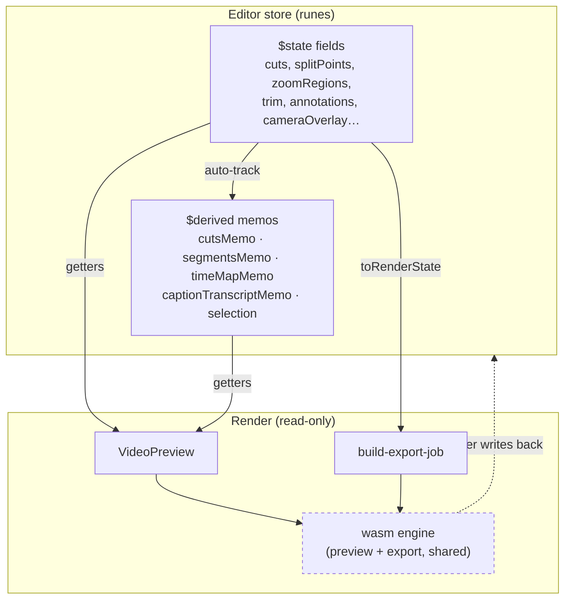
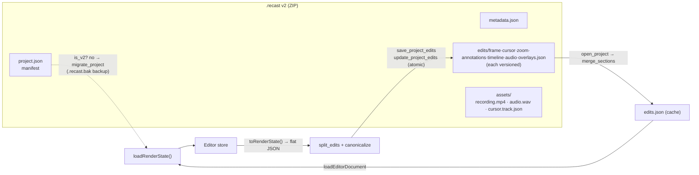

## Overview

The editor keeps its entire document in one reactive store, `createEditorStore()`
in `packages/editor/src/stores/editor-store.svelte.ts`, built on Svelte 5
runes. `$state`/`$state.raw` fields hold the raw document; `$derived`/`$derived.by`
memos compute everything downstream of it (kept segments, the output time-map, the
caption rescale, the current selection). Nothing outside the store writes those
fields except through the store's own methods.

State flows **one way**. The store is the single source of truth; the preview and
export engines *read* a snapshot of it (`FrameInput` params or an
`EditorRenderState`) and composite frames, but never write back into the store.
The document model itself is runes-free and Tauri-free; it lives in
`packages/editor/src/lib/editor/render-state.ts` (`EditorRenderState`, all its
types, defaults, and pure helpers) so the wire/IPC layer and unit tests can import
the shape without pulling in reactivity (`render-state.ts`).

Persistence crosses into Rust. `store.toRenderState()` serializes the document to a
flat camelCase JSON blob; Rust splits it into per-concern, versioned sections inside
a `.recast` ZIP (format **v2**: a `project.json` manifest + `edits/<section>.json`
files + `assets/` media). Reads fan the sections back into one `edits.json`;
`store.loadRenderState()` rehydrates the store. Legacy v1 bundles (single root
`edits.json`) are migrated in place behind a dialog. All writes are atomic
(temp-file + rename, never remove-before-rename).

## Diagram





## Key components

| Component | Location | Role |
|---|---|---|
| `createEditorStore()` | `editor-store.svelte.ts` | The reactive document store; returns getters/setters + methods |
| `$state`/`$state.raw` fields | `editor-store.svelte.ts`-`373` | Raw document state; `.raw` for replace-only large arrays (`transcript`, `thumbnailStrip`, `cursorSamplesRaw`, undo stacks ) |
| `captureSettings()` | `editor-store.svelte.ts` | The exact set of **undoable** fields; must stay in sync with `applySnapshot` |
| `pushUndoState` / `withoutUndo` / `pushUndoStateCoalesced` | , ,  | Undo history (`$state.raw` stacks, `$state.snapshot` clones, bound to 50); suppression + coalescing |
| `cutsMemo` / `segmentsMemo` / `timeMapMemo` / `renderMap` | , , ,  | Memoized cut→segment→time-map chain; exposed via `effectiveCuts`/`segments`/`timeMap` getters |
| `captionTranscriptMemo` |  | Transcript rescaled onto the video/time axis; every caption surface reads this |
| `annotationsByZOrdered` / `selection` | ,  | Memoized z-sorted overlay list; single exclusive selection |
| `toRenderState()` | `editor-store.svelte.ts` | Serialize store → `EditorRenderState` (de-proxied, orphan anchors pruned) |
| `loadRenderState()` | `editor-store.svelte.ts` | Rehydrate store from a (partial) `EditorRenderState`, applying `??` back-compat defaults; clears `isDirty`, sets `savedSnapshot` |
| `markSaved` / `revertToSaved` / `savedSnapshot` | , ,  | Dirty tracking + revert-to-disk baseline |
| `EditorRenderState` | `render-state.ts` | The persisted document shape (runes-free, Tauri-free) |
| `handleSave` / load / migration | `+page.svelte`, ,  | Desktop wiring: serialize→IPC→`markSaved`; load→`loadRenderState`; v1→migration dialog |
| IPC: `saveProjectEdits`/`autosaveProject`/`migrateProject` | `apps/desktop/src/lib/ipc.ts`, ,  | Tauri command wrappers; save returns saved-at unix ms |
| `format.rs` (sections, split/merge, canonicalize) | `apps/desktop/src-tauri/src/project/format.rs` | v2 layout, `section_for_key`, `split_edits`, `merge_sections`, `canonicalize`, `is_v2` |
| `writer.rs` (`write_project`, `update_project_edits`) | `project/writer.rs`,  | Atomic ZIP writes; edits-only rewrite raw-copies media |
| `reader.rs` (`open_project`) | `project/reader.rs` | Extract to temp cache, fan sections → `edits.json` |
| `mod.rs` (`is_legacy_project`, `migrate_project`) | `project/mod.rs`,  | v1 detection + in-place re-pack with `.recast.bak` |

## Control / data flow

### An edit updates the preview

1. A UI action calls a store method (e.g. `addCut`, `splitAt`, `updateZoomRegion`)
   or a setter. Mutating methods call `pushUndoState()` (or a coalesced/`withoutUndo`
   variant) and reassign a `$state` field with a fresh array/object, never
   index-mutate (`editor-store.svelte.ts`).
2. Reassigning a `$state` field invalidates every `$derived` memo that read it.
   The `cuts → cutsMemo → segmentsMemo → timeMapMemo` chain recomputes lazily on
   next read; the pure math (`deriveSegments`, `timeMapFromSegments`) is unchanged,
   only re-run when an input actually changed.
3. `VideoPreview.svelte` reads `store.toRenderState()` inside its scene effect
   and hands it to the engine, which evaluates it in Rust. The engine holds no
   store reference and cannot write back. This is the one-way boundary.
4. Export takes the same path: `store.toRenderState()` → `buildExportJob` → the
   *same* engine, so preview and export composite identically
   (`lib/export/build-export-job.ts`).

### Loading a project

1. `loadEditorDocument(path)` (IPC) → Rust `open_project` extracts the ZIP to a
   per-path temp cache and, for v2, merges `edits/*.json` back into one flat
   `edits.json` (`reader.rs`). v1 bundles return `needs_migration=true`.
2. The desktop route resets the store, and if `document.needsMigration` is set it
   **stops** and shows the migration dialog instead of loading
   (`+page.svelte`). Otherwise it sets `metadata` then calls
   `store.loadRenderState(document.renderState)`.
3. `loadRenderState` copies each field into fresh state with `??` defaults for
   fields absent in older projects, sets `isDirty=false`, and snapshots
   `savedSnapshot` as the revert baseline.

### Saving a project

1. `handleSave` serializes `store.toRenderState()` to JSON and calls
   `saveProjectEdits(documentPath, editsJson)`.
2. Rust `save_project_edits` runs `update_project_edits` on a `spawn_blocking`
   thread, clears the autosave shadow, and returns the save timestamp
   (`commands/editor.rs`).
3. `update_project_edits` opens the existing v2 archive, **raw-copies** every
   non-`edits/` entry (manifest, metadata, media, no decode/re-encode), rewrites
   only the `edits/` sections (`split_edits` + `canonicalize`), writes to a
   `.recast.tmp`, and atomically renames over the original (`writer.rs`).
4. Back in JS, `store.markSaved(savedAt)` clears `isDirty`, records `lastSavedAt`,
   and refreshes `savedSnapshot`.

Autosave (`autosaveProject`, `analysis.ts`) writes the same `toRenderState()`
JSON to a separate recovery shadow, gated on `isDirty`.

## The v3 folder project

Every recording is written as `Name.recast/`, a folder, and there is no setting
that says otherwise. A `.recast` file is the interchange form, not a save format:
it can be imported and exported, never saved back into.

```
Name.recast/
  project.rcx          the document: one markup file, ids, seconds, 0..1 fractions
  capture.json         the recorder's metadata, verbatim
  media/               recording.mp4, camera.mp4, mic.wav, system.wav, imported/
  tracks/              cursor.json, words.json (pointed at by <track src>)
  branches/            agent proposals
  .cache/              wal.log, store.json, edits.json, thumbs (never packaged)
```

`crates/recast-project` owns the format: the schema table, parser and
canonical serializer, validation, ops addressed by id or kind path, the diff
that turns two documents into an op batch, the one typed mapping
`Document <-> RenderState`, migration from v1 and v2 (the archive is kept as
`.bak`), pack and unpack for the interchange zip, and the store.

Import and export go through one door each. `import_project_archive` copies the
picked archive into the recordings folder and converts it there, so the file the
user chose is left alone; `migrate_project` converts an archive already in the
library in place. Both dispatch on what the archive is: a v1 or v2 bundle is
migrated, one written by `export_project_archive` is unpacked.
`export_project_archive` packs a folder into a single `.recast` and leaves the
folder as the project. `recast project pack` and `recast project unpack` are the
same two operations on the CLI.

**While the app runs, the core's in-memory document is the truth.** Every
write, the GUI's whole-state save included, becomes one sequenced op batch on
the owner (`project/documents.rs`): appended to `.cache/wal.log` with fsync,
then checkpointed into `project.rcx` 500 ms after the last batch, on blur,
and on exit. A crash loses at most the batch in flight; the WAL replays on
the next open. `doc.show`, `doc.apply`, `doc.since` and `doc.flush` expose
that copy on the control socket and as Tauri commands, with `expectSeq` so a
stale writer gets the ops it missed instead of a refusal.

**The webview holds a replica.** The engine's wasm compiles the same crate in,
so `packages/editor/src/lib/document/` can turn the store's state into an op
batch (`opsForState`), send it with `expectSeq`, and apply the answer with
the same code the core ran. Another writer's batch arrives as a
`document:changed` event, is pulled as ops, and lands in the store as one
undo step. Unsaved edits are mirrored first, so both sides merge; when both
wrote the same property the editor's value stands and a toast says so.

**The file is a writer too.** `project.rcx` is watched (`project/watch.rs`);
an outside edit is read back as ops against the last checkpoint, so edits
sequenced since are kept, our own checkpoint echoes back and is ignored, and
a file that does not parse is reported with its line and column rather than
loaded.

**Media is served through `recast-asset://`** (`asset_scheme.rs`): a
deny-first scope of app roots, the opened project, files the document names
and files the user picked; explicit MIME with `nosniff`; single-range reads
for seeking. The old asset protocol with `scope: ["**"]` is gone.

**Variables and components.** `<vars>` declares typed values that any
attribute references as `$name`; a reference resolves on the way into the
engine and never in the file, so a variable survives every round trip. The
Variables tab in the inspector edits the declarations, and appears only for a
project that has some. A `<graphic>` or `<shader>` names a registered component
and its parameters, never code. Both are read into the render state, so an
editor that has never seen the file still carries them through a save. See the
preview page for how they render.

**Lighting.** `<material contact rim rimWidth/>` on `<screen>` or `<camera>`
is a few numbers, not a light model. Absent means unlit.

**A composition instead of a recording.** `<sequence>` holds `` and
`<text>` items on the output clock, with a transition between neighbours. They
are the same elements annotations use, and the parent is what says which clock
they are on. A document does one or the other: the validator refuses a
`<sequence>` alongside a `<screen>`.

Bundles still open and save through the same store seam, so the editor did
not change; the folder adapter (`project/v3.rs`) derives `.cache/edits.json`
from the document on open and diffs the saved state back into ops. Agents
read the document with `recast_doc_show` and propose on branches; live apply
is a setting, see the agentic page.

## Invariants & gotchas

- **Only `$state` that affects output belongs in the reactive graph.** Fields read
  by the renderer are `$state`; transient/UI-only fields (`timeMode`,
  `isTrimming`, selection ids) are still `$state` but are deliberately excluded
  from `captureSettings`/`toRenderState` so they neither undo nor persist. Large
  replace-only arrays use `$state.raw` (`transcript`, `thumbnailStrip`,
  `cursorSamplesRaw`, undo stacks): deep-proxying tens of thousands of entries is
  pure overhead; only array identity needs reactivity.
- **One-way flow: the engine never mutates the store.** The compositor and its
  evaluator are pure over the scene and hold no store reference. External seeks must go through `store.seek()` (moves playhead
  *and* transport), never `store.currentTime =` alone, which the next playback
  publish overwrites.
- **`$effect` that writes store state must `untrack` + `withoutUndo`.** A live-preview
  effect (e.g. previewing a preset as the cursor moves) writes through `withoutUndo`
  so it records no undo entry and does not flip `isDirty`; the committed change is
  made outside that scope (`withoutUndo`; live setters `setBackgroundLive`,
  `updateCameraOverlayLive`). Continuous gestures coalesce with
  `pushUndoStateCoalesced` so one drag is one undo.
- **`captureSettings` and `applySnapshot` must stay in lockstep.** Any undoable
  field left out of `captureSettings` silently survives an undo, the user
  sees unrelated edits revert while their tweak stays put. Camera overlay was once
  captured but not restored, which destroyed camera edits on undo (fixed at ).
- **Serialization is a boundary, not the store.** `toRenderState` de-proxies via
  spreads/maps and prunes orphaned segment-speed/anim anchors so sections diff
  cleanly. Export-only fields (`cursorSprite*`) are populated right before
  `enqueue_export` and are **never** persisted or read back by `loadRenderState`
  (`render-state.ts`). `loadRenderState` must default every optional field with
  `??` or an older project fails to load.
- **`.recast` v2 is sectioned + independently versioned.** `section_for_key`
  (`format.rs`) is a grouping table, not a type mirror; unrecognised keys fall
  back to `frame`, so a *future* editor toggle round-trips losslessly even before the
  table learns it (`RenderState` passthrough + the `futureKey` round-trip tests).
  Each `edits/<section>.json` carries its own `version` for per-section migration.
  Output is canonicalized (sorted keys, id-sorted arrays) so git diffs are minimal
  (`canonicalize`).
- **Atomic writes; never remove-before-rename.** `update_project_edits` writes a
  `.recast.tmp`, `sync_all()`, then `fs::rename` over the original, which already
  replaces atomically. Deleting the original first opens a window where a crash
  loses the project outright (`writer.rs`, and the reader mirrors this for
  extracted assets at `reader.rs`). Packing and unpacking stage beside the target
  and swap for the same reason (`package.rs`, `v3.rs`).
- **Conversion is dialog-gated and backed up.** An opened archive reports
  `needs_migration`, the user confirms, and the archive is kept as a one-time
  `.recast.bak` (recordings can be irreplaceable). Nothing writes a v2 bundle any
  more: `writer::write_project` is `#[cfg(test)]`, kept only to fixture the reader.

- **v3 never trusts the file while the app runs.** Reads through the tool,
  not the disk: the file is a checkpoint up to half a second behind. Two GUI
  instances on one folder are not supported; the second is read-only, as with
  bundles.
- **Migration to v3 never refuses an editor-written value.** A zoom past the
  slider's cap in an old bundle migrates and is reported, not rejected; the
  store likewise refuses only errors a batch introduces, so one legacy value
  cannot block every later edit.

## Related

- [agentic-edits-mcp.md](/architecture/agentic-edits-mcp), branches, the live document verbs and the gated live apply.
- [preview-engine.md](/architecture/preview-engine), the read-only consumer of store state.
- [timeline-model.md](/architecture/timeline-model), the cut/segment/time-map math the memos wrap.
- [export-pipeline.md](/architecture/export-pipeline), `toRenderState` → the same engine → encoder.
