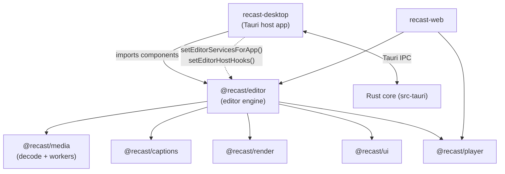
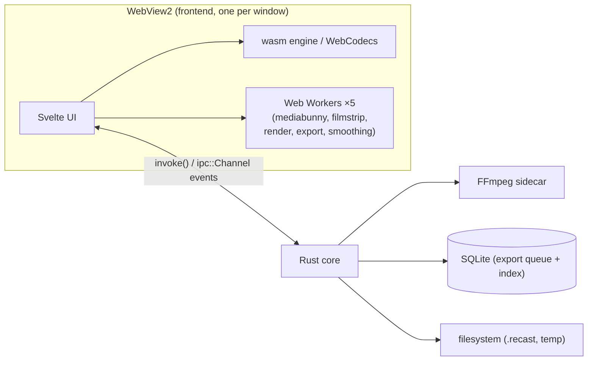

Recast is an **offline-first desktop screen recorder + video editor**. Stack: **Tauri v2** (Rust backend) + **Svelte 5** (runes) frontend, in a **pnpm monorepo**. The editor engine lives in the `@recast/editor` package; the desktop app (`recast-desktop`) is a thin **host** that wires it to native capabilities through injected services and host-hooks.

The guiding architectural bet: **one compositor** drives *both* the live preview and the export, so the two can never diverge. It is a Rust crate over wgpu, compiled to wasm for the browser and natively for the desktop, and FFmpeg is demoted from a second compositor to a pure **muxer**. Recording is Rust; editing and preview run in the WebView, where the engine is the same crate compiled to wasm; export composites either there with WebCodecs or natively in the same crates, and persistence and heavy native work cross the Tauri IPC boundary.

## Package & host map

The `@recast/*` packages **ship source** (their `exports` map points at `./src`), so each consuming app compiles their `.svelte`/`.ts` itself. This is load-bearing for Vite config (see [04-media-decode-and-workers.md](/architecture/media-decode-workers)).

## Runtime process model

## Conventions

- **`path:line`** citations point at the real source at time of writing.
- Diagrams are Mermaid, written inline in the markdown so the source of a
  diagram is readable without rendering it.
- "Host" means the desktop app (`apps/desktop`); "package" or "engine" means
  `@recast/editor`.
- Every page states its inputs, outputs, entrypoints, and invariants in
  frontmatter. Those are the summary; the prose is the detail.
