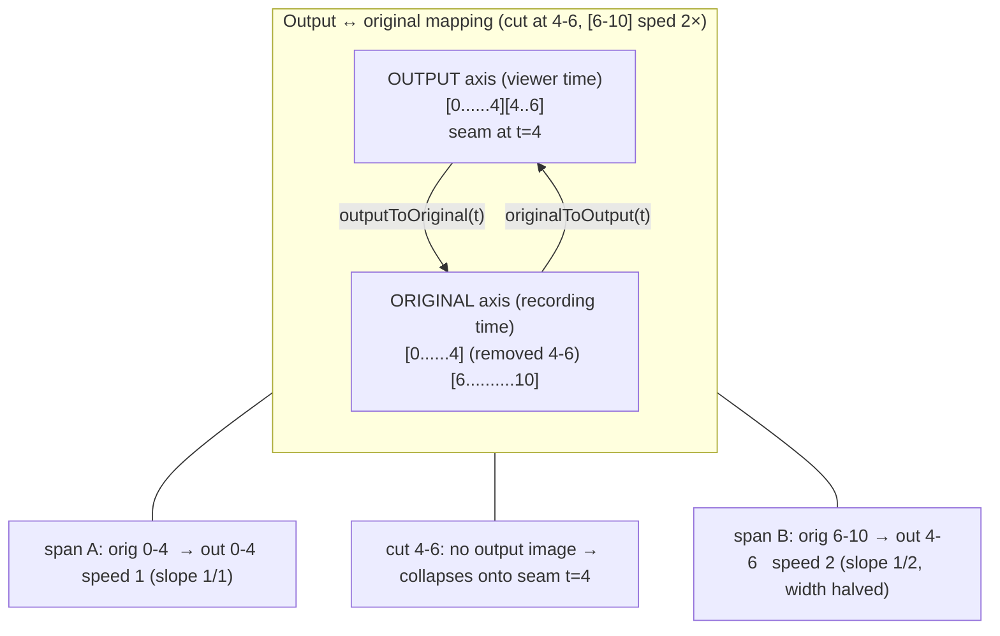
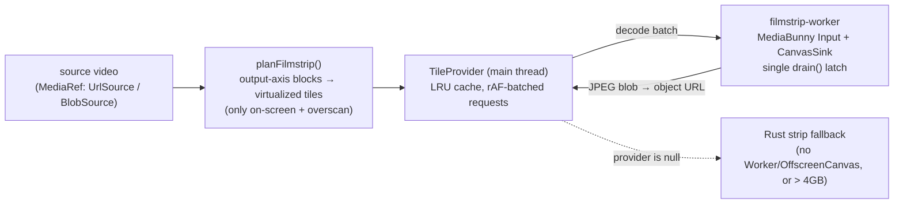

## Overview

The timeline model is the pure arithmetic that maps between two axes:

- **Original time**: seconds on the raw recording, the space cuts, splits, zoom
  regions, and annotations all live in.
- **Output time**: seconds the viewer actually sees after edits (trim + cuts +
  per-segment speed) are applied.

Editing never mutates media; it produces a piecewise-linear map. The model is
**OUTPUT-axis first**: kept spans are laid end-to-end on the output axis, removed
time collapses to a zero-width seam, and a sped segment's output width shrinks by
`1/speed`. Playhead, waveform, filmstrip, and export all resolve time through the
*same* functions, so preview and export cannot drift.

All model files are pure and framework-free, in `packages/editor/src/lib/timeline/`.
The Rust export pipeline re-implements the identical math in
`apps/desktop/src-tauri/src/commands/export/cuts_speed.rs`, and both sides are
pinned to shared JSON fixtures.

Layered structure:

- `cuts.ts`, removed original ranges; translation-only original↔output map.
- `segments.ts`, split + ripple-delete model; derives kept `Segment[]` and seams.
- `segment-speed.ts`, per-segment speed overrides, anchored to a segment's
  original start.
- `time-map.ts`, the general piecewise map (cuts *and* speed). Reduces exactly
  to the `cuts.ts` translation map when every span is 1× (`time-map.ts`).
- `storyboard.ts` / `filmstrip*.ts`, thumbnail generation on the output axis.

## Diagram

## Key components

| Symbol | File | Role |
| --- | --- | --- |
| `TimelineCut`, `normalizeCuts` | `cuts.ts` | Removed original range; sort + merge overlapping/touching cuts (EPS 1e-4). |
| `originalToOutput` / `outputToOriginal` (cuts) | `cuts.ts` | Translation-only map: subtract/add removed spans. |
| `Segment`, `deriveSegments` | `segments.ts` | Kept `[trimStart,trimEnd]` minus cuts, sliced at split points; drops zero-length + stray splits. |
| `Seam`, `deriveSeams` | `segments.ts` | Collapsed-cut markers between adjacent segments (touching splits yield none). |
| `segmentAt`, `planSplit`, `planDeleteSegment` | `segments.ts` | Split/ripple-delete planning; delete becomes a `manual` cut. |
| `SegmentSpeed`, `segmentSpeedAt(Time)` | `segment-speed.ts` | Speed anchored to a segment's original start; clamped 0.25-4×. |
| `buildSpeedOf`, `pruneSegmentSpeeds` | `segment-speed.ts` | Index→speed lookup for the time-map; drop orphaned anchors. |
| `TimeMap`, `MappedSpan`, `buildTimeMap` | `time-map.ts` | Kept spans placed on both axes; `outputDuration` = Σ span_width/speed. |
| `timeMapFromSegments` | `time-map.ts` | Playback/export map: kept segments + per-segment speed. |
| `displayTimeMap` | `time-map.ts` | Transient full-source axis WHILE trimming (head/tail at 1×). |
| `buildGapMap` | `time-map.ts` | Re-spaces cuts as visible gaps for the "show cut gaps" view (render-only). |
| `originalToOutput` / `outputToOriginal` (map) | `time-map.ts` | Speed-aware piecewise map; binary-searched forward direction. |
| `planStoryboard`, `storyboardCrop`, `storyboardCoverCrop` | `storyboard.ts` | Hover-sprite grid geometry + CSS crop math. |
| `planFilmstrip`, `LruCache` | `filmstrip.ts` | Virtualized output-axis tile layout; bounded LRU with `onEvict`. |
| `createTileProvider` / `MediabunnyTileProvider` | `filmstrip-source.ts` | Main-thread tile/hover/storyboard provider; returns null → strip fallback. |
| `startFilmstripWorker`, `drain`, `buildStoryboard` | `filmstrip-worker.ts` | Off-thread decode; single-decoder drain latch. |
| Rust mirror: `collect_export_cuts`, `build_speed_segments`, `warped_output_duration`, `build_speed_setpts_expr`, `build_speed_audio_filter` | `cuts_speed.rs` | Export-side re-implementation of the identical math. |

## Control / data flow

### Resolving output time t → original source time

1. Build the map once from the edit state:
   `timeMapFromSegments(deriveSegments(shape), buildSpeedOf(segments, overrides))`
   (`time-map.ts`, `segments.ts`, `segment-speed.ts`). Each kept span
   gets `outStart/outEnd` laid end-to-end, width `(origEnd-origStart)/speed`
   (`time-map.ts`).
2. `outputToOriginal(map, t)` walks spans: clamps t into the
   kept range, and inside a span returns `origStart + (t-outStart)*speed`. On an
   exact internal seam the **right-hand span wins** (NLE convention, matches
   `segmentAt`).
3. The reverse `originalToOutput(map, t)` binary-searches the
   first span with `origEnd >= t` (spans are ordered/disjoint, so `origEnd` is
   monotone). A time in a removed gap collapses onto the next span's `outStart`
   (the seam): same semantics as the cut-only `cuts.ts`. Binary search was
   added because the waveform lane evaluates it per bucket over ~2000 buckets, so
   at high cut counts the linear scan dominated a zoom.

At all-1× the whole thing reduces to the `cuts.ts` translation map, proven by
the parity fixtures (`time-map.ts`, `time-map.test.ts`).

### Same model feeds preview and export

- **Preview** routes playhead/scrub/waveform/filmstrip through the map above. The
  legacy `<video>` path additionally reads `segmentSpeedAtTime` to set
  `playbackRate` per segment (`segment-speed.ts`).
- **Export** (`cuts_speed.rs`) rebuilds the same kept-segment + speed structure on
  the post-trim axis: `collect_export_cuts` (clamp/sort/merge) →
  `build_speed_segments` (mirrors `deriveSegments` + anchoring) →
  `warped_output_duration` = `Σ (end-start)/speed` (identical formula to
  `buildTimeMap`'s `outputDuration`). Cuts are applied **last** as a pure
  frame-drop (`select`/`aselect`), so zoom/cursor/blur, computed on the
  continuous post-trim timeline, stay correct.
  Speed slots in at the same tail point as a timing warp:
  `build_speed_setpts_expr` remaps survivor PTS onto the warped axis
  , and audio is retimed per segment via `atrim`+`atempo`+`concat`
  (`build_speed_audio_filter`).

### Filmstrip thumbnail production

1. The clip bar computes output-axis `FilmstripBlock`s (one per kept segment,
   cut-free internally) from the time-map's span widths, then
   `planFilmstrip(blocks, viewport, opts)` (`filmstrip.ts`) emits only tiles
   intersecting the viewport + overscan. Tile count scales with block pixel width
   (`ceil(widthPx/tileTarget)`), and each tile's `sampleOriginalSec` is
   interpolated across the block's **original** span, so speeding a segment
   narrows its output width (fewer tiles) without moving sample times
.
2. `MediabunnyTileProvider` (`filmstrip-source.ts`) batches requests once per
   frame (`requestAnimationFrame`), pauses decoding during playback so it doesn't
   compete with the preview decoder for hardware slots (`setDecodePaused`),
   and posts a `decode` message to the worker.
3. The worker (`filmstrip-worker.ts`) holds one MediaBunny `Input` +
   `CanvasSink`, range-streams the source (never buffers the whole file,
   ), and drains all decodes through a **single `drain()` latch**
   : `getCanvas` builds a fresh `VideoDecoder` per call, so overlapping
   drains would mean one live hardware decoder per in-flight message. Newest batch
   drains first; the hover storyboard sprite (fixed 8×4 grid) builds only once no
   tiles are queued. Frames are JPEG-encoded (quality 0.82) and
   the blob is posted back → object URL in the provider's LRU.
4. Hover-scrub uses either a decoded frame (`previewAt`, own 64-entry cache) or,
   once built, the storyboard sprite cropped by `storyboardCrop` /
   `storyboardCoverCrop` (`storyboard.ts`).
5. **Fallback**: `createTileProvider` returns `null` (never throws) when
   Worker/OffscreenCanvas is missing, the source exceeds `MAX_STREAM_BYTES` (4 GB),
   or the worker reports a decode error; the caller then renders the fixed
   Rust-generated strip.

## Invariants & gotchas

- **OUTPUT-axis design.** Spans are laid end-to-end on the output axis and every
  consumer (playhead, waveform, filmstrip, export duration) reads that axis. This
  is what lets cuts and speed *compose* without any consumer knowing about the
  other. `outputDuration` is the single source of truth for post-edit length.
- **Cut collapse semantics.** Removed original time has no output image and maps
  onto the **seam** = the next kept span's `outStart` (`time-map.ts`,
  `cuts.ts`). Zero width on the output axis; rendered as a single marker at
  `gapStart` (`segments.ts`). Adjacent segments that merely *touch* (a split,
  nothing removed) produce no seam (`deriveSeams`, `segments.ts`).
- **Seam side.** On an exact internal boundary the **right/following** span wins
  everywhere (`outputToOriginal`, `segmentAt`, `spanAtOriginal`,
  `segmentSpeedAtTime`). Keep this consistent or a seek onto a seam lands one
  segment off.
- **Speed warp + audio atempo.** Output width = `origWidth/speed` (speed 2 ⇒ half
  width, faster). A non-positive/non-finite speed falls back to 1 so a bad
  override can't make a zero-width or NaN span (`time-map.ts`,
  `segment-speed.ts`). Video warp is `setpts`; audio must match via chained
  `atempo`, FFmpeg's `atempo` only accepts 0.5-2.0 per stage, so 0.25-4× is
  covered by chaining (`cuts_speed.rs`, e.g. 4× → two `atempo=2.0`).
- **Speed anchors are original-time.** An override is pinned to a segment's
  *original* start (stable under cuts/ripple-deletes, which never move original
  times). A trim/split that orphans an anchor drops it silently, same forgiving
  rule as stray splits (`segment-speed.ts`, `pruneSegmentSpeeds`). Setting
  speed back to ~1 removes the entry so the list stays sparse and serializes to
  nothing (`setSegmentSpeed`).
- **`displayTimeMap` vs resting map.** The resting/playback/export map is
  kept-only (`timeMapFromSegments`). `displayTimeMap` (`time-map.ts`) is used
  *only transiently while dragging a trim handle*, it un-collapses the trimmed
  head/tail at 1× so the drag isn't degenerate at the clip's left edge. Never feed
  it to playback or export.
- **`buildGapMap` is render-only.** It re-spaces cuts as visible gaps for the
  opt-in "show cut gaps" view. Playback and export never use
  it; with no cuts it's a no-op.
- **Boundary EPS = 1e-4 on BOTH sides.** The tolerance for treating two times as
  the same boundary / merging touching cuts is `1e-4` in TS
  (`cuts.ts`, `time-map.ts`, `segments.ts`, `segment-speed.ts`) and
  `CUT_MERGE_EPS = 1e-4` in Rust (`cuts_speed.rs`). They MUST stay in lockstep
  or the previewed edit and the export disagree on where a segment begins/ends.
- **TS↔Rust parity fixtures.** `__fixtures__/cut-parity.json` and
  `speed-parity.json` are the anti-drift contract, asserted by BOTH languages:
  - TS: `time-map.test.ts` / `cuts.test.ts` load `cut-parity.json`;
    `segment-speed.test.ts` loads `speed-parity.json`
    (`import … from "./__fixtures__/…json"`).
  - Rust: `cuts_speed.rs` load the SAME files via
    `include_str!(concat!(env!("CARGO_MANIFEST_DIR"), "/../../../packages/editor/…"))`.
  - `expectedKeptDuration` must equal the collapsed `[trimStart,trimEnd]` length
    on both sides; `expectedOutputDuration` must equal the time-map's
    `outputDuration` and the export's `warped_output_duration`.
  - **Assertion tolerance is tighter than the model EPS**: TS uses
    `toBeCloseTo(…, 6)` and Rust uses `abs() < 1e-6`.
    The `1e-4` is the *boundary* epsilon inside the math, not the parity check.
    (The fixture `_comment` still points at legacy `apps/desktop/src/lib/timeline/…`
    test paths; the live tests are in `packages/editor/src/lib/timeline/`.)
- **`output_duration_cap`.** Export's `-t` cap is the warped output length, not
  the raw trimmed span, otherwise the infinite background generators freeze the
  last frame past content-end, and slow-motion (warped > raw) gets truncated. GIF
  keeps the raw span only for a cuts-only export.
- **Single decoder latch.** The filmstrip worker's `draining` boolean is
  load-bearing: MediaBunny builds a fresh `VideoDecoder` per `getCanvas`, so
  without the latch a scroll spawns tens of live hardware decoders
  (`filmstrip-worker.ts`). Every worker reply path (`tile`/`error`/`drop`)
  must release the request id or the tile wedges in-flight and the id maps grow
  unbounded (`filmstrip-source.ts`).

## Related

- [preview-engine.md](/architecture/preview-engine), how the preview consumes the time-map for
  playhead/scrub and the shared compositor.
- `06-export-pipeline.md`, the Rust FFmpeg filtergraph that applies cuts + speed
  (`cuts_speed.rs`) and the export-side duration cap.
- `08-state-and-project-format.md`, where cuts, split points, and segment-speed
  overrides are stored and serialized in the `.recast` edit model.
