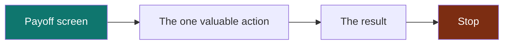
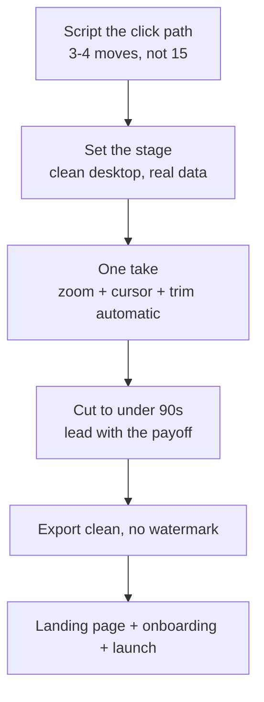

Buyers are more than twice as likely to purchase after watching a product demo, and a video on a landing page lifts engagement over a wall of text by a wide margin. You already knew the demo matters. The problem is that recording one usually feels like a project: a script, a dozen takes, an editing timeline you fight with at midnight, and a result that still looks like a screen capture with ambition.

It does not have to be that. This is the workflow a single founder can run in an afternoon and come out with something that looks like it went through an agency. No timeline scrubbing, no keyframes, no budget.

## What separates a demo that converts from one that gets closed

Before any recording, understand what the viewer is actually doing. They are deciding, in the first ten seconds, whether this is worth their attention. A demo converts when it respects that, and it fails on a few predictable things:

- **It starts with a tour instead of a result.** Nobody wants your navigation. They want to see the thing your product does that they came to do.
- **The cursor wanders and nothing draws the eye.** The viewer does not know where to look, so they look away.
- **It is too long.** A product demo that runs past two minutes is usually three demos wearing a trench coat.
- **It looks raw.** Flush-to-the-edge capture with a jerky pointer reads as unfinished, and unfinished reads as untrustworthy.

Every step below exists to fix one of those.

## Step 1: script the click path, not the words

Do not write a narration script first. Write the path your cursor will take. A demo is a sequence of actions, and the words follow the actions, not the other way around.

Open a note and list the moves in order:

1. Land on the one screen that shows the payoff.
2. Do the single most valuable action a user can do.
3. Show the result of that action.
4. Stop.

That is often the entire script. Three or four moves. The mistake is listing fifteen. Pick the one job your product does best and demo that job, start to finish. You can always record a second clip for the second feature.

## Step 2: set the stage before you hit record

Two minutes of prep saves ten takes.

- **Close everything irrelevant.** Notifications off, extra tabs gone, a clean desktop. Nothing kills trust like a Slack ping mid-demo.
- **Use realistic data.** "Test User 1" and "asdf" make it look like a toy. Seed a few believable names and numbers.
- **Pick your frame.** Record the window, not the whole monitor, unless the whole monitor is the point. A tight frame keeps the eye on the product.
- **Warm up the action once.** Do the click path a single time without recording so your hand knows the route.

## Step 3: record in one clean take, and let the polish be automatic

Here is where the old workflow and the modern one split.

The old way: record raw, then open an editor, then manually add zoom keyframes on every click, smooth the cursor by hand, cut the dead air, add padding and a background, and export. Hours, and it shows.

The modern way: record raw, and the zoom, cursor smoothing, framing, and trimming happen automatically because the tool reads your clicks and cursor data as you go. You get the produced look on the first pass and only touch the editor if you want to change something.

This is the single biggest lever in the whole playbook. The automatic zoom is what makes a demo look produced, and doing it by hand is exactly the tedious part that makes people give up. If you want the detail on why click-driven zoom beats manual keyframing, that is its own topic, but for now: let the tool do it.

Tools that do this automatically include Recast, which is free and open source, and Cap. If you are on Windows specifically, we compared the [options that give you the Screen Studio look](/blog/screen-studio-for-windows) in detail.

## Step 4: keep it under ninety seconds

Watch your take back with one question: what can I cut? Almost always the answer is the beginning. The first few seconds where you get oriented, the throat-clearing, the "so if I click here". Cut into the action. If the tool trimmed your silences automatically, you are most of the way there. A demo that lands the payoff in the first ten seconds and finishes under ninety earns the replay.

## Step 5: export clean and put it where buyers are

Export a hardware-encoded MP4 with no watermark. A watermark on your own product demo undercuts the exact trust you are trying to build, so use a tool that does not stamp local exports.

Then place it deliberately:

- **Above the fold on your landing page.** The demo is the hero, not a link buried in a features section.
- **In your onboarding.** The same clip that sells also teaches, so it earns its keep twice.
- **On your launch.** Product Hunt, X, Hacker News. A launch with a crisp fifteen-second auto-zoomed demo stands out in a feed of screenshots.

## The whole thing, at a glance

## A note on doing it for free

None of this needs an agency or a subscription. The recording and polish half of the workflow runs on a free desktop app. You spend nothing on the part that used to cost the most, the editing, because the tool does the zoom and framing for you. If you are weighing tools, we laid out the [open source options against Loom](/blog/open-source-loom-alternative), including where each one actually falls short.

## Frequently asked

**How long should a product demo be?**
For a landing page or launch, aim for fifteen to ninety seconds. Lead with the payoff in the first ten. Longer, feature-by-feature walkthroughs belong in onboarding or docs, not on the page where someone decides whether to sign up.

**Do I need a script?**
Script the click path, not the narration. List the three or four actions in order and the words follow. Over-scripted narration is what makes demos sound like a call center.

**What is the easiest way to make it look produced?**
Automatic zoom. It is the feature that reads as "produced" more than any other, and modern recorders apply it from your click data so you do not touch a timeline. [Recast](/download) and Cap both do this.

**Can I record a good demo on Windows?**
Yes. The tools with automatic zoom on Windows are covered in our [Screen Studio for Windows rundown](/blog/screen-studio-for-windows). You are not stuck with raw capture anymore.

---

Ready to record one this afternoon? [Download Recast](/download), it is free and open source, and the first take will already have the zoom and framing on it. Then put it above the fold and watch what it does to your signups.
