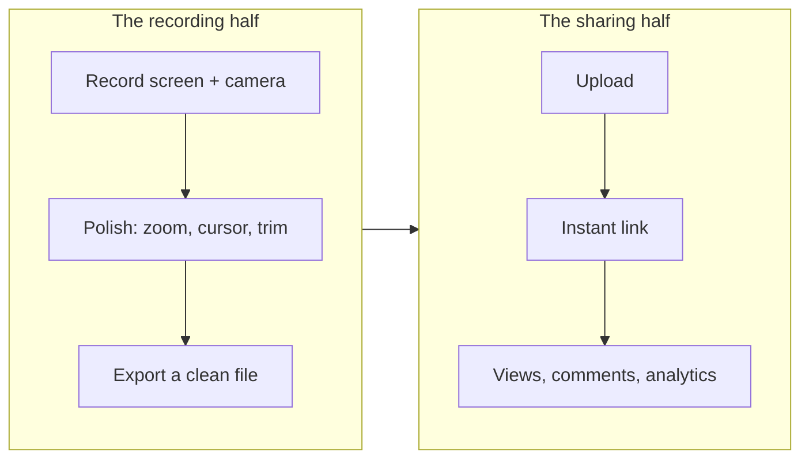

Loom works. That is the uncomfortable starting point for any post like this. You hit record, you stop, and a share link is in your clipboard before you have thought about it. Millions of people use it for exactly that reason, and no open source tool has matched that one-tap sharing yet.

So why look elsewhere? Three reasons come up again and again from founders and indie hackers:

- **Price.** Loom's paid plan runs $18 a month per creator, $15 if you pay annually. For a solo founder that is a real line item for what is, most days, a handful of clips.
- **Ownership.** Your recordings live on someone else's servers, behind their retention rules and their pricing changes. The free tier caps length and stamps output.
- **Trust.** You cannot read the code, you cannot host it yourself, and you cannot be certain what happens to a demo that shows a not-yet-public product.

If none of that bothers you, keep using Loom. It is genuinely good at what it does. If any of it does, here is the open source field in 2026, ranked, with the trade-offs on the table.

## What "Loom alternative" actually splits into

Loom is really two products welded together, and most open source tools only replace one half. Naming the halves is the whole trick to choosing well.

Some tools nail the recording half and hand you a file. Some run the whole pipeline including hosted sharing. Know which half you actually need before you pick, because a tool that is perfect at one can be empty at the other.

## The shortlist

### Cap

Cap is the most starred open source screen recorder on GitHub for a reason. It covers both halves. Studio mode gives you automatic zoom from click data, cursor smoothing, captions, and keyboard overlays. Instant mode gives you a quick share link with viewer comments and AI transcripts. You can use their hosted cloud, bring your own S3 bucket, or self host the whole thing.

If you want the closest open source thing to full Loom that works today, this is it. Paid plans top out around $8 a month, roughly half of Loom. The gaps: the desktop app is Windows and macOS only, no Linux, and browser-based "record a response" flows are not its strength.

**Best when:** you want both halves, real sharing included, and you are on Windows or Mac.

### Recast

Full disclosure, this is our tool. Recast is a free, open source desktop app that owns the recording half completely and is still building out the sharing half.

On the recording side it does what Loom's desktop app does and then some: records screen, camera, and mic, and applies automatic zoom toward your clicks, cursor smoothing, silence trimming, and auto backgrounds and framing while you record. Exports are hardware encoded MP4 with no watermark on local output, ever. The app is offline first and needs no account, so a recording never touches a server unless you decide it should. Windows is the stable build; macOS and Linux are in beta, and Linux is a platform Cap does not cover at all.

The honest part: the hosted sharing layer, Recast Cloud, with view analytics, access controls, and bring-your-own storage, is on the waitlist, not shipped. So today Recast replaces the record-and-polish half of Loom for free and hands you a clean file to put wherever you like. It does not yet hand you a Loom-style dashboard link. If that is the half you need this week, Cap is the more complete answer.

**Best when:** you want free, offline, no watermark, no account, and Linux on the table, and you are fine shipping the file yourself for now.

### OBS Studio

OBS is free, open source, runs everywhere, and captures better than anything on this list. It is also purely the raw-capture quarter of the recording half. No automatic zoom, no cursor polish, no framing, no sharing. You record, then you edit and host it all yourself. It is the right pick when you want total control and are happy to do the polish and distribution by hand. It is the wrong pick if the appeal of Loom was that you did not have to.

**Best when:** you want maximum control over capture and do not want any automation.

## Side by side

| | Records + polishes | Auto zoom | Hosted sharing | No watermark | Self host | Linux | Price |
|---|---|---|---|---|---|---|---|
| **Loom** | Yes | No | Yes | Paid only | No | No | $18/mo |
| **Cap** | Yes | Yes | Yes | Yes | Yes | No | Free tier + ~$8/mo |
| **Recast** | Yes | Yes | On the way | Always | N/A yet | Beta | Free |
| **OBS** | Capture only | No | No | Yes | N/A | Yes | Free |

## The cost angle, plainly

If price is what pushed you off Loom, the math is not subtle. Loom is $18 a month, so $216 a year per creator. For a solo founder recording changelog clips and demos, an open source desktop app that runs locally is $0 for the identical recording work. You spend the difference on hosting the files, which for most people is a folder in cloud storage they already pay for.

The pitch is not that free tools are strictly better. Loom's one-tap sharing is still ahead. The pitch is that for a lot of solo work, you are paying a subscription for a convenience you could replace with a free app and a drag into Drive.

## Frequently asked

**Is there a truly free, open source Loom alternative?**
Yes. Cap and Recast are both open source. Cap has a free tier plus paid hosting; Recast's desktop app is free with no watermark on local exports.

**Can I self host so my recordings never leave my infrastructure?**
Cap can be fully self hosted, storage and sharing included. Recast is offline first, so recordings stay on your machine until you choose to move them; its hosted layer is still rolling out.

**Which of these has automatic zoom like Screen Studio?**
Cap and Recast both zoom toward clicks automatically. If that specific look is your goal, see our rundown of [Screen Studio alternatives for Windows](/blog/screen-studio-for-windows).

**Will an open source tool remove the Loom watermark?**
There is nothing to remove. Recast and OBS never watermark local exports, and Cap does not watermark either. The watermark is a free-tier Loom thing, not a screen-recording thing.

---

Want to try the record-and-polish half without a subscription or a sign-up? [Download Recast](/download), it is free and open source, and see how a raw take looks after the automatic zoom and framing land on it. If you are planning a launch, the [product demo playbook](/blog/how-to-record-a-product-demo) walks through the whole thing end to end.
