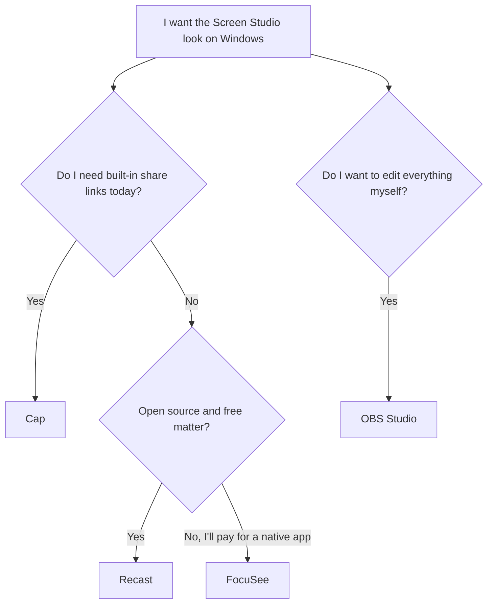

If you have watched a polished product demo in the last two years, there is a good chance it was made with Screen Studio. The automatic zoom that pushes in on a click, the soft padding around the window, the cursor that glides instead of jerks. It set the look that everyone now copies.

Then you go to install it on Windows and hit the wall. Screen Studio is macOS only, and the team has been clear they have no Windows build coming. So the question that brings most people here is simple: what gives you that same result on a Windows machine, without moving to a Mac?

I have run the current crop. Here is what holds up, ranked, with the trade-offs stated plainly so you can pick on facts instead of a landing page.

## What "the Screen Studio look" actually is

Before comparing tools, it helps to name the three things people are really asking for, because most recorders do one of them and call it done.

1. **Automatic zoom.** The recording pushes in toward whatever you clicked, holds, then pulls back. No timeline scrubbing, no keyframes. This is the single feature that separates a demo that looks produced from one that looks like a support ticket.
2. **Auto layout.** Padding, a background, and framing applied around the raw capture so the window floats instead of sitting flush against the screen edge.
3. **Cursor polish.** The pointer path gets smoothed so a shaky hand reads as a steady one, and clicks get a subtle highlight.

A recorder that only captures the screen, even at high quality, is not in this category. OBS records beautifully and does none of the three. Keep that distinction in mind as you read.

## The shortlist

### 1. Recast

Full disclosure up front: this is our tool, so read the rest with that in mind. I have tried to keep the comparison fair, and I name where the others win below.

Recast is a free, open source desktop app. The Windows build is the stable one, with macOS and Linux in beta. It records the screen, camera, and microphone, then applies the three things above automatically as you record, not as a manual pass afterward.

- **Automatic zoom** reads your click and cursor data and pushes in toward the action. You can retime or remove any zoom in the editor, but the first pass is done for you.
- **Auto layout** drops the capture onto a background with padding and framing, live, so you see the finished look while recording.
- **Cursor smoothing** kills the twitch and snaps the path toward targets.

Exports are hardware encoded MP4 with no watermark, ever, on a local export. The app is offline first and needs no account to record, edit, or export. Where it is heading, and not yet fully there, is the hosted share-link layer with view analytics and access controls, which is on the waitlist rather than shipped. If your whole reason for wanting Screen Studio is the editing-free polished output, that part is here today and free. If you need Loom-style instant sharing with a dashboard, that is the part still rolling out.

**Wins on:** native Windows, automatic zoom, free, open source, no watermark, also runs on Linux.
**Falls short on:** the hosted sharing and analytics layer is not live yet, and the macOS build is still beta.

### 2. Cap

Cap is the most starred open source screen recorder on GitHub, and deservedly so. It runs on Windows and macOS, has a Studio mode with automatic zooms based on click data, cursor smoothing, keyboard overlays, and captions, plus an Instant mode for quick share links with comments and AI transcripts. You can self host it or use their cloud.

It is the closest thing to a true Screen Studio replacement that also has real sharing today. The gaps: there is no Linux desktop app, and the polish, while very good, is a notch behind Screen Studio's defaults in my testing. If you are on Windows or Mac and want sharing built in right now, Cap is a strong pick.

**Wins on:** mature sharing, self hosting, large community, Windows and Mac.
**Falls short on:** no Linux, polish defaults slightly behind Screen Studio.

### 3. FocuSee

FocuSee is a native Windows app that zooms on click and produces cinematic output without timeline editing, and it adds subtitle generation and audio cleanup on top. It is a paid, closed source tool. If you want the automatic look and do not care about open source or price, it is a legitimate option and one of the few that nails the zoom on Windows.

**Wins on:** strong auto zoom on Windows, extras like subtitles and audio cleanup.
**Falls short on:** paid, closed source, no self hosting.

### 4. OBS Studio

OBS belongs on every list like this, with a caveat. It is the best raw screen capture on the planet, free, open source, every platform, no watermark, no limits. It is also the wrong tool for this specific job. There is no automatic zoom, no auto layout, no cursor smoothing. You get a clean recording and then you do all the polish yourself in a separate editor. Pick OBS when you want total control over capture and are happy to edit. Do not pick it expecting the Screen Studio result out of the box.

**Wins on:** capture quality, control, free, every platform.
**Falls short on:** none of the three polish features, steep setup.

## Side by side

| | Auto zoom | Auto layout | Cursor smoothing | Windows | Linux | Price | Open source |
|---|---|---|---|---|---|---|---|
| **Recast** | Yes | Yes | Yes | Stable | Beta | Free | Yes |
| **Cap** | Yes | Partial | Yes | Yes | No | Free tier + paid | Yes |
| **FocuSee** | Yes | Yes | Yes | Yes | No | Paid | No |
| **OBS** | No | No | No | Yes | Yes | Free | Yes |
| **Screen Studio** | Yes | Yes | Yes | No | No | Paid | No |

## How to choose without overthinking it

The honest summary: if you want free, open source, native Windows, and the automatic polish with no editing, try Recast. If you want the same polish plus mature sharing today and do not need Linux, Cap is excellent. If you will pay for a closed source native app, FocuSee is solid. And if you want to control every frame yourself, OBS is unbeaten at capture and useless at auto polish, which is exactly the trade you are making.

## Frequently asked

**Is there an official Screen Studio for Windows?**
No. Screen Studio is macOS only and the team has said there are no plans for a Windows version. Every option above is a third party alternative, not an official port.

**Which one is free with no watermark?**
Recast and OBS are both free with no watermark. Recast gives you the automatic zoom and layout; OBS gives you raw capture that you polish yourself.

**Can I get automatic zoom on Windows at all?**
Yes. Recast, Cap, and FocuSee all zoom toward clicks automatically on Windows. That is the feature Screen Studio is famous for, and it is no longer Mac only.

**What about Linux?**
Of this list, only OBS and Recast run on Linux, and Recast's Linux build is still beta. If Linux is a hard requirement and you want auto polish, Recast is currently the only one that even attempts it.

---

If the automatic look is what you came for and you are on Windows, [download Recast](/download) and record something. It is free, it needs no account, and the first take will already have the zoom and framing on it. Prefer to see the features first? The [feature tour](/features) walks through what gets applied and when.
