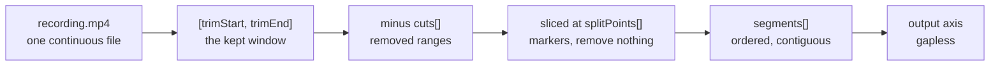
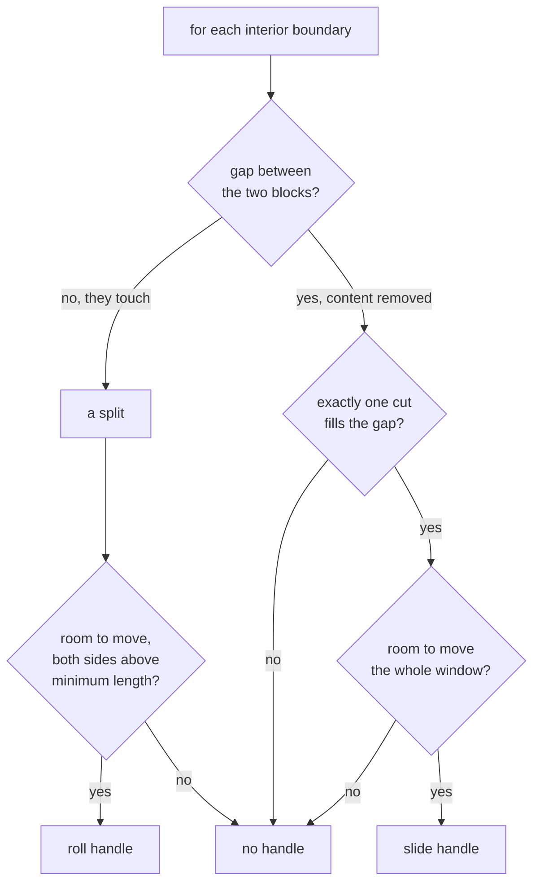

The complaint was short: the blocks on the timeline don't move. Drag a zoom region and it sits there. Drag a video clip and nothing happens at all.

Two different causes hid behind one symptom. One was an ordinary bug, sitting in a pure function with a unit mismatch in it. The other was not a bug: the video track genuinely has nowhere to drag a clip to, and no amount of pointer handling was going to change that. Getting to a timeline that feels like Premiere meant being honest about which was which.

## The timeline is derived, not stored

Most NLEs store a sequence: an ordered list of clips, each with a position, each free to move. Recast does not. A project is one recording plus a description of what to leave out.



That whole chain is one pure function, in `apps/desktop/src/lib/timeline/segments.ts`:

```ts
export function deriveSegments(shape: ClipShape): Segment[] {
  const { trimStart, trimEnd, splitPoints } = shape;
  if (trimEnd - trimStart <= EPS) return [];

  // Kept intervals = [trimStart, trimEnd] minus the normalized cuts.
  const cuts = normalizeCuts(shape.cuts).filter(
    (c) => c.end > trimStart && c.start < trimEnd,
  );
  const kept: Array<{ start: number; end: number }> = [];
  let cursor = trimStart;
  for (const c of cuts) {
    const cutStart = Math.max(c.start, trimStart);
    const cutEnd = Math.min(c.end, trimEnd);
    if (cutStart - cursor > EPS) kept.push({ start: cursor, end: cutStart });
    cursor = Math.max(cursor, cutEnd);
  }
  if (trimEnd - cursor > EPS) kept.push({ start: cursor, end: trimEnd });
  // ...then slice each kept interval at the splits inside it
}
```

There is a lot to like about this. Undo is trivial, because the state is small and declarative. Export and preview can never disagree about where a cut is, because both derive from the same numbers. Nothing is destructive.

The cost shows up the moment someone grabs a clip.

## A clip has no position of its own

A block on screen is a segment, and a segment's position is a consequence of everything to its left. The output axis is gapless by construction: remove a range and everything after it slides left to close the hole.

```
source     [========================================]
trim           [================================]
cuts           [=====]XXXXX[=======]XXX[========]
splits         [==|==]     [===|===]   [========]
segments        0  1        2   3       4
output         [0][1][2][3][4]              <- no gaps, ever
```

So "drag clip 2 to the right" has no meaning. There is no gap to move it into, and no field to write the new position to. You can express it in a sequence model. You cannot express it here.

I could have faked it. Reordering the segment list and rewriting the cut ranges to match would produce a timeline that appeared to let you drag clips around, right up until you exported and found the source ranges no longer lined up with the file. Instead the honest question was: what edits *does* this model support?

## Three edits, and all of them are real

It turns out the answer is the three trims every NLE editor already knows, and they fall straight out of the data.

**Roll** is a split boundary. One block's end and the next block's start are the same number, so moving it grows one and shrinks the other by exactly the same amount.

```
before   [    A     |        B        ]
after    [    A         |    B        ]
                  split moves
         total length unchanged
```

**Slide** is a seam, which is a removed range with content on both sides. Move the hole without resizing it, and both neighbours change while the output length stays put.

```
before   [   A   ]XXXXX[      B       ]
after    [     A   ]XXXXX[    B       ]
                 the hole moves
         removed amount unchanged
```

**Slip** needs a hole on *both* sides. The block keeps its length and its slot on the output axis, and its source window shifts inside that slot. On screen the block does not move at all, the frames inside it do, which is exactly what slip looks like in Premiere.

```
source   [ A ]XXXXX[   B   ]XXXXX[ C ]
                    ^^^^^^^
                    slide this window left or right
                    inside the room the two holes give it

output   [ A ][   B   ][ C ]     <- B never moves here
```

All three are length-preserving, which turned out to matter more than expected. Because the total output length never changes, the axis under the cursor does not move mid-drag, so the pointer can be mapped absolutely instead of tracking a delta against a shifting map.

Deciding which handle a boundary gets is a short walk over the segment list:



The whole model lives in `timeline-spine.logic.ts` as pure functions with no Svelte in them:

```ts
for (let i = 0; i < segs.length - 1; i++) {
  const left = segs[i];
  const right = segs[i + 1];
  const gap = right.start - left.end;

  if (gap <= EPS) {
    // Touching: a split. Rolling it is bounded by both neighbours' minimums.
    handles.push({ kind: "roll", at: left.end, min: left.start + minClip, max: right.end - minClip });
    continue;
  }

  // A gap: exactly one cut should fill it. More than one means an un-merged
  // pair, and picking one would silently leave the other behind.
  const inside = shape.cuts.filter((c) => c.start >= left.end - EPS && c.end <= right.start + EPS);
  if (inside.length !== 1) continue;
  // ...emit a slide handle, reserving the removed length
}
```

That `inside.length !== 1` guard is the kind of thing that only looks paranoid until it isn't. Cuts merge on drag end, not during, so two adjacent cuts can share a gap for a while. Guessing which one to move would corrupt the other.

## The bug that made all of it look broken

None of that architecture mattered while dragging a zoom card moved it about a hundredth of the distance the pointer travelled.

The card drag maths projects a pointer delta through the display map. Here is what it did:

```ts
function projectAnchor(g: CardDragGeometry, orig: number): number {
  const outDelta = (g.clientX - g.startClientX) / g.pps;
  return g.tOf(g.xOf(orig) + outDelta);
}
```

And here are the two mappers the callers hand it:

```ts
const xOf = (t: number) => originalToOutput(store.renderMap, t) * pixelsPerSecond;   // seconds -> PIXELS
const tOf = (xPx: number) => outputToOriginal(store.renderMap, xPx / pixelsPerSecond); // PIXELS -> seconds
```

`xOf` returns pixels. `tOf` expects pixels. And `outDelta` was divided by `pps` before being added to them, which makes it seconds. Adding seconds to pixels, then dividing by `pps` a second time on the way out, means the card advanced by `delta / pps²` seconds.

At 100 pixels per second, a 150 pixel drag should move a card 1.5 seconds. It moved it 15 milliseconds. The types were all `number`, so nothing complained, and it had been wrong since the file was first written.

The fix is one line, and the test that proves it is worth more than the fix:

```ts
it("moves the card one-for-one with the pointer by default", () => {
  const result = computeCardMove(geometry({ clientX: 150, startClientX: 0 }));
  expect(result.start).toBeCloseTo(3.5);   // origin 2s + 150px at 100px/s
  expect(result.end).toBeCloseTo(5.5);
});
```

I wrote that test before the fix and watched it fail with `expected 2.0166 to be close to 3.5`. Two point oh one six is the origin plus one frame, which is what a hundredth of a drag rounds to. That number is the bug printed out in full.

## Anchors have to move with the boundary

There is a second-order problem with roll, slide, and slip that is easy to miss. Per-segment speeds and scene animations are stored keyed by the segment's original start time:

```rust
pub struct SegmentSpeed {
    /// Segment's original start time (seconds): the stable anchor.
    pub start: f64,
    pub speed: f64,
}
```

The comment is right that this is stable under cuts and ripple-deletes, because those do not move original times. Roll and slide and slip do. So a boundary move renames the segment, the anchor no longer matches any segment start, and the prune pass drops it as an orphan. Roll a split and the clip silently loses its 2x speed and its entrance animation.

Every one of the three edits routes through one place that carries the anchors across:

```rust
fn reanchor_segment(from: f64, to: f64) {
    if (from - to).abs() <= 1e-4 { return; }
    // move any speed / animation anchored at `from` onto `to`
}
```

## The bug the type checker could not see

One more, because it cost the most time relative to its size. After redesigning the blocks into solid clips, every one of them rendered as a short pill about a third of its proper height, sitting in a correctly sized row.

The shared class string opened with `relative`. Every consumer applies it to an element that is already `absolute inset-0`:

```svelte
class="absolute inset-0 ... {CLIP_BASE}"
```

Tailwind emits position utilities in a fixed order, and `relative` comes after `absolute` in the generated stylesheet. So `relative` wins the cascade no matter which order you write them in the class attribute. `inset-0` had nothing to resolve against, and every clip collapsed to the size of its own label.

Class strings are strings. `svelte-check` was clean, 954 tests were green, and the app was visibly wrong. The guard is a test that reads the constant:

```ts
const POSITION = /(?:^|\s)(?:static|fixed|absolute|relative|sticky)(?:\s|$)/;

it("leaves positioning to the consumer", () => {
  expect(CLIP_BASE).not.toMatch(POSITION);
});
```

## Making the drags feel like drags

The last stretch was sensitivity, which is mostly a list of small decisions:

- A press is a click until the pointer travels 3px. Before that, selecting a card nudged it and left an undo entry that changed nothing.
- Hold Shift for precision and pointer travel is damped to a quarter. The anchor is re-seeded whenever the modifier flips, so pressing or releasing Shift mid-drag never jumps the block.
- Hold Ctrl or Cmd to drop snapping for one gesture. The frame grid still applies, because a sub-frame write makes the preview and the export disagree about which frame is first.
- The dragged card keeps its row for the whole gesture. Repacking on every pointer move used to move it to a different row the instant it touched a neighbour, leaving it somewhere other than under the cursor.
- Edge grips reach 3px outside the block, kept under the gap between neighbours so two grips can never overlap.

The precision one is worth a note. Damping travel is easy; making it continuous is the part people skip. If you scale the accumulated delta, the block jumps the moment the modifier changes state. The fix is to re-anchor on every flip and keep a running offset, so the position function stays continuous through the change:

```ts
if (event.shiftKey !== drag.precision) {
  const before = gearedValue(raw);
  drag.precision = event.shiftKey;
  drag.anchorTime = raw;
  drag.gearOffset = before - raw;   // gearedValue(raw) still returns `before`
}
```

## Where this leaves it

The video track now supports roll, slide, and slip, with the boundary handles folded into the seam and split markers that were already there rather than stacked on top of them. Every other lane drags and resizes properly, which it turns out it never really did.

What is still missing is auto-scroll: drag to the edge of the viewport and the timeline does not follow. That needs a scroll-delta term threaded into the drag geometry, because the card maths is purely `clientX`-relative and a container scroll silently desyncs it. It is a known gap rather than a forgotten one.

The thing I keep coming back to is the first decision. The pressure was to make clips draggable because that is what a timeline looks like. The model could not express it, and the two options were to fake it or to find out what the model could express instead. Roll, slide, and slip were sitting there the whole time, they are what professional editors actually reach for, and every one of them changes a clip's start and end time for real.
