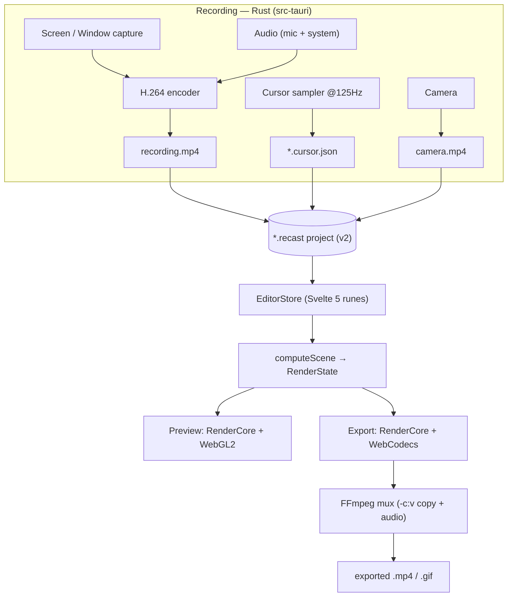
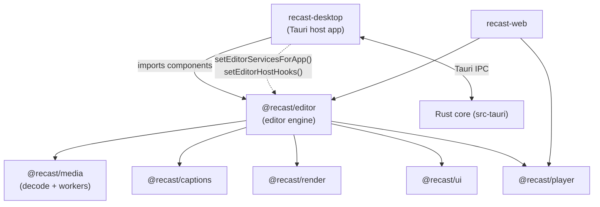
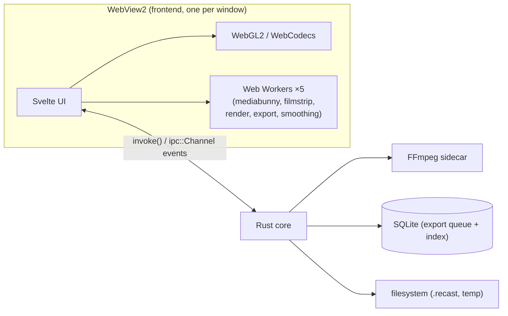

# Recast — Architecture

Recast is an **offline-first desktop screen recorder + video editor**. Stack: **Tauri v2** (Rust backend) + **Svelte 5** (runes) frontend, in a **pnpm monorepo**. The editor engine lives in the `@recast/editor` package; the desktop app (`recast-desktop`) is a thin **host** that wires it to native capabilities through injected services and host-hooks.

The guiding architectural bet: **one compositor** (`RenderCore`, WebGL2) drives *both* the live preview and the export, so the two can never diverge. FFmpeg is demoted from a second compositor to a pure **muxer**. Recording is Rust; editing/preview/export compositing is browser (WebView2 + WebGL2 + WebCodecs); persistence and heavy native work cross the Tauri IPC boundary.

## Top-level data flow

## Package & host map

The `@recast/*` packages **ship source** (their `exports` map points at `./src`), so each consuming app compiles their `.svelte`/`.ts` itself. This is load-bearing for Vite config (see [04-media-decode-and-workers.md](04-media-decode-and-workers.md)).

## Runtime process model

## Document index

| # | Doc | Covers |
|---|-----|--------|
| — | **README.md** (this) | System overview, package map, process model |
| 01 | [Recording pipeline](01-recording-pipeline.md) | Capture backends, encoder, cursor/audio/camera tracks |
| 02 | [Editor forking & host seam](02-editor-forking-and-host-seam.md) | `@recast/editor` extraction, shims, services, host-hooks |
| 03 | [Preview & RenderCore](03-preview-and-rendercore.md) | VideoPreview, RenderCore, WebGL2 backend, pass list |
| 04 | [Media decode & workers](04-media-decode-and-workers.md) | MediaBunny, frame ring, the 5 workers, Vite worker gotchas |
| 05 | [Timeline model](05-timeline-model.md) | TimeMap, segments, cuts, speed, filmstrip |
| 06 | [Export pipeline](06-export-pipeline.md) | Engine choice, browser render, queue, Rust mux, fallback |
| 07 | [IPC & Tauri boundary](07-ipc-and-tauri-boundary.md) | Commands, AppError, channels, service injection |
| 08 | [State & project format](08-state-and-project-format.md) | EditorStore runes, one-way flow, `.recast` v2 |
| 09 | [Captions & transcription](09-captions-and-transcription.md) | ASR, Silero VAD, caption render + burn-in |

## Conventions used in these docs

- **`path:line`** citations point at the real source at time of writing.
- Diagrams are Mermaid, theme-agnostic (no hardcoded colors).
- "Host" = the desktop app (`apps/desktop`); "package"/"engine" = `@recast/editor`.
